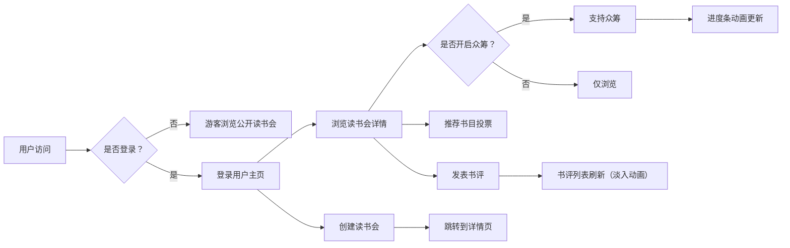

## 1. 产品概述

面向独立书店的在线读书会组织与书评众筹应用，为书友提供创建主题读书会、提交书评、投票推荐书目及众筹购买新书的一站式平台。

- **核心价值**：连接独立书店与读者，构建有温度的阅读社区，通过众筹模式支持小众好书出版与引进
- **目标用户**：热爱阅读的书友、独立书店经营者、读书会发起人

## 2. 核心功能

### 2.1 用户角色

| 角色 | 注册方式 | 核心权限 |
|------|----------|----------|
| 游客用户 | 无需注册 | 浏览公开读书会信息、查看书评 |
| 注册用户 | 账号密码注册 | 创建读书会、发表书评、投票推荐、支持众筹 |
| 读书会发起人 | 注册用户自动拥有 | 管理自己创建的读书会、设置众筹目标 |

### 2.2 功能模块

1. **用户认证模块**：注册、登录、用户信息管理、头像展示
2. **读书会管理模块**：创建、浏览、详情展示、成员管理
3. **书评模块**：提交书评、星级评分、"有用"投票、书评列表
4. **推荐书目模块**：关键词聚合、投票推荐、排行榜、跳转书店链接
5. **众筹模块**：众筹进度条、支持众筹、金额输入、贡献排行榜
6. **导航与布局模块**：顶部导航栏、用户下拉菜单、响应式汉堡菜单

### 2.3 页面详情

| 页面名称 | 模块名称 | 功能描述 |
|----------|----------|----------|
| 首页/读书会列表 | 顶部导航栏 | 登录/注册入口、用户头像下拉菜单、汉堡菜单（移动端） |
| 首页/读书会列表 | 读书会瀑布流 | 卡片展示封面、标题、书评数、投票倒计时，悬停上浮效果 |
| 创建读书会页面 | 创建表单 | 名称、简介、封面URL、开始/结束日期、众筹开关、目标金额、众筹截止日 |
| 读书会详情页 | 头部信息 | 封面大图、简介、发起人昵称、成员列表（最多8个头像+N） |
| 读书会详情页 | 书评列表 | 用户头像、昵称、星级、内容摘要、"有用"投票数，新评论淡入动画 |
| 读书会详情页 | 书评弹窗 | 星级评分条、评论文本框、提交按钮 |
| 读书会详情页 | 推荐书目 | 关键词聚合、前三书目卡片、推荐投票按钮、书店链接跳转 |
| 读书会详情页 | 众筹区域 | 渐变色进度条、目标/已筹金额、支持众筹按钮、金额输入、排行榜 |

## 3. 核心流程

### 3.1 主流程描述

用户访问应用 → 浏览读书会列表（游客）/ 登录后浏览 → 创建或加入读书会 → 发表书评 / 投票推荐书目 → 支持众筹（若开启）→ 查看众筹进度与排行榜

### 3.2 流程图

## 4. 用户界面设计

### 4.1 设计风格

- **主色调**：暖色调米白色背景（#F5F0E8）、咖啡色主色（#8B4513）、暗红色点缀（#8B0000）
- **按钮风格**：圆角胶囊按钮，咖啡色填充，悬停时微亮效果
- **字体**：标题使用衬线字体（如 Playfair Display）营造书香氛围，正文使用易读的无衬线字体
- **布局风格**：卡片式布局、圆角设计、柔和阴影、瀑布流排列
- **视觉元素**：纸张纹理背景、书脊装饰元素、羽毛笔图标风格

### 4.2 页面设计概览

| 页面名称 | 模块名称 | UI 元素 |
|----------|----------|---------|
| 首页 | 导航栏 | 暖米白背景、咖啡色文字、头像下拉菜单、悬停下划线 |
| 首页 | 读书会卡片 | 圆角12px、柔和阴影、封面图+渐变遮罩、悬停上浮4px+渐变边框 |
| 详情页 | 书评卡片 | 左头像右内容布局、黄色五角星评分、底部"有用"按钮 |
| 详情页 | 众筹进度条 | 蓝色到紫色渐变填充、圆角进度条、数字计数器动画 |
| 详情页 | 推荐书目卡 | 排行徽章、书名、投票数、推荐按钮灰态反馈 |

### 4.3 响应式

- **桌面优先**：默认桌面端布局，瀑布流多列展示
- **平板适配**：宽度 < 1024px 时调整卡片列数
- **手机适配**：宽度 < 768px 时卡片变为两列，导航栏变为汉堡菜单
- **触控优化**：按钮最小触控区域 44x44px，重要操作拇指可达区

### 4.4 动效设计

- 页面加载：元素交错淡入（staggered fade-in）
- 卡片悬停：轻微上浮 + 阴影加深 + 渐变边框
- 书评提交：新评论从顶部滑入 + 淡入动画
- 众筹进度：数字滚动动画 + 进度条平滑过渡
- 投票反馈：按钮颜色渐变 + 轻微缩放反馈
