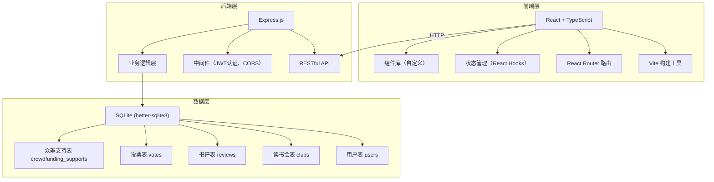
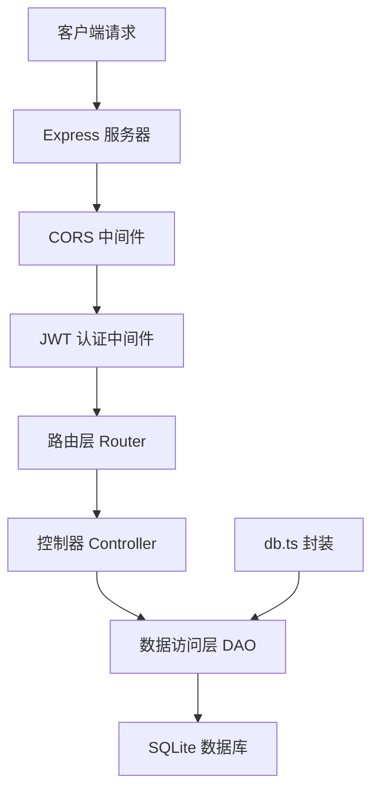
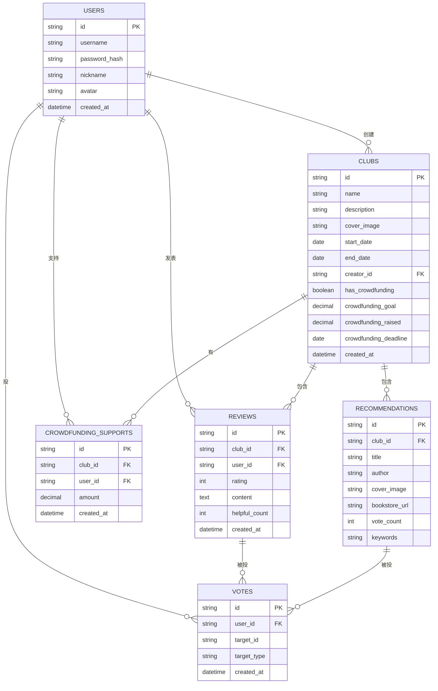

## 1. 架构设计



## 2. 技术描述

- **前端**：React 18 + TypeScript + Vite 5
- **路由**：React Router DOM 6
- **样式**：原生 CSS + CSS Modules（或 Tailwind CSS 备选）
- **状态管理**：React Hooks (useState, useEffect, useContext)
- **后端**：Express 4
- **数据库**：SQLite (better-sqlite3)
- **认证**：JWT (jsonwebtoken) + bcryptjs 密码加密
- **工具库**：uuid（唯一ID）、cors（跨域）

## 3. 路由定义

### 前端路由

| 路由 | 页面 | 说明 |
|------|------|------|
| / | 首页/读书会列表 | 瀑布流展示所有公开读书会 |
| /login | 登录页 | 用户登录 |
| /register | 注册页 | 用户注册 |
| /create | 创建读书会 | 创建新读书会表单 |
| /club/:id | 读书会详情 | 读书会详情页，含书评、推荐书目、众筹 |
| /my-clubs | 我的读书会 | 用户创建/加入的读书会列表 |
| /my-reviews | 我的书评 | 用户发表的书评列表 |

### 后端 API 路由

| 方法 | 路径 | 说明 | 认证 |
|------|------|------|------|
| POST | /api/auth/register | 用户注册 | 否 |
| POST | /api/auth/login | 用户登录 | 否 |
| GET | /api/auth/me | 获取当前用户 | 是 |
| GET | /api/clubs | 获取读书会列表 | 否 |
| GET | /api/clubs/:id | 获取读书会详情 | 否 |
| POST | /api/clubs | 创建读书会 | 是 |
| GET | /api/clubs/:id/reviews | 获取书评列表 | 否 |
| POST | /api/clubs/:id/reviews | 提交书评 | 是 |
| POST | /api/reviews/:id/helpful | 书评"有用"投票 | 是 |
| GET | /api/clubs/:id/recommendations | 获取推荐书目 | 否 |
| POST | /api/recommendations/:id/vote | 推荐书目投票 | 是 |
| GET | /api/clubs/:id/crowdfunding | 获取众筹信息 | 否 |
| POST | /api/clubs/:id/crowdfunding/support | 支持众筹 | 是 |

## 4. API 定义

### 类型定义

```typescript
interface User {
  id: string;
  username: string;
  nickname: string;
  avatar: string;
  createdAt: string;
}

interface Club {
  id: string;
  name: string;
  description: string;
  coverImage: string;
  startDate: string;
  endDate: string;
  creatorId: string;
  creatorNickname: string;
  reviewCount: number;
  memberCount: number;
  hasCrowdfunding: boolean;
  crowdfundingGoal: number;
  crowdfundingRaised: number;
  crowdfundingDeadline: string;
  createdAt: string;
}

interface Review {
  id: string;
  clubId: string;
  userId: string;
  userNickname: string;
  userAvatar: string;
  rating: number;
  content: string;
  helpfulCount: number;
  createdAt: string;
}

interface Recommendation {
  id: string;
  clubId: string;
  title: string;
  author: string;
  coverImage: string;
  bookstoreUrl: string;
  voteCount: number;
  keywords: string[];
}

interface CrowdfundingSupport {
  id: string;
  clubId: string;
  userId: string;
  userNickname: string;
  amount: number;
  createdAt: string;
}
```

### 响应格式

```typescript
interface ApiResponse<T> {
  success: boolean;
  data?: T;
  error?: string;
}
```

## 5. 服务端架构图



## 6. 数据模型

### 6.1 数据模型定义



### 6.2 建表语句

```sql
CREATE TABLE IF NOT EXISTS users (
  id TEXT PRIMARY KEY,
  username TEXT UNIQUE NOT NULL,
  password_hash TEXT NOT NULL,
  nickname TEXT NOT NULL,
  avatar TEXT DEFAULT '',
  created_at DATETIME DEFAULT CURRENT_TIMESTAMP
);

CREATE TABLE IF NOT EXISTS clubs (
  id TEXT PRIMARY KEY,
  name TEXT NOT NULL,
  description TEXT NOT NULL,
  cover_image TEXT DEFAULT '',
  start_date DATE,
  end_date DATE,
  creator_id TEXT NOT NULL,
  has_crowdfunding INTEGER DEFAULT 0,
  crowdfunding_goal REAL DEFAULT 0,
  crowdfunding_raised REAL DEFAULT 0,
  crowdfunding_deadline DATE,
  created_at DATETIME DEFAULT CURRENT_TIMESTAMP,
  FOREIGN KEY (creator_id) REFERENCES users(id)
);

CREATE TABLE IF NOT EXISTS reviews (
  id TEXT PRIMARY KEY,
  club_id TEXT NOT NULL,
  user_id TEXT NOT NULL,
  rating INTEGER NOT NULL,
  content TEXT NOT NULL,
  helpful_count INTEGER DEFAULT 0,
  created_at DATETIME DEFAULT CURRENT_TIMESTAMP,
  FOREIGN KEY (club_id) REFERENCES clubs(id),
  FOREIGN KEY (user_id) REFERENCES users(id)
);

CREATE TABLE IF NOT EXISTS recommendations (
  id TEXT PRIMARY KEY,
  club_id TEXT NOT NULL,
  title TEXT NOT NULL,
  author TEXT DEFAULT '',
  cover_image TEXT DEFAULT '',
  bookstore_url TEXT DEFAULT '',
  vote_count INTEGER DEFAULT 0,
  keywords TEXT DEFAULT '',
  FOREIGN KEY (club_id) REFERENCES clubs(id)
);

CREATE TABLE IF NOT EXISTS votes (
  id TEXT PRIMARY KEY,
  user_id TEXT NOT NULL,
  target_id TEXT NOT NULL,
  target_type TEXT NOT NULL,
  created_at DATETIME DEFAULT CURRENT_TIMESTAMP,
  UNIQUE(user_id, target_id, target_type)
);

CREATE TABLE IF NOT EXISTS crowdfunding_supports (
  id TEXT PRIMARY KEY,
  club_id TEXT NOT NULL,
  user_id TEXT NOT NULL,
  amount REAL NOT NULL,
  created_at DATETIME DEFAULT CURRENT_TIMESTAMP,
  FOREIGN KEY (club_id) REFERENCES clubs(id),
  FOREIGN KEY (user_id) REFERENCES users(id)
);

CREATE TABLE IF NOT EXISTS club_members (
  id TEXT PRIMARY KEY,
  club_id TEXT NOT NULL,
  user_id TEXT NOT NULL,
  joined_at DATETIME DEFAULT CURRENT_TIMESTAMP,
  UNIQUE(club_id, user_id)
);
```

## 7. 项目结构

```
auto84/
├── package.json
├── vite.config.js
├── tsconfig.json
├── index.html
├── src/
│   ├── App.tsx
│   ├── main.tsx
│   ├── index.css
│   ├── components/
│   │   ├── BookClubCard.tsx
│   │   ├── ReviewModal.tsx
│   │   ├── Navbar.tsx
│   │   ├── StarRating.tsx
│   │   ├── ReviewCard.tsx
│   │   ├── RecommendationCard.tsx
│   │   ├── CrowdfundingBar.tsx
│   │   └── MemberAvatars.tsx
│   ├── pages/
│   │   ├── HomePage.tsx
│   │   ├── LoginPage.tsx
│   │   ├── RegisterPage.tsx
│   │   ├── CreateClubPage.tsx
│   │   ├── ClubDetailPage.tsx
│   │   ├── MyClubsPage.tsx
│   │   └── MyReviewsPage.tsx
│   ├── context/
│   │   └── AuthContext.tsx
│   ├── hooks/
│   │   └── useAuth.ts
│   ├── utils/
│   │   ├── api.ts
│   │   └── format.ts
│   ├── types/
│   │   └── index.ts
│   └── server/
│       ├── server.js
│       └── db.ts
```
