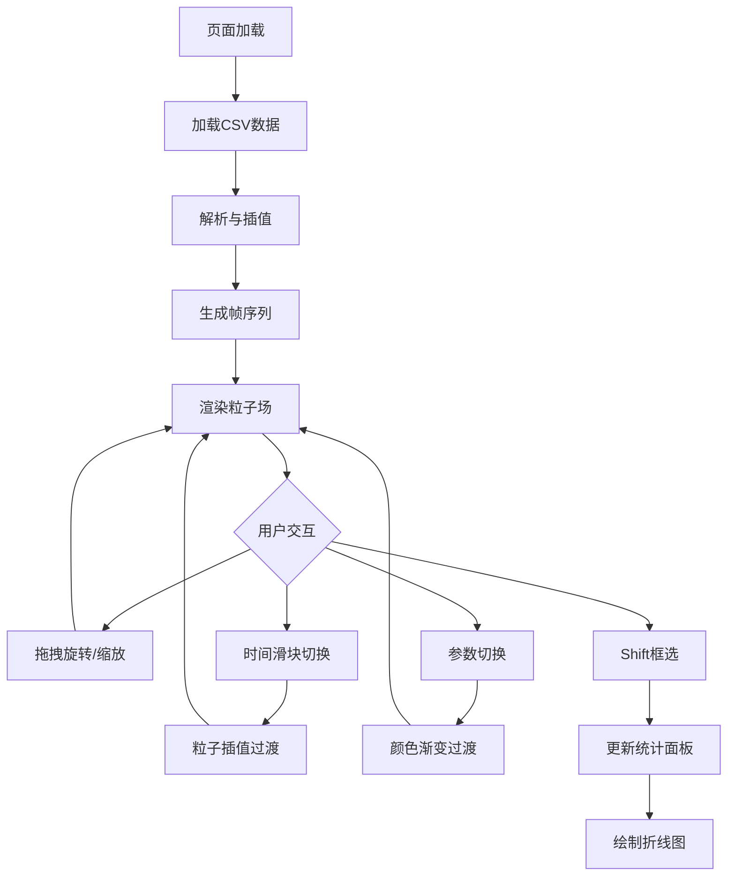

## 1. 产品概述

三维空气质量粒子场实时可视化与时空探索应用，面向环境监测中心研究人员，将海量空气质量传感器数据（PM2.5、CO2、温度、湿度）以三维彩色粒子场形式实时呈现，支持交互式空间旋转/缩放、时间维度滑块探索、区域框选统计，实现数据在空间和时间上的直观变化趋势分析。

- 目标用户：环境监测研究人员、空气质量分析师
- 核心价值：将抽象传感器时序数据转化为直观三维粒子场，支持时空维度的交互探索与区域统计

## 2. 核心功能

### 2.1 功能模块

1. **三维粒子场页面**：全屏三维粒子场渲染、左侧控制面板、左下角统计面板

### 2.2 页面详情

| 页面名称 | 模块名称 | 功能描述 |
|---------|---------|---------|
| 三维粒子场页面 | 数据加载与解析 | 页面加载后自动加载内置CSV示例数据（100个传感器×24小时），解析并线性插值缺失数据，显示蓝紫渐变加载进度条 |
| 三维粒子场页面 | 粒子场渲染 | 在[-10,10]立方体内渲染粒子，粒子颜色映射浓度（青→紫→红渐变），粒子大小0.2-0.8随浓度线性变化，鼠标悬停显示指示光圈 |
| 三维粒子场页面 | 时间维度探索 | 水平时间滑块（圆角矩形渐变滑块，拖拽0.05秒放缩动画），松开后0.2秒内切换帧，0.3秒颜色/位置插值过渡 |
| 三维粒子场页面 | 空间交互与选区 | 鼠标拖拽旋转（阻尼效果）、滚轮缩放（1-50单位）、Shift+拖拽框选（半透明蓝色线框、2px边框、闪烁发光边缘），选区更新统计面板 |
| 三维粒子场页面 | 参数切换 | PM2.5/CO2/温度三个切换按钮，切换时0.5秒颜色渐变过渡 |
| 三维粒子场页面 | 统计曲线 | 选区粒子参数平均值折线图（马卡龙色系），y轴动态范围，0.4秒淡入/0.3秒淡出 |

## 3. 核心流程

用户打开页面 → 自动加载示例CSV数据 → 解析插值生成帧序列 → 渲染三维粒子场 → 用户通过时间滑块切换时刻 → 粒子场平滑过渡 → 用户旋转/缩放视角 → 用户Shift+拖拽框选区域 → 统计面板显示区域折线图 → 用户切换参数 → 粒子颜色渐变过渡

## 4. 用户界面设计

### 4.1 设计风格

- 主题色：暗色背景（#1a1a2e），科技感蓝紫色调
- 控制面板：#16213e半透明背景，毛玻璃效果，蓝紫色外发光阴影
- 按钮：圆角矩形，悬停从#0f3460到#533483渐变过渡
- 滑块：细长槽体，圆角矩形渐变滑块，上方黑色圆角tooltip
- 统一间距和圆角（8px）
- 图表：马卡龙色系折线，白色纤细坐标轴和网格虚线

### 4.2 页面设计概览

| 页面名称 | 模块名称 | UI元素 |
|---------|---------|--------|
| 三维粒子场页面 | 粒子场区域 | 全屏Canvas，暗色背景#1a1a2e，粒子青紫红渐变 |
| 三维粒子场页面 | 控制面板 | 左侧固定280px宽，半透明#16213e，毛玻璃效果，蓝紫外发光阴影，包含时间滑块、颜色映射下拉、参数按钮 |
| 三维粒子场页面 | 时间滑块 | 细长槽体，圆角矩形渐变滑块，两端时间标签，上方浮动tooltip |
| 三维粒子场页面 | 颜色映射下拉 | 圆角边框，支持热力图/彩虹/蓝白红 |
| 三维粒子场页面 | 参数按钮 | 三个圆角矩形按钮（PM2.5/CO2/温度），悬停渐变 |
| 三维粒子场页面 | 统计面板 | 左下角360×200px，深色半透明毛玻璃背景，recharts折线图 |
| 三维粒子场页面 | 加载进度条 | 居中细长矩形，蓝紫线性渐变 |

### 4.3 响应式设计

- 桌面优先，视口<768px时：控制面板宽度100%，统计面板宽度100%并上移
- 粒子场景自适应视口缩放比例

### 4.4 三维场景指引

- 环境：暗色空间背景（#1a1a2e），无HDRI
- 灯光：环境光+微弱点光源营造深度感
- 相机：透视相机，初始距离约30单位，OrbitControls阻尼旋转
- 构图：立方体空间居中，粒子密度分布展示浓度变化
- 交互：旋转阻尼、缩放1-50、Shift框选、鼠标悬停光圈
- 粒子：Points几何体，自定义着色器uniforms（uColorMap/uMinValue/uMaxValue），大小0.2-0.8，颜色青→紫→红
