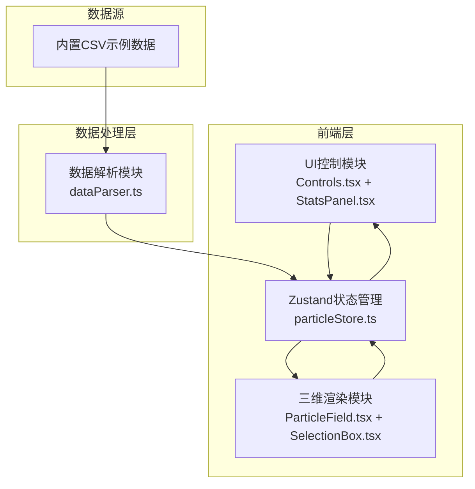

## 1. 架构设计



数据流向：CSV → dataParser（解析插值）→ particleStore（全局状态）→ ParticleField（渲染）/ Controls（UI）/ StatsPanel（统计）→ 用户交互 → particleStore → 各模块更新

## 2. 技术说明

- 前端：React@18 + TypeScript + Three.js + @react-three/fiber + @react-three/drei + Vite
- 状态管理：Zustand
- 颜色映射：d3-scale
- 图表：recharts
- 初始化工具：vite-init（react-ts模板）
- 后端：无
- 数据库：无（内置CSV示例数据）

## 3. 路由定义

| 路由 | 用途 |
|------|------|
| / | 主页面，三维粒子场可视化与交互 |

## 4. 文件结构与调用关系

```
project/
├── package.json                     # 依赖管理，启动脚本
├── vite.config.js                   # Vite构建配置
├── tsconfig.json                    # TypeScript配置
├── index.html                       # 入口HTML
├── src/
│   ├── main.tsx                     # 应用入口
│   ├── App.tsx                      # 根组件
│   ├── stores/
│   │   └── particleStore.ts         # Zustand全局状态：传感器数据、当前帧、粒子位置、颜色阈值、选区
│   ├── parsers/
│   │   └── dataParser.ts            # CSV解析与插值 → 输出帧序列到store
│   ├── renderers/
│   │   ├── ParticleField.tsx        # 粒子系统渲染，读取store帧数据，着色器颜色/大小
│   │   └── SelectionBox.tsx         # 框选渲染，drag事件 → 选区写入store
│   └── components/
│       ├── Controls.tsx             # 时间滑块、颜色映射、参数按钮 → dispatch store
│       └── StatsPanel.tsx           # 统计折线图，读取store选区和帧数据
└── public/
    └── sample-data.csv              # 内置示例传感器数据
```

调用关系：
- `App.tsx` → `ParticleField.tsx`（Canvas渲染）、`SelectionBox.tsx`（选区）、`Controls.tsx`（控制面板）、`StatsPanel.tsx`（统计）
- `App.tsx` → `dataParser.ts`（初始化加载CSV）
- `dataParser.ts` → `particleStore.ts`（写入解析后的帧序列数据）
- `ParticleField.tsx` ← `particleStore.ts`（读取当前帧粒子数据）
- `SelectionBox.tsx` → `particleStore.ts`（写入选区范围）
- `Controls.tsx` → `particleStore.ts`（写入当前帧索引、参数类型、颜色映射）
- `StatsPanel.tsx` ← `particleStore.ts`（读取选区和帧数据）

## 5. 数据模型

### 5.1 帧序列数据结构

```typescript
interface SensorData {
  timestamp: number;
  sensors: {
    id: string;
    x: number;
    y: number;
    z: number;
    pm25: number;
    co2: number;
    temperature: number;
    humidity: number;
  }[];
}

interface FrameData {
  time: number;
  particles: Float32Array; // [x,y,z,value, ...] per particle
}

interface SelectionRange {
  xMin: number; xMax: number;
  yMin: number; yMax: number;
  zMin: number; zMax: number;
}

interface ParticleStore {
  rawData: SensorData[];
  frames: FrameData[];
  currentFrameIndex: number;
  activeParameter: 'pm25' | 'co2' | 'temperature';
  colorMapType: 'thermal' | 'rainbow' | 'blueWhiteRed';
  colorRange: { min: number; max: number };
  selection: SelectionRange | null;
  isLoading: boolean;
  loadingProgress: number;
  setCurrentFrame: (index: number) => void;
  setActiveParameter: (param: string) => void;
  setColorMapType: (type: string) => void;
  setSelection: (range: SelectionRange | null) => void;
  setFrames: (frames: FrameData[]) => void;
  setLoading: (loading: boolean) => void;
  setLoadingProgress: (progress: number) => void;
}
```

### 5.2 CSV数据格式

```csv
timestamp,sensor_id,x,y,z,pm25,co2,temperature,humidity
2024-01-01T00:00:00,S001,-8.2,3.1,5.7,45.2,412.5,22.3,65.1
```
