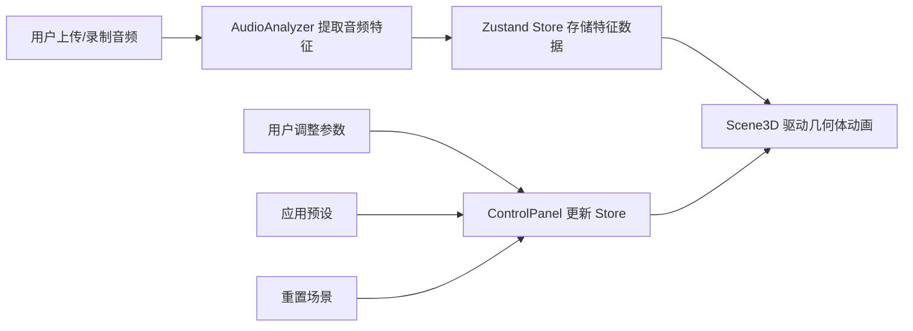

## 1. 产品概述
音乐驱动三维几何雕塑生成器，为数字艺术创作者提供将音乐可视化为律动抽象雕塑的创意工具。通过实时音频分析，驱动三维几何体在空间中产生富有表现力的动画效果。

- **主要用途**：将音乐旋律转化为三维视觉艺术，支持创作者实时调整参数探索无限视觉可能性
- **目标用户**：数字艺术家、音乐可视化爱好者、VJ、新媒体创作者
- **核心价值**：打通听觉与视觉的创作壁垒，提供直观且富有表现力的音频可视化创作体验

## 2. 核心特性

### 2.1 功能模块

1. **音频输入模块**：支持上传音频文件和麦克风实时录音
2. **三维场景模块**：包含 icosahedron、torus、octahedron 三种几何体的动画雕塑
3. **参数控制面板**：精确控制每个几何体的视觉属性和音频响应
4. **预设系统**：提供柔和/激烈/随机三组预设，一键切换风格
5. **波形可视化**：实时渲染音频波形，带渐变色和光晕效果

### 2.2 页面详情

| 页面名称 | 模块名称 | 功能描述 |
|-----------|-------------|---------------------|
| 主页 | 3D 场景 | 全屏 Three.js 渲染的几何雕塑动画，支持鼠标拖拽旋转视角、滚轮缩放 |
| 主页 | 控制面板 | 右侧悬浮的毛玻璃面板，包含所有几何体参数调节控件 |
| 主页 | 音轨预览 | 底部悬浮的波形可视化区域，显示当前播放音频的波形 |
| 主页 | 音频输入 | 顶部文件上传和麦克风录音按钮 |

## 3. 核心流程

**用户操作流程**：
1. 用户进入页面，看到默认动画的几何雕塑
2. 用户上传 MP3/WAV 文件或启动麦克风录音
3. 音频开始播放，底部显示渐变色波形
4. 几何雕塑根据音乐节奏和频率实时变换形态
5. 用户通过右侧面板调整每个几何体的参数
6. 用户可一键应用预设风格或重置到初始状态

## 4. 用户界面设计

### 4.1 设计风格

- **主色调**：深空背景 `#0A0A1A`，营造沉浸式宇宙感
- **强调色**：紫色到青色的渐变光谱 `#8B5CF6 → #22D3EE`，用于波形和几何体发光
- **辅助色**：半透明白色毛玻璃效果 `rgba(255,255,255,0.1)`，用于控制面板
- **字体**：使用 Space Grotesk 作为显示字体，配合 Inter 作为正文字体，营造科技未来感
- **按钮风格**：圆角矩形，半透明背景，hover 时轻微放大并增加发光效果
- **动效**：所有交互元素带有 0.2 秒弹性过渡动画，预设切换带有 0.5 秒缓动
- **视觉层次**：3D 场景作为底层，控制面板和波形预览作为悬浮层，通过半透明和模糊效果营造深度

### 4.2 页面设计概述

| 页面名称 | 模块名称 | UI 元素 |
|-----------|-------------|-------------|
| 主页 | 3D 场景 | Three.js Canvas，深空背景，发光几何体，Bloom 后期效果，相机环绕旋转 |
| 主页 | 控制面板 | 毛玻璃卡片，分段式参数分组，滑块控件，开关按钮，预设选择器，重置按钮 |
| 主页 | 音轨预览 | Canvas 波形图，紫青渐变填充，峰值高光，播放进度指示 |
| 主页 | 音频输入 | 文件上传按钮，录音按钮，播放/暂停控制 |

### 4.3 响应式设计

- **桌面端**（≥768px）：控制面板固定于右侧，波形预览固定于底部
- **移动端**（<768px）：控制面板和波形预览折叠为底部抽屉，支持拖拽展开/收起，动画缓动时间 0.3 秒
- **触控优化**：所有可交互元素最小尺寸 44px，支持触摸滑动调节参数

### 4.4 3D 场景设计

- **环境**：深空背景 `#0A0A1A`，无外部 HDRI，使用自发光材质营造氛围
- **光照**：环境光 + 点光源组合，点光源随音乐强度变化亮度和颜色
- **相机**：透视相机，初始距离 8，俯仰角限制 15°-75°，始终朝向原点
- **构图**：三个几何体分布于以原点为中心的椭圆轨道上，形成平衡的三角构图
- **交互**：鼠标拖拽旋转视角，滚轮缩放，阻尼效果提升手感
- **后期**：Bloom 发光效果（threshold 0.2, strength 1.5, radius 0.5），营造 Blender 风格的辉光
- **性能**：使用 LOD 技术，每物体最多 5000 三角面，帧率保持 45fps 以上

## 5. 非功能需求

### 5.1 性能约束
- 拖动参数滑块时帧率 ≥ 45fps
- 音频分析更新频率 ≤ 60 次/秒
- 单个几何体面数 ≤ 5000 三角面
- 音频文件最长支持 60 秒

### 5.2 交互约束
- 相机俯仰角限制：15° - 75°
- 参数平滑时间：0.1 - 2.0 秒
- 椭圆离心率范围：0 - 0.9
- 预设切换缓动时间：0.5 秒
