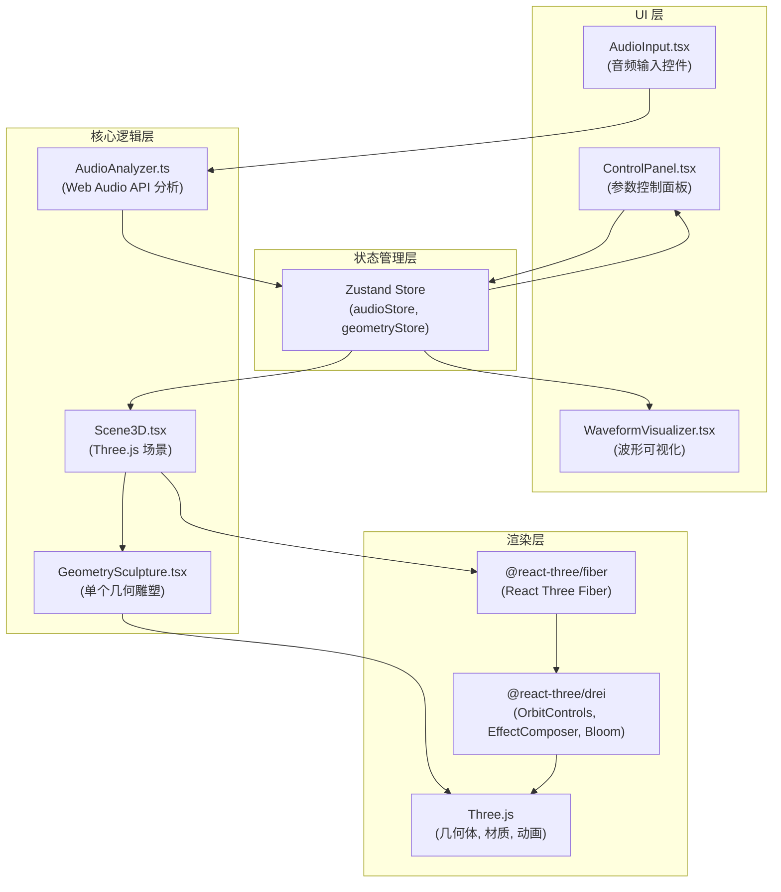
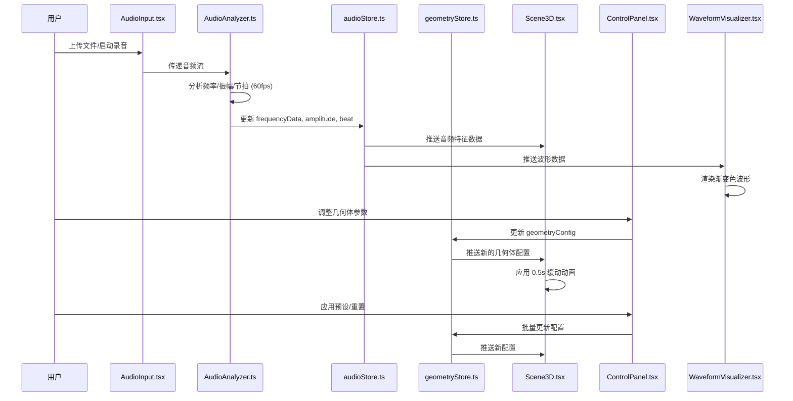

## 1. 架构设计



## 2. 技术栈描述

| 类别 | 技术选型 | 版本 | 用途 |
|------|---------|------|------|
| 前端框架 | React | 18.x | UI 组件框架 |
| 渲染引擎 | Three.js | ^0.160.0 | 3D 图形渲染 |
| React 绑定 | @react-three/fiber | ^8.15.0 | React Three.js 集成 |
| 辅助组件 | @react-three/drei | ^9.92.0 | 3D 场景辅助组件 |
| 状态管理 | zustand | ^4.4.0 | 全局状态管理 |
| 构建工具 | Vite | ^5.0.0 | 开发和构建 |
| 语言 | TypeScript | ^5.3.0 | 类型安全 |
| 样式方案 | TailwindCSS | ^3.4.0 | 原子化 CSS |
| 图标库 | lucide-react | ^0.294.0 | 图标组件 |

## 3. 目录结构

```
src/
├── main.tsx                      # React 根入口
├── index.css                     # 全局样式 + Tailwind
├── types/
│   └── index.ts                  # 全局类型定义
├── store/
│   ├── audioStore.ts             # 音频相关状态
│   └── geometryStore.ts          # 几何体参数状态
├── audio/
│   ├── AudioAnalyzer.ts          # Web Audio API 音频分析
│   └── AudioContextManager.ts    # 音频上下文管理
├── scene/
│   ├── Scene3D.tsx               # 3D 场景主组件
│   ├── GeometrySculpture.tsx     # 单个几何雕塑组件
│   └── SceneLights.tsx           # 场景光照组件
├── ui/
│   ├── ControlPanel.tsx          # 参数控制面板
│   ├── WaveformVisualizer.tsx    # 波形可视化
│   ├── AudioInput.tsx            # 音频输入控件
│   ├── PresetSelector.tsx        # 预设选择器
│   ├── GeometryControls.tsx      # 单个几何体参数控件
│   └── MobileDrawer.tsx          # 移动端抽屉组件
└── utils/
    ├── animation.ts              # 动画缓动函数
    ├── audio.ts                  # 音频处理工具
    └── constants.ts              # 常量配置
```

## 4. 模块调用关系

### 4.1 数据流图



### 4.2 关键模块职责

| 模块 | 职责 | 输入 | 输出 |
|------|------|------|------|
| AudioAnalyzer.ts | Web Audio API 封装，提取音频特征 | 音频文件路径 / 麦克风流 | frequencyData[], amplitude, bass, mid, treble, beatDetected |
| audioStore.ts | 音频特征数据状态管理 | 分析器输出数据 | 供场景和 UI 消费的响应式状态 |
| geometryStore.ts | 几何体参数状态管理 | 用户参数调整, 预设应用 | 每个几何体的完整配置 |
| Scene3D.tsx | Three.js 场景初始化与渲染 | 音频特征 + 几何体配置 | 3D 场景动画 |
| GeometrySculpture.tsx | 单个几何体动画逻辑 | 音频频段数据 + 自身配置 | 几何体位置/旋转/缩放/颜色 |
| ControlPanel.tsx | 参数调节 UI | store 状态 | 用户交互事件 |
| WaveformVisualizer.tsx | 波形渲染 | 时域音频数据 | Canvas 绘制的渐变色波形 |

## 5. 数据模型定义

### 5.1 几何体配置类型

```typescript
export type GeometryType = 'icosahedron' | 'torus' | 'octahedron';
export type FrequencyBand = 'bass' | 'mid' | 'treble';
export type MaterialMode = 'solid' | 'wireframe';
export type PresetType = 'gentle' | 'intense' | 'random';

export interface GeometryConfig {
  id: string;
  type: GeometryType;
  enabled: boolean;
  baseSize: number;
  baseColor: string;
  materialMode: MaterialMode;
  rotationSpeed: { x: number; y: number; z: number };
  orbitRadius: number;
  orbitSpeed: number;
  orbitEccentricity: number;
  orbitOffset: number;
  frequencyBand: FrequencyBand;
  responseSensitivity: number;
  responseSmoothness: number;
  zFloatAmplitude: number;
  scaleMultiplier: number;
  colorShiftIntensity: number;
}

export interface GeometryState extends GeometryConfig {
  currentPosition: { x: number; y: number; z: number };
  currentRotation: { x: number; y: number; z: number };
  currentScale: number;
  currentColor: string;
}
```

### 5.2 音频数据类型

```typescript
export interface AudioFeatures {
  isPlaying: boolean;
  duration: number;
  currentTime: number;
  amplitude: number;
  bass: number;
  mid: number;
  treble: number;
  frequencyData: Uint8Array;
  timeDomainData: Uint8Array;
  beatDetected: boolean;
  bpm: number;
}
```

### 5.3 预设配置

```typescript
export interface Preset {
  name: string;
  type: PresetType;
  geometries: Partial<GeometryConfig>[];
}

export const PRESETS: Record<PresetType, Preset> = {
  gentle: {
    name: '柔和',
    type: 'gentle',
    geometries: [
      { responseSensitivity: 0.5, rotationSpeed: { x: 0.3, y: 0.5, z: 0.2 }, scaleMultiplier: 1.2 },
      { responseSensitivity: 0.6, rotationSpeed: { x: 0.4, y: 0.3, z: 0.4 }, scaleMultiplier: 1.3 },
      { responseSensitivity: 0.4, rotationSpeed: { x: 0.2, y: 0.6, z: 0.3 }, scaleMultiplier: 1.1 },
    ],
  },
  intense: {
    name: '激烈',
    type: 'intense',
    geometries: [
      { responseSensitivity: 1.8, rotationSpeed: { x: 2.0, y: 2.5, z: 1.5 }, scaleMultiplier: 2.0 },
      { responseSensitivity: 2.0, rotationSpeed: { x: 2.5, y: 1.8, z: 2.2 }, scaleMultiplier: 2.2 },
      { responseSensitivity: 1.6, rotationSpeed: { x: 1.5, y: 2.8, z: 1.8 }, scaleMultiplier: 1.9 },
    ],
  },
  random: {
    name: '随机',
    type: 'random',
    geometries: [
      { responseSensitivity: Math.random() * 1.5 + 0.5, rotationSpeed: { x: Math.random() * 2, y: Math.random() * 2, z: Math.random() * 2 } },
      { responseSensitivity: Math.random() * 1.5 + 0.5, rotationSpeed: { x: Math.random() * 2, y: Math.random() * 2, z: Math.random() * 2 } },
      { responseSensitivity: Math.random() * 1.5 + 0.5, rotationSpeed: { x: Math.random() * 2, y: Math.random() * 2, z: Math.random() * 2 } },
    ],
  },
};
```

## 6. 核心实现方案

### 6.1 音频分析实现

- 使用 `AnalyserNode` 获取频域和时域数据
- 频段划分：Bass (20-250Hz), Mid (250-2000Hz), Treble (2000-20000Hz)
- 节拍检测：通过计算低频段能量突变检测节拍
- 数据节流：使用 `requestAnimationFrame` 控制更新频率 ≤ 60fps

### 6.2 几何体动画实现

- 使用 `useFrame` hook 在每帧更新几何体状态
- 椭圆轨道公式：`x = radius * cos(angle)`, `z = radius * sin(angle) * (1 - eccentricity)`
- 音频响应插值：使用指数平滑 `current = current + (target - current) * (1 / (smoothness * 60))`
- LOD 实现：根据相机距离切换不同细节级别的几何体

### 6.3 状态管理实现

- `audioStore`: 单例 store，存储实时音频特征数据
- `geometryStore`: 存储三个几何体的配置参数，支持部分更新和批量更新
- 使用 `subscribe` 方法监听状态变化，触发 UI 和场景更新

### 6.4 性能优化

- 几何体使用 `BufferGeometry` 而非 `Geometry`
- 共享材质实例，减少状态切换
- 使用 `InstancedMesh` 管理多个几何体（如果需要）
- 音频分析使用 `fftSize = 256` 平衡精度和性能
- 参数变化使用缓动动画，避免突变导致的重绘

## 7. 关键文件清单

| 文件路径 | 描述 | 行数预估 |
|---------|------|---------|
| [src/main.tsx](file:///C:/Users/Administrator/Desktop/P/tasks/auto88/src/main.tsx) | 应用入口 | 50 |
| [src/audio/AudioAnalyzer.ts](file:///C:/Users/Administrator/Desktop/P/tasks/auto88/src/audio/AudioAnalyzer.ts) | 音频分析核心 | 200 |
| [src/store/audioStore.ts](file:///C:/Users/Administrator/Desktop/P/tasks/auto88/src/store/audioStore.ts) | 音频状态管理 | 80 |
| [src/store/geometryStore.ts](file:///C:/Users/Administrator/Desktop/P/tasks/auto88/src/store/geometryStore.ts) | 几何体状态管理 | 150 |
| [src/scene/Scene3D.tsx](file:///C:/Users/Administrator/Desktop/P/tasks/auto88/src/scene/Scene3D.tsx) | 3D 场景主组件 | 180 |
| [src/scene/GeometrySculpture.tsx](file:///C:/Users/Administrator/Desktop/P/tasks/auto88/src/scene/GeometrySculpture.tsx) | 几何雕塑组件 | 250 |
| [src/ui/ControlPanel.tsx](file:///C:/Users/Administrator/Desktop/P/tasks/auto88/src/ui/ControlPanel.tsx) | 控制面板 | 200 |
| [src/ui/WaveformVisualizer.tsx](file:///C:/Users/Administrator/Desktop/P/tasks/auto88/src/ui/WaveformVisualizer.tsx) | 波形可视化 | 150 |
| [src/ui/AudioInput.tsx](file:///C:/Users/Administrator/Desktop/P/tasks/auto88/src/ui/AudioInput.tsx) | 音频输入控件 | 120 |
| [src/types/index.ts](file:///C:/Users/Administrator/Desktop/P/tasks/auto88/src/types/index.ts) | 类型定义 | 100 |
