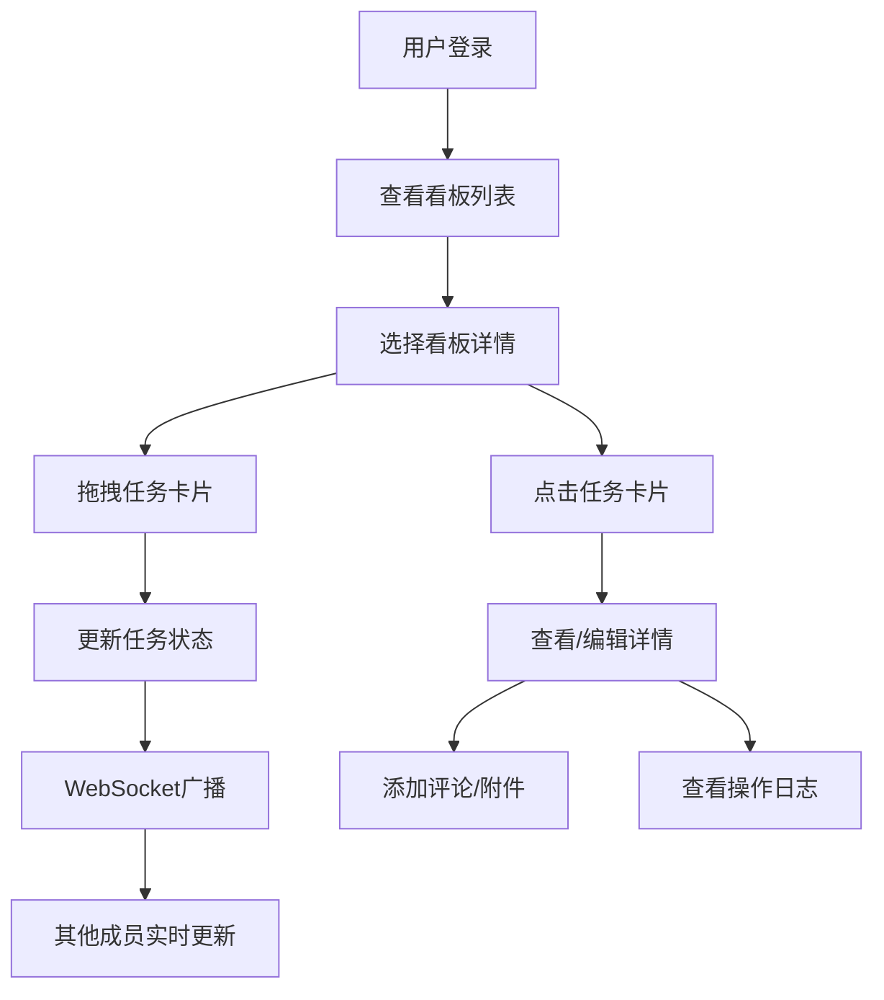

## 1. 产品概述

团队任务进度可视化看板应用，解决远程团队协作中任务状态不透明、进度更新滞后的问题。通过直观的看板视图、拖拽式任务管理、实时协作通知，帮助团队成员随时了解项目进展。

- 目标用户：远程协作的产品研发团队、项目管理团队
- 核心价值：提升团队协作效率，实时同步任务状态，降低沟通成本

## 2. 核心功能

### 2.1 用户角色

| 角色 | 登录方式 | 核心权限 |
|------|----------|----------|
| 团队管理员 | 账号登录 | 创建/编辑项目看板、管理团队成员、自定义泳道 |
| 普通成员 | 账号登录 | 查看看板、拖拽任务、编辑任务详情、添加评论 |

### 2.2 功能模块

1. **登录页面**：用户登录、团队选择
2. **看板列表页**：展示所属团队的所有项目看板
3. **看板详情页**：泳道视图、任务卡片、筛选功能
4. **任务详情模态框**：任务信息、评论、附件、操作日志
5. **团队管理**：成员管理、看板管理、泳道配置

### 2.3 页面详情

| 页面名称 | 模块名称 | 功能描述 |
|---------|---------|---------|
| 登录页面 | 登录表单 | 用户名/密码登录，记住登录状态 |
| 看板列表页 | 看板卡片列表 | 展示所有可访问的项目看板，点击进入详情 |
| 看板详情页 | 泳道区域 | 多列泳道展示，任务卡片可拖拽交换状态 |
| 看板详情页 | 筛选栏 | 按负责人、优先级、截止日期筛选任务 |
| 任务详情模态框 | 任务信息 | 展示/编辑任务标题、描述、优先级、截止日期 |
| 任务详情模态框 | 评论列表 | 查看历史评论，添加新评论 |
| 任务详情模态框 | 操作日志 | 按时间倒序展示任务变更历史 |
| 团队管理面板 | 成员管理 | 添加/移除团队成员 |
| 团队管理面板 | 看板管理 | 创建/编辑看板，自定义泳道名称和顺序 |

## 3. 核心流程

用户登录系统后，查看所属团队的项目看板列表。选择一个看板进入详情页，通过拖拽任务卡片到不同泳道更新任务状态。点击任务卡片查看详情，可编辑任务信息、添加评论、查看操作日志。管理员可管理团队成员和看板配置，所有变更通过WebSocket实时推送给其他成员。

## 4. 用户界面设计

### 4.1 设计风格

- 主色调：深灰蓝 #2c3e50
- 强调色：淡薄荷绿 #a8e6cf、浅珊瑚色 #ff8a80
- 背景色：极浅灰 #f5f7fa
- 卡片风格：圆角 8px，悬浮时阴影加深并微上移 4px
- 毛玻璃效果：泳道区域使用 backdrop-filter: blur(8px)
- 动画曲线：cubic-bezier(0.25, 0.46, 0.45, 0.94)
- 优先级标识：高/中/低对应红/黄/绿色小圆点

### 4.2 页面设计概览

| 页面名称 | 模块名称 | UI元素 |
|---------|---------|--------|
| 看板详情页 | 顶部导航栏 | 深灰蓝背景，团队名称、用户头像、通知图标 |
| 看板详情页 | 筛选栏 | 负责人下拉、优先级筛选、日期筛选 |
| 看板详情页 | 泳道区域 | 毛玻璃背景，多列并排，任务卡片纵向排列 |
| 看板详情页 | 任务卡片 | 白色背景，标题、负责人头像、优先级圆点、截止日期 |
| 任务模态框 | 模态框容器 | 居中弹出，淡入动画，阴影加深 |
| 任务模态框 | 标签页 | 详情、评论、操作日志三个标签切换 |
| Toast通知 | 右上角弹出 | 柔和提示音，3秒自动淡出 |

### 4.3 响应式设计

- 大屏（>1200px）：三列泳道并排
- 中屏（768-1200px）：两列泳道
- 小屏（<768px）：单列纵向堆叠，底部导航栏固定悬浮
- 拖拽操作帧率稳定在 55fps 以上
- 看板数据初次加载不超过 1.5 秒
- WebSocket增量更新延迟低于 300ms

### 4.4 交互动效

- 任务拖拽：立体浮动阴影、弹性跟随动画
- 筛选切换：淡入淡出过渡动画
- 卡片悬浮：阴影加深、微上移 4px
- Toast通知：淡入弹出，3秒后淡出消失
- 模态框：缩放淡入效果
