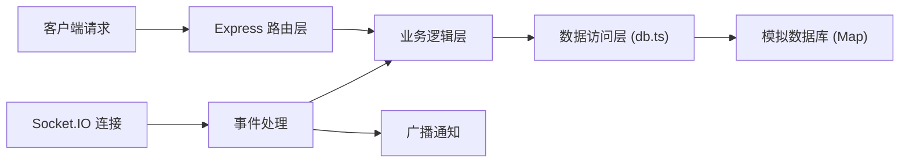
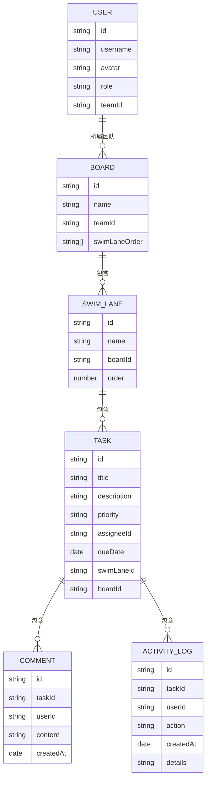

## 1. 架构设计

```mermaid
graph TB
    subgraph "前端 (React + TypeScript)"
        A["App.tsx (路由与状态管理]
        B["BoardView.tsx 看板视图]
        C["TaskModal.tsx 任务模态框]
        D["Socket.IO 客户端"]
        E["REST API 调用]
    end
    
    subgraph "后端 (Express + Socket.IO)"
        F["Express REST API"]
        G["Socket.IO 服务端"]
        H["模拟数据库 (Map)"]
    end
    
    D <--> G
    E <--> F
    F <--> H
    G <--> H
```

## 2. 技术说明

- 前端：React 18 + TypeScript + Vite
- 后端：Express 4 + Socket.IO 4
- 状态管理：React useState/useEffect + Socket.IO 实时同步
- 拖拽库：react-beautiful-dnd
- 路由：react-router-dom
- 构建工具：Vite
- 开发模式：前后端分离，Vite 代理到后端端口 3001

## 3. 路由定义

| 路由 | 用途 |
|------|------|
| /login | 登录页面 |
| /boards | 看板列表页 |
| /boards/:boardId | 看板详情页 |
| /admin | 团队管理面板 |

## 4. API 定义

### 4.1 用户认证

```typescript
// POST /api/auth/login
interface LoginRequest {
  username: string;
  password: string;
}

interface LoginResponse {
  user: User;
  token: string;
}
```

### 4.2 看板数据

```typescript
// GET /api/boards - 获取用户所属团队的所有看板
// GET /api/boards/:id - 获取单个看板详情
// POST /api/boards - 创建新看板
// PUT /api/boards/:id - 更新看板信息
// DELETE /api/boards/:id - 删除看板
```

### 4.3 任务管理

```typescript
// PUT /api/tasks/:id - 更新任务
// POST /api/tasks/:id/comments - 添加评论
```

### 4.4 团队管理

```typescript
// GET /api/team/members - 获取团队成员
// POST /api/team/members - 添加成员
// DELETE /api/team/members/:id - 移除成员
```

## 5. 服务端架构图



## 6. 数据模型

### 6.1 数据模型定义



### 6.2 类型定义

```typescript
interface User {
  id: string;
  username: string;
  avatar: string;
  role: 'admin' | 'member';
  teamId: string;
}

interface Board {
  id: string;
  name: string;
  teamId: string;
  swimLanes: SwimLane[];
}

interface SwimLane {
  id: string;
  name: string;
  boardId: string;
  order: number;
}

interface Task {
  id: string;
  title: string;
  description: string;
  priority: 'high' | 'medium' | 'low';
  assigneeId: string;
  dueDate: string;
  swimLaneId: string;
  boardId: string;
  createdAt: string;
}

interface Comment {
  id: string;
  taskId: string;
  userId: string;
  content: string;
  createdAt: string;
}

interface ActivityLog {
  id: string;
  taskId: string;
  userId: string;
  action: string;
  details: string;
  createdAt: string;
}
```

## 7. WebSocket 事件

| 事件名 | 方向 | 说明 |
|--------|------|------|
| task:updated | 服务端→客户端 | 任务状态/内容更新 |
| task:created | 服务端→客户端 | 新任务创建 |
| task:deleted | 服务端→客户端 | 任务删除 |
| board:updated | 服务端→客户端 | 看板配置更新 |
| member:added | 服务端→客户端 | 成员添加 |
| member:removed | 服务端→客户端 | 成员移除 |
| notification | 服务端→客户端 | 通用通知 |
