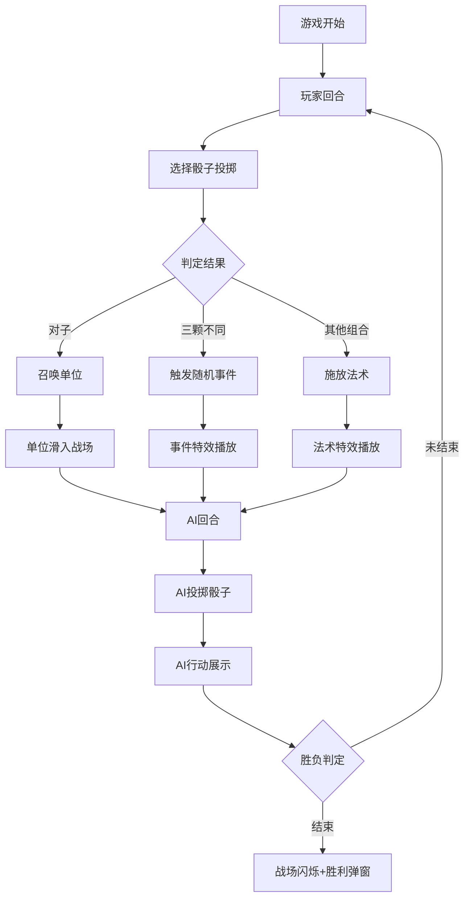

## 1. 产品概述

像素风命运骰子战术对决应用——玩家在六边形网格战场上通过投掷不同面数的命运骰子来召唤单位、施放法术或触发随机事件，在回合制中与AI对手策略博弈。目标用户为休闲策略游戏爱好者，核心价值在于骰子随机性与战术深度的结合，带来每局不同的体验。

## 2. 核心功能

### 2.1 用户角色

| 角色 | 说明 |
|------|------|
| 玩家 | 手动选择骰子投掷，决定召唤/法术策略 |
| AI对手 | 每回合自动投掷骰子，以策略算法选择行动 |

### 2.2 功能模块

1. **战场页面**：六边形网格战场、单位显示、法术特效、基地标记
2. **骰子面板**：五颗骰子投掷、动画展示、结果判定
3. **游戏引擎**：回合管理、胜负判定、事件触发
4. **AI控制器**：自动决策、行动执行

### 2.3 页面详情

| 页面/组件 | 模块名称 | 功能描述 |
|-----------|----------|----------|
| 战场页面 | 六边形网格 | 8x6六边形网格，深墨绿背景，浅灰网格线，基地格特殊标记 |
| 战场页面 | 单位渲染 | 剑士/法师/弓箭手像素图标，移动动画，伤害数字上浮 |
| 战场页面 | 法术特效 | 雷击亮黄光环、治疗翠绿光环、传送紫罗兰光环 |
| 骰子面板 | 骰子按钮 | 五颗骰子（D4/D6/D8/D10/D12），磨砂玻璃圆形按钮，颜色渐变 |
| 骰子面板 | 投掷动画 | 0.8秒旋转减速动画，微光粒子飘散效果 |
| 游戏引擎 | 回合管理 | 玩家回合→AI回合交替，胜负判定 |
| 游戏引擎 | 骰子判定 | 对子召唤单位、不同点数组合触发法术/事件 |
| AI控制器 | 决策模块 | 根据棋盘状态选择最优骰子组合和目标 |
| 胜利弹窗 | 结算界面 | 战场闪烁三次，像素风胜利弹窗 |

## 3. 核心流程

玩家进入游戏→看到战场和骰子面板→玩家回合：选择骰子投掷→判定结果（召唤单位/施放法术/触发事件）→单位滑入战场或法术特效播放→AI回合：自动投掷→AI行动展示（0.5秒延迟+红色高亮）→循环直到胜负判定→战场闪烁+胜利弹窗

## 4. 用户界面设计

### 4.1 设计风格

- **主色**：#2a1a0e 暖棕
- **辅色**：#4a7c59 森林绿
- **强调色**：#d4a017 琥珀金
- **战场背景**：#1a2a1a 深墨绿
- **网格线条**：#4a6a4a 浅灰绿
- **按钮**：硬边缘、无圆角、像素风格
- **字体**：'Courier New', monospace 等宽像素字体
- **单位图标**：8x8像素网格CSS绘制
- **骰子按钮**：半透明磨砂玻璃质感，50px直径圆形
- **骰子颜色**：D4-红橙、D6-黄、D8-绿、D10-蓝、D12-紫

### 4.2 页面设计概览

| 页面 | 模块 | UI元素 |
|------|------|--------|
| 战场 | 六边形网格 | 深墨绿背景，浅灰绿网格线，基地格金色标记 |
| 战场 | 单位图标 | 8x8像素剑士(银)/法师(蓝)/弓箭手(绿) |
| 战场 | 法术特效 | 圆形扩散光环，0.5秒，颜色随法术变化 |
| 骰子面板 | 骰子按钮 | 磨砂玻璃圆形按钮，颜色渐变，点击旋转0.8秒 |
| 骰子面板 | 粒子效果 | 旋转时微光粒子飘散 |
| 胜利弹窗 | 结算界面 | 像素边框，颗粒感背景，闪烁动画 |

### 4.3 响应式设计

- 桌面优先，移动端自适应（最小宽度320px）
- 战场和骰子面板按屏幕尺寸等比缩放
- 触控优化：骰子按钮点击区域适当放大

### 4.4 动画规格

- 骰子旋转：0.8秒，减速停止
- 单位滑入：从战场边缘滑入目标格，0.3秒闪烁
- 法术光环：从中心向外扩散，0.5秒
- 伤害数字：从目标头顶上浮并消失
- 胜利闪烁：3次，每次0.3秒，背景变对应玩家颜色
- AI行动：0.5秒延迟展示，红色半透明高亮
