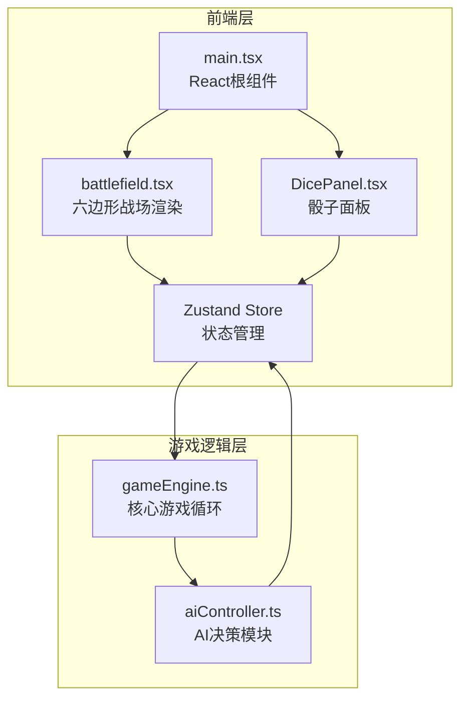

## 1. 架构设计



## 2. 技术选型

- **前端框架**：React 18 + TypeScript
- **构建工具**：Vite
- **状态管理**：Zustand
- **样式方案**：CSS（像素风全局样式 + CSS动画）
- **初始化工具**：vite-init (react-ts模板)
- **后端**：无（纯前端应用）
- **数据库**：无

## 3. 路由定义

| 路由 | 用途 |
|------|------|
| / | 游戏主页面（战场+骰子面板） |

## 4. 状态管理设计（Zustand Store）

```typescript
interface GameState {
  phase: 'player' | 'ai' | 'gameOver'
  turn: number
  playerUnits: Unit[]
  aiUnits: Unit[]
  diceResults: DiceResult[]
  availableDice: DiceType[]
  selectedDice: DiceType[]
  isRolling: boolean
  battlefield: HexCell[][]
  winner: 'player' | 'ai' | null
  animations: Animation[]
}

interface Unit {
  id: string
  type: 'swordsman' | 'mage' | 'archer'
  hp: number
  maxHp: number
  attack: number
  position: { row: number; col: number }
  owner: 'player' | 'ai'
}

interface HexCell {
  row: number
  col: number
  unit: Unit | null
  isBase: boolean
  baseOwner: 'player' | 'ai' | null
  terrain: 'normal' | 'blocked'
}

interface DiceResult {
  type: DiceType
  value: number
  rolling: boolean
}

type DiceType = 4 | 6 | 8 | 10 | 12
```

## 5. 核心模块职责

### 5.1 gameEngine.ts
- 回合管理（玩家/AI交替）
- 骰子投掷逻辑（随机数生成+动画时序）
- 单位召唤规则（对子判定→单位类型映射）
- 法术触发引擎（三颗不同→随机事件选择）
- 胜负判定（全灭/基地占领）

### 5.2 aiController.ts
- 评估当前棋盘态势
- 选择最优骰子组合策略
- 决定召唤/法术目标
- 输出行动指令

### 5.3 battlefield.tsx
- 六边形网格CSS渲染
- 单位图标CSS像素艺术
- 法术特效动画
- 伤害数字上浮
- 胜利闪烁效果

### 5.4 DicePanel.tsx
- 骰子按钮渲染（磨砂玻璃+颜色渐变）
- 投掷旋转动画
- 微光粒子效果
- 结果显示

## 6. 文件结构

```
├── package.json
├── index.html
├── tsconfig.json
├── vite.config.js
└── src/
    ├── main.tsx          # React根组件
    ├── gameEngine.ts     # 核心游戏引擎
    ├── battlefield.tsx   # 战场渲染组件
    ├── aiController.ts   # AI决策模块
    ├── DicePanel.tsx     # 骰子面板组件
    └── styles.css        # 像素风全局样式
```
