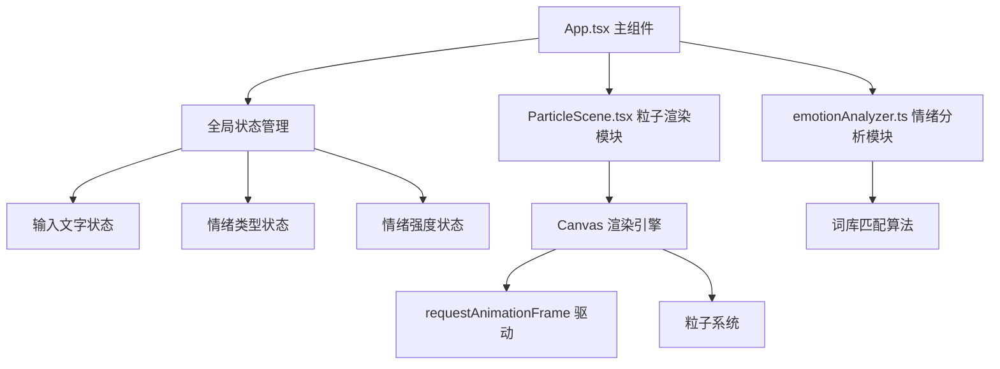

## 1. 架构设计



## 2. 技术描述

- **前端框架**：React 18 + TypeScript
- **构建工具**：Vite
- **状态管理**：React useState/useEffect Hooks
- **渲染技术**：HTML5 Canvas API + requestAnimationFrame
- **动画实现**：CSS Transitions + Canvas 粒子系统
- **依赖库**：react, react-dom, vite, @vitejs/plugin-react, typescript, @types/react, @types/react-dom

## 3. 文件结构

| 文件路径 | 用途 |
|---------|------|
| package.json | 项目依赖与脚本配置 |
| index.html | 入口HTML页面 |
| tsconfig.json | TypeScript配置（严格模式，ES2020） |
| vite.config.js | Vite配置（React插件） |
| src/App.tsx | 主组件，全局状态管理，模块协调 |
| src/emotionAnalyzer.ts | 情绪分析模块，词库匹配算法 |
| src/ParticleScene.tsx | 粒子动画渲染模块，Canvas绘制 |

## 4. 核心模块定义

### 4.1 情绪分析模块

```typescript
type EmotionType = 'joy' | 'sadness' | 'anger' | 'calm' | 'anxiety';

interface EmotionResult {
  type: EmotionType;
  score: number;
}

function analyzeEmotion(text: string): EmotionResult;
```

### 4.2 粒子系统接口

```typescript
interface Particle {
  x: number;
  y: number;
  vx: number;
  vy: number;
  size: number;
  opacity: number;
  life: number;
}

interface ParticleSceneProps {
  emotion: EmotionType | null;
  intensity: number;
  transitioning: boolean;
}
```

## 5. 性能优化策略

- 粒子数量上限控制（200个）
- requestAnimationFrame 帧率控制（30FPS+）
- 粒子对象池复用
- Canvas 分层渲染
- 过渡动画 GPU 加速
