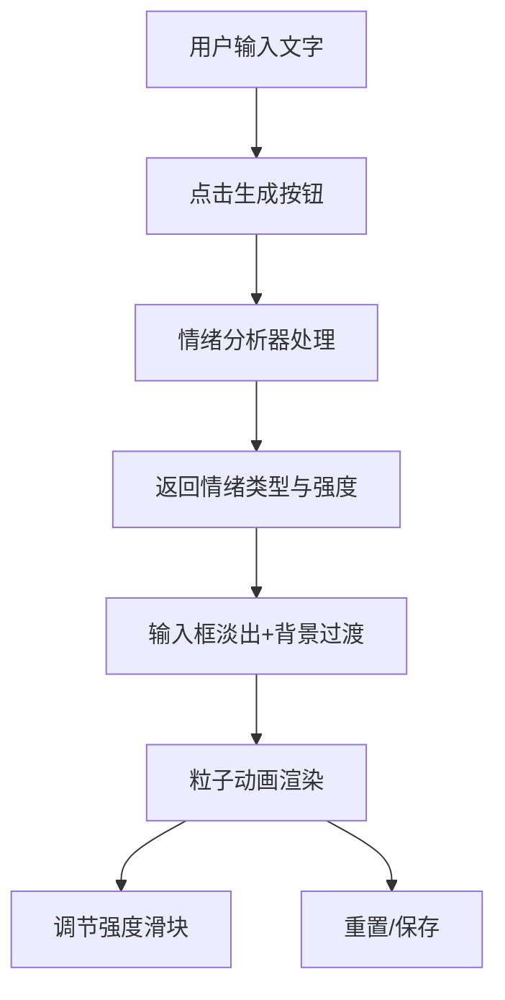

## 1. 产品概述

基于文本情绪分析的动态视觉海报生成器，用户输入文字后自动分析情绪并生成对应风格的动态粒子动画海报。

- 核心价值：将文字情感转化为可视化的动态艺术作品，让用户能够直观感受文字背后的情绪色彩
- 目标用户：创意设计师、诗歌爱好者、社交媒体用户、任何希望将文字情感可视化的人群

## 2. 核心功能

### 2.1 功能模块

1. **文字输入区**：波纹动画输入框、生成按钮
2. **情绪分析引擎**：基于词库匹配的五类情绪识别（喜悦、悲伤、愤怒、平静、焦虑）
3. **动态粒子画布**：五种情绪对应的粒子动画系统
4. **情绪强度控制**：滑块调节动画速度与粒子密度
5. **操作按钮**：重置按钮、保存为PNG按钮

### 2.2 页面详情

| 页面名称 | 模块名称 | 功能描述 |
|-----------|-------------|---------------------|
| 主页面 | 文字输入区 | 深色背景输入框，四周波纹扩散动画，输入文字后点击生成 |
| 主页面 | 情绪分析模块 | 内置词库匹配算法，分析文字返回情绪类型和强度 |
| 主页面 | 背景过渡 | 输入框淡出，背景从深蓝色平滑过渡到情绪主色调（1.5秒） |
| 主页面 | 粒子动画画布 | 五种情绪对应不同粒子形态，支持交叉淡入淡出切换 |
| 主页面 | 情绪强度滑块 | 0-100范围，影响动画速度和粒子密度，轨道颜色渐变 |
| 主页面 | 操作按钮 | 左下角重置、右下角保存PNG（1920x1080） |

## 3. 核心流程

用户输入文字 → 点击生成按钮 → 情绪分析器识别情绪类型 → 输入框淡出+背景渐变过渡 → 对应情绪粒子动画呈现 → 用户可调节强度滑块 → 可重置或保存海报

## 4. 用户界面设计

### 4.1 设计风格

- **主色调**：深色背景 #1a1a2e，情绪对应渐变色
- **情绪配色**：
  - 喜悦：暖橙渐变（#ff9a56 → #ff6b6b）
  - 悲伤：冷蓝渐变（#4a90d9 → #1e3a5f）
  - 愤怒：暗红渐变（#c0392b → #641e16）
  - 平静：青绿渐变（#1abc9c → #0e6655）
  - 焦虑：紫灰渐变（#8e7cc3 → #4a4a6a）
- **按钮风格**：圆角简约风格，半透明玻璃质感
- **字体**：现代无衬线字体，优雅简约
- **布局风格**：全屏沉浸式，居中布局，边角功能按钮
- **动画风格**：流畅平滑的过渡，粒子自然流动

### 4.2 页面设计概览

| 页面名称 | 模块名称 | UI元素 |
|-----------|-------------|-------------|
| 主页面 | 输入区 | 居中深色卡片，波纹动画，输入框+生成按钮 |
| 主页面 | 画布区 | 全屏Canvas，粒子动画，背景渐变 |
| 主页面 | 控制区 | 左下角重置按钮、右下角强度滑块+保存按钮 |

### 4.3 响应式设计

桌面端优先，全屏Canvas自适应窗口尺寸，控制按钮固定在角落位置。
