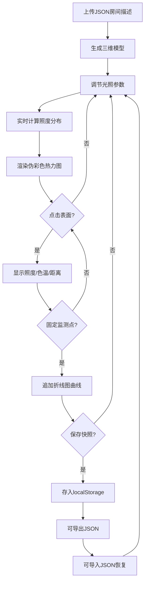

## 1. 产品概述

建筑自然光模拟器（ArchLight Sim）是一款面向建筑设计师的三维光照仿真工具，解决传统物理模型无法快速迭代不同时间、天气和灯具布局下光照效果的问题，辅助早期设计决策。用户上传JSON格式的房间描述，系统自动生成三维模型并实时计算室内表面照度分布，以伪彩色热力图可视化呈现。

- 目标用户：建筑设计师、室内设计师、照明工程师
- 核心价值：将物理模型数天的光照实验缩短至秒级实时迭代，降低早期设计决策成本

## 2. 核心功能

### 2.1 用户角色

| 角色 | 使用方式 | 核心权限 |
|------|----------|----------|
| 建筑设计师 | 直接访问 | 全部功能：场景编辑、光照模拟、监测点管理、快照管理 |

### 2.2 功能模块

1. **主工作台页面**：三维场景视图 + 控制面板 + 监测点信息面板 + 折线图

### 2.3 页面详情

| 页面名称 | 模块名称 | 功能描述 |
|----------|----------|----------|
| 主工作台 | 三维场景视图 | Three.js渲染房间模型，覆盖热力图纹理，支持OrbitControls旋转缩放，点击表面选择监测点 |
| 主工作台 | 控制面板 | 地理位置/日期/时间/天气/灯具参数调节，能耗显示，快照管理 |
| 主工作台 | 监测点信息面板 | 显示选中点的照度值/色温估计/最近光源距离，支持固定监测点 |
| 主工作台 | 折线图 | 固定监测点的照度时间序列曲线（最多12条），实时更新 |

## 3. 核心流程

用户上传JSON房间描述 → 系统生成三维模型 → 用户调节光照参数（地理/时间/天气/灯具） → 系统实时计算照度分布并渲染热力图 → 用户点击表面查看详细照度 → 固定监测点追踪照度变化 → 保存/导出场景快照

## 4. 用户界面设计

### 4.1 设计风格

- 主色调：暗色科技风 — 背景#1e1e2e / #11111b，文字#cdd6f4，强调色#89b4fa
- 按钮风格：圆角6px，hover态渐变发光
- 字体：系统默认等宽字体 + 无衬线字体组合
- 布局风格：左右两栏（控制面板320px + 主视图），暗色分组卡片
- 图标风格：Lucide线性图标

### 4.2 页面设计概述

| 页面名称 | 模块名称 | UI元素 |
|----------|----------|--------|
| 主工作台 | 控制面板 | 320px宽，#1e1e2e背景，分组卡片（圆角8px，浅灰边框），自定义滑块（手柄10px #89b4fa，轨道4px #45475a），能耗进度条（200x12px，绿→橙→红渐变） |
| 主工作台 | 三维场景视图 | 剩余宽度，#11111b背景，右上角热力图图例，白色圆形点击标记（直径10px） |
| 主工作台 | 监测点信息面板 | #313244底色，圆角6px，阴影2px #00000040，图钉按钮固定监测点 |
| 主工作台 | 折线图 | 背景透明，线条2px，网格虚线#585b70，自动缩放图例 |
| 主工作台 | 快照管理 | 缩略网格120x80px，底部名称+日期，支持导入导出 |

### 4.3 响应式

- 桌面优先，宽度<768px时自动切换上下布局
- 控制面板在移动端默认收起80px高，点击展开按钮完整显示
- 所有交互带0.2-0.3秒ease-out过渡动画

### 4.4 三维场景指引

- 环境氛围：暗色空间中建筑模型被光源照亮，强调光影对比
- 灯光设置：太阳光（方向光）+ 月光（弱方向光）+ 环境光 + 室内点/面光源
- 相机设置：透视相机，OrbitControls，默认45度俯角观察房间
- 交互：鼠标拖拽旋转/缩放，点击表面选择监测点
- 纹理：512x512伪彩色热力图纹理覆盖在所有室内表面
