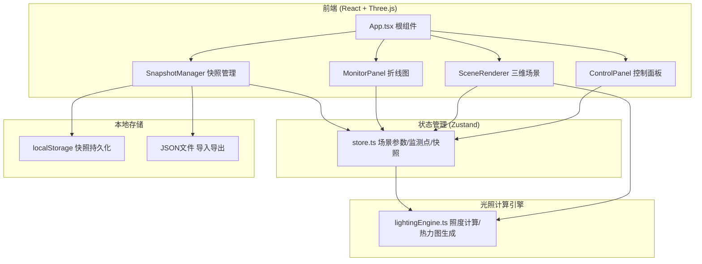
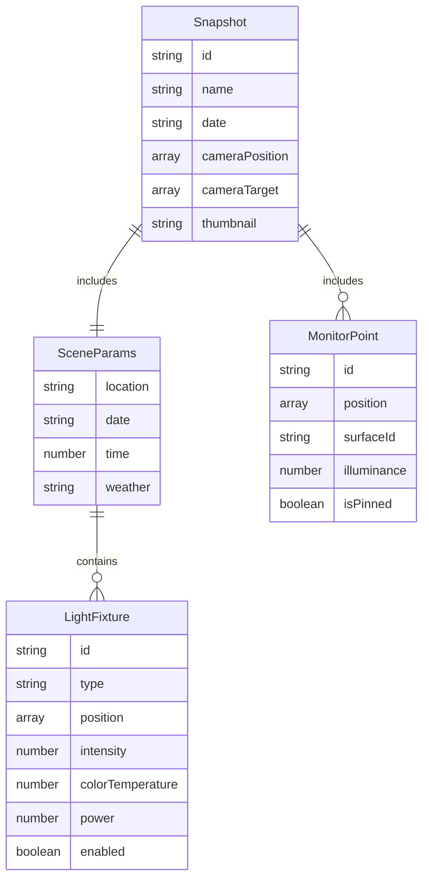

## 1. 架构设计



## 2. 技术说明

- 前端：React@18 + TypeScript + Three.js (@react-three/fiber + @react-three/drei) + Vite
- 初始化工具：vite-init (react-ts模板)
- 状态管理：Zustand
- 图表库：Recharts
- 图标库：lucide-react
- 后端：无（纯前端应用）
- 数据库：无（localStorage + JSON文件导入导出）

## 3. 路由定义

| 路由 | 用途 |
|------|------|
| / | 主工作台（唯一页面，包含三维视图、控制面板、监测点面板、折线图） |

## 4. API定义

无后端API，所有计算在客户端完成。

### 4.1 核心类型定义

```typescript
interface RoomGeometry {
  width: number;
  depth: number;
  height: number;
  walls: WallDefinition[];
  furniture: FurnitureDefinition[];
}

interface WallDefinition {
  id: string;
  start: [number, number];
  end: [number, number];
  height: number;
  reflectance: number;
}

interface FurnitureDefinition {
  id: string;
  type: string;
  position: [number, number, number];
  size: [number, number, number];
  reflectance: number;
}

interface LightFixture {
  id: string;
  type: 'point' | 'area';
  position: [number, number, number];
  intensity: number;
  colorTemperature: number;
  power: number;
  enabled: boolean;
}

interface SceneParams {
  location: 'beijing' | 'shanghai' | 'london' | 'newyork';
  date: string;
  time: number;
  weather: 'clear' | 'cloudy' | 'overcast';
  lights: LightFixture[];
}

interface MonitorPoint {
  id: string;
  position: [number, number, number];
  surfaceId: string;
  illuminance: number;
  colorTemperature: number;
  nearestLightDistance: number;
  isPinned: boolean;
}

interface Snapshot {
  id: string;
  name: string;
  date: string;
  params: SceneParams;
  cameraPosition: [number, number, number];
  cameraTarget: [number, number, number];
  monitorPoints: MonitorPoint[];
  thumbnail: string;
}

interface ChartDataPoint {
  time: number;
  values: Record<string, number>;
}
```

## 5. 数据模型

### 5.1 数据模型定义



## 6. 文件组织

| 文件路径 | 职责 |
|----------|------|
| src/store.ts | Zustand store：场景参数、监测点、快照、折线图数据 |
| src/modules/lightingEngine.ts | 光照计算：computeIrradiance / calculateLightingParams / generateHeatmapTexture |
| src/modules/sceneRenderer.tsx | Three.js场景：房间模型、热力图纹理、灯光、OrbitControls |
| src/components/ControlPanel.tsx | 控制面板：地理/日期/时间/天气/灯具/能耗 |
| src/components/MonitorPanel.tsx | 折线图：Recharts渲染监测点照度曲线 |
| src/components/SnapshotManager.tsx | 快照管理：保存/加载/导入/导出 |
| src/styles.css | 全局样式：暗色主题、响应式、自定义控件 |
