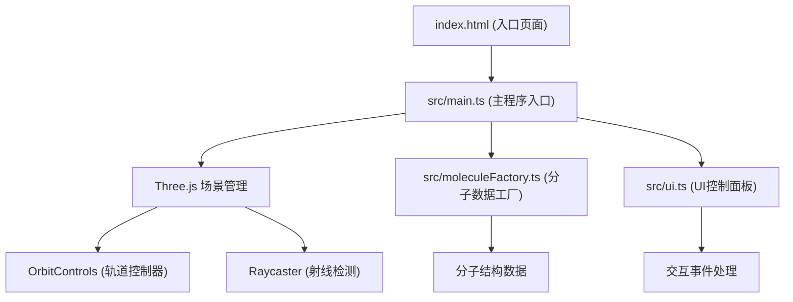

## 1. 架构设计



## 2. 技术描述
- **前端**：TypeScript + Three.js + Vite
- **构建工具**：Vite
- **3D库**：Three.js
- **类型定义**：@types/three
- **初始化方式**：Vite vanilla-ts 模板

## 3. 项目结构
```
auto100/
├── package.json
├── vite.config.js
├── tsconfig.json
├── index.html
└── src/
    ├── main.ts              # 主程序入口，Three.js场景管理
    ├── moleculeFactory.ts   # 分子数据工厂，生成原子和键数据
    └── ui.ts                # UI控制面板逻辑
```

## 4. 数据模型

### 4.1 原子类型定义
```typescript
interface AtomType {
  name: string;
  color: number;
  radius: number;
}

interface Atom {
  type: string;
  position: [number, number, number];
}

interface Bond {
  from: number;
  to: number;
}

interface MoleculeData {
  atoms: Atom[];
  bonds: Bond[];
}
```

### 4.2 预设原子类型
| 元素 | 名称 | 颜色 | 半径 |
|------|------|------|------|
| H | hydrogen | 0xffffff | 0.3 |
| C | carbon | 0x808080 | 0.5 |
| O | oxygen | 0xff0000 | 0.6 |

### 4.3 分子结构坐标

**水(H2O)**：
- O: (0, 0, 0)
- H: (0.96, 0, 0)
- H: (-0.24, 0.93, 0)
- 键: O-H1, O-H2

**甲烷(CH4)**：
- C: (0, 0, 0)
- H: (1.09, 0, 0)
- H: (-0.36, 0.72, 0.72)
- H: (-0.36, -0.72, 0.72)
- H: (-0.36, 0, -1.02)
- 键: C-H1, C-H2, C-H3, C-H4

**葡萄糖(C6H12O6)**：六元环结构，包含6个C、12个H、6个O原子

## 5. 核心功能实现要点

### 5.1 分子渲染
- 使用 SphereGeometry(16段细分) 创建原子球体
- 使用 CylinderGeometry(8段细分) 创建化学键
- 同一类型原子共享 MeshBasicMaterial/MeshStandardMaterial
- 计算两原子间向量，旋转圆柱体对齐原子连线
- 圆柱体长度等于两原子间距离

### 5.2 交互控制
- OrbitControls 实现鼠标拖拽旋转
- enableDamping = true, dampingFactor = 0.1
- 惯性旋转：松开鼠标后继续旋转0.5秒
- 光标样式：拖拽时为 grab，拖拽中为 grabbing

### 5.3 分子切换动画
- 切换时新分子从缩放0到1
- 动画时长0.5秒
- 缓动曲线：cubic-bezier(0.34, 1.56, 0.64, 1)
- 逐个缩放所有原子和键的mesh

### 5.4 自动旋转
- 滑块范围0-100，默认50
- 速度映射：value / 100 * 90 度/秒
- 动画循环中更新分子组的 rotation.y

### 5.5 原子点击检测
- Raycaster 检测鼠标射线与原子mesh的交点
- 点击后在右上角显示信息面板
- 信息面板从右侧滑入，动画0.3s ease-in-out
- 显示原子名称、颜色(十六进制)、半径

### 5.6 性能优化
- 原子和键分别共享材质
- 几何体复用以减少内存占用
- 合理的细分平衡视觉质量和性能
