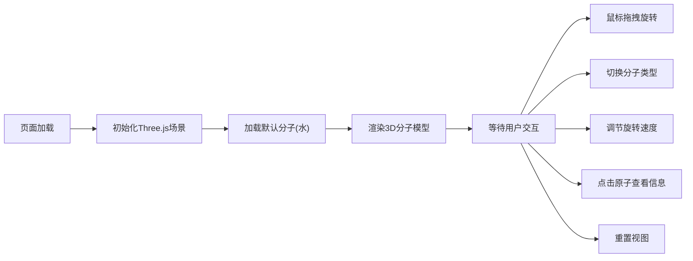

## 1. 产品概述
交互式3D分子结构查看与旋转操作应用，让用户能在浏览器中加载、查看和操作常见的分子结构模型（如水、甲烷、葡萄糖）。
- 主要用途：教育、科普、化学学习场景下的分子可视化工具
- 目标用户：学生、教师、化学爱好者以及需要可视化分子结构的专业人员
- 产品价值：提供直观的3D交互体验，帮助用户理解分子的空间结构和原子组成

## 2. 核心功能

### 2.2 功能模块
1. **3D分子渲染模块**：加载并显示水、甲烷、葡萄糖三种预设分子结构
2. **交互控制模块**：鼠标拖拽旋转、自动旋转、视图重置
3. **控制面板模块**：分子选择下拉框、旋转速度滑块、重置按钮
4. **原子信息模块**：点击原子显示详细信息面板

### 2.3 页面详情
| 页面名称 | 模块名称 | 功能描述 |
|-----------|-------------|---------------------|
| 主页面 | 3D场景 | 全屏渲染分子结构，支持鼠标拖拽旋转，原子点击交互 |
| 主页面 | 顶部控制面板 | 分子选择、旋转速度调节、视图重置 |
| 主页面 | 右上角信息面板 | 显示选中原子的名称、颜色、半径 |

## 3. 核心流程
用户进入页面后，默认加载水分子3D模型，可通过鼠标拖拽旋转查看。使用顶部控制面板切换不同分子、调节自动旋转速度或重置视图。点击任意原子可查看其详细信息。

## 4. 用户界面设计

### 4.1 设计风格
- **主色调**：深蓝色系，顶部#0f172a到底部#1e3a8a的渐变背景
- **原子配色**：氧原子红色#ff0000、氢原子白色#ffffff、碳原子灰色#808080
- **键颜色**：#94a3b8，透明度0.7
- **控制面板**：背景色#1e293b，高度60px
- **按钮风格**：圆角设计，悬停时颜色变浅或微放大
- **字体**：现代无衬线字体，白色文字，清晰可读
- **布局风格**：顶部固定控制面板，全屏3D画布，右上角浮动信息面板

### 4.2 页面设计概述
| 页面名称 | 模块名称 | UI Elements |
|-----------|-------------|-------------|
| 主页面 | 3D场景 | 全屏Canvas，渐变背景，3D分子模型，光照效果 |
| 主页面 | 控制面板 | flex布局居中，下拉框和滑块间距16px，自定义滑块样式 |
| 主页面 | 信息面板 | 半透明黑色#00000080背景，白色文字，圆角8px，右侧滑入动画0.3s |

### 4.3 响应式
- Desktop-first设计
- 控制面板自适应宽度
- 3D场景自动适配窗口大小变化

### 4.4 3D场景指导
- **环境**：深蓝色渐变背景，营造科技感和沉浸感
- **光照**：环境光+方向光组合，确保分子各面清晰可见
- **相机**：透视相机，轨道控制器支持阻尼旋转和惯性
- **交互**：鼠标拖拽旋转，点击原子高亮显示信息
- **动画**：分子切换缩放动画(cubic-bezier)，自动旋转，信息面板滑入
- **性能**：共享材质减少draw call，合理的几何体细分

## 5. 性能要求
- 帧率不低于55fps
- 最多同时渲染100个原子和150个键
- 原子球体：SphereGeometry，细分16段
- 键圆柱体：CylinderGeometry，细分8段
- 所有几何体共享材质以减少draw call
