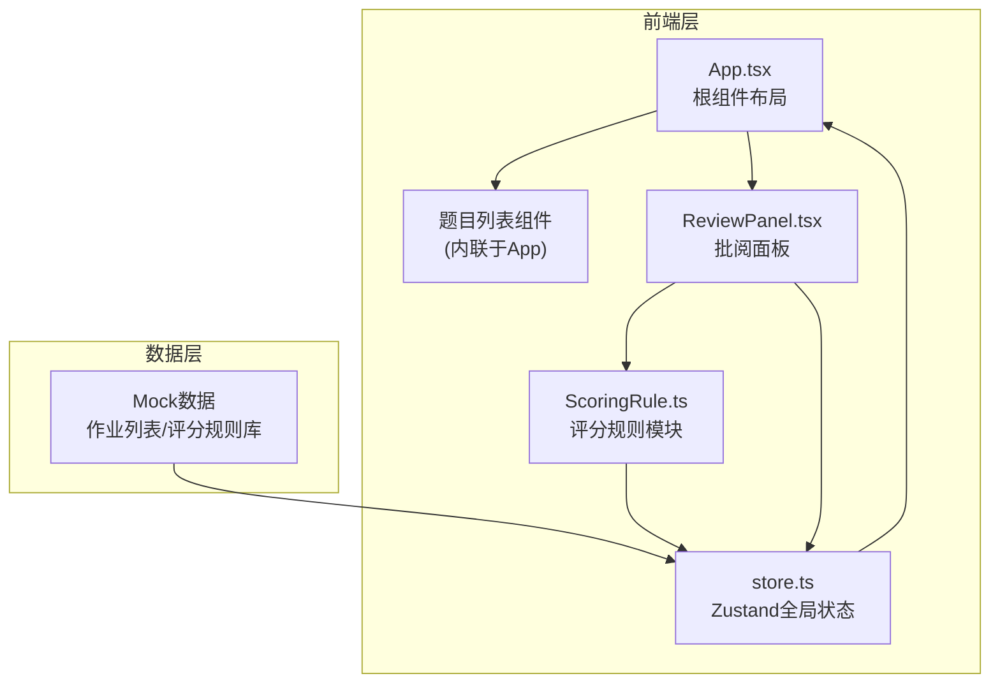
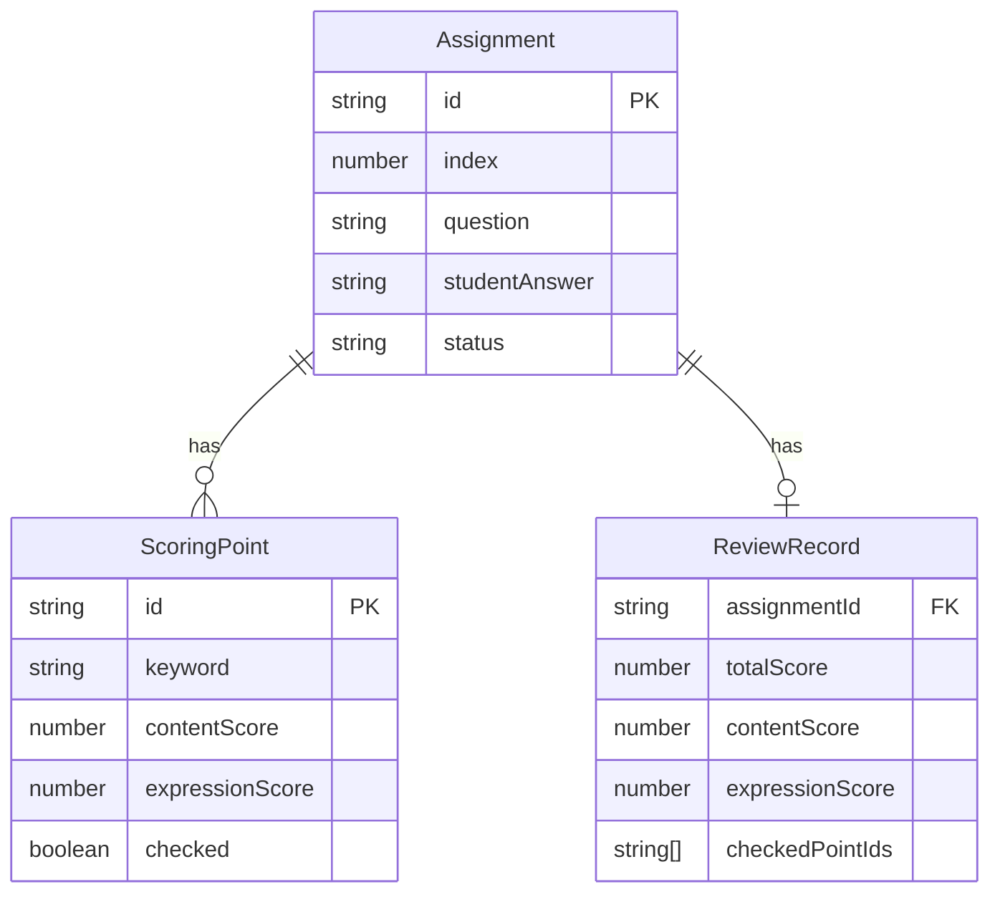

## 1. 架构设计



## 2. 技术说明

- 前端：React@18 + TypeScript + Zustand + Vite
- 初始化工具：vite-init (react-ts模板)
- 后端：无（纯前端，使用Mock数据）
- 数据库：无（内存状态管理，Zustand store）

### 文件结构与调用关系

```
├── package.json          # 依赖管理，启动脚本 npm run dev
├── vite.config.js        # Vite基础配置，入口index.html
├── tsconfig.json         # 严格模式，ES2020模块
├── index.html            # 入口页面
└── src/
    ├── store.ts          # Zustand全局状态（作业列表、选中题目、批阅记录）
    │                       # 数据流向：provide状态给组件 ← receive用户操作更新
    ├── App.tsx           # 根组件（顶部标签栏+左侧题目列表+右侧批阅面板）
    │                       # 数据流向：接收store → 渲染子组件 → 回调更新store
    ├── ScoringRule.ts    # 评分规则模块（预置规则库+评分计算函数）
    │                       # 数据流向：被App/ReviewPanel调用 → 返回评分结果给store
    └── ReviewPanel.tsx   # 右侧批阅面板（答案展示+评分点匹配+助教调整）
                            # 数据流向：从store读取 → 触发评分规则 → 写入批阅记录到store
```

## 3. 路由定义

| 路由 | 用途 |
|------|------|
| / | 批阅看板主页（单页应用，无路由切换） |

## 4. API定义

不适用（纯前端应用，无后端API）

## 5. 服务器架构图

不适用（无后端）

## 6. 数据模型

### 6.1 数据模型定义



### 6.2 数据定义

```typescript
interface Assignment {
  id: string;
  index: number;
  question: string;
  studentAnswer: string;
  status: 'pending' | 'reviewed';
}

interface ScoringPoint {
  id: string;
  keyword: string;
  contentScore: number;
  expressionScore: number;
  checked: boolean;
}

interface ReviewRecord {
  assignmentId: string;
  totalScore: number;
  contentScore: number;
  expressionScore: number;
  checkedPointIds: string[];
}

interface AppState {
  assignments: Assignment[];
  selectedId: string | null;
  scoringPoints: Record<string, ScoringPoint[]>;
  reviewRecords: Record<string, ReviewRecord>;
  selectAssignment: (id: string) => void;
  togglePoint: (assignmentId: string, pointId: string) => void;
  submitReview: (assignmentId: string) => void;
}
```
