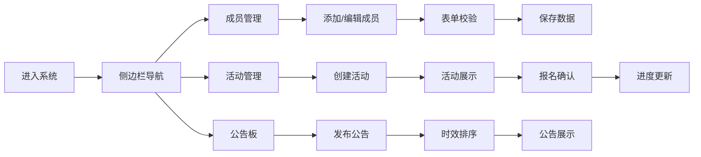

## 1. 产品概述
大学生社团管理系统，帮助小型社团告别微信群接龙和Excel的混乱管理方式，实现成员、活动、公告的高效数字化管理。
- 主要解决：成员信息零散、活动报名统计困难、公告传达不及时的痛点
- 目标用户：大学社团管理员、兴趣小组负责人、社团成员
- 产品价值：简化社团日常管理流程，提升信息透明度和协作效率

## 2. 核心功能

### 2.1 用户角色
| 角色 | 使用方式 | 核心权限 |
|------|----------|----------|
| 社团管理员 | 直接登录后台系统 | 成员增删改查、活动发布与管理、公告发布与管理 |
| 社团成员 | 浏览系统页面 | 查看成员列表、报名活动、查看公告 |

### 2.2 功能模块
1. **成员管理页面**：成员卡片网格展示、添加成员表单、编辑成员详情模态框
2. **活动管理页面**：活动卡片列表、创建活动表单、报名确认模态框
3. **公告板页面**：公告卡片列表、发布公告表单、时效性排序

### 2.3 页面详情
| 页面名称 | 模块名称 | 功能描述 |
|-----------|-------------|---------------------|
| 成员管理页 | 成员卡片网格 | 卡片宽280px高180px，悬停上移6px+阴影，展示姓名、角色标签、入社日期、联系方式 |
| 成员管理页 | 添加成员表单 | 姓名必填(2-10汉字)、角色下拉、入社日期默认今天、手机号11位验证(错误时边框#ef4444变红) |
| 成员管理页 | 编辑详情模态框 | 表单字段一致，保存按钮#22c55e，取消按钮#94a3b8，保存时文字变"保存中..."并禁用0.5s |
| 活动管理页 | 活动卡片列表 | 卡片宽320px圆角16px，渐变背景#eff6ff→#ffffff，左侧4px竖条#3b82f6，时间格式化展示 |
| 活动管理页 | 创建活动表单 | 活动名称、开始/结束时间、地点、最大参与人数(30-100整数)、简介(≤500字) |
| 活动管理页 | 报名模态框 | 背景rgba(0,0,0,0.5)，弹窗宽400px圆角12px，fadeIn+scale动画0.3s，进度条8px高渐变#3b82f6→#2563eb |
| 公告板页面 | 公告卡片列表 | 100%宽，间距16px，标题20px/600，正文16px/400，相对时间发布，紧急标记感叹号#f97316 |
| 公告板页面 | 发布公告表单 | 标题、正文、是否紧急选项，7天内自动置顶 |
| 侧边栏导航 | 全局导航 | 宽240px，背景#0f172a，导航项高48px圆角8px，激活项左侧4px竖条#3b82f6 |

## 3. 核心流程
管理员登录系统后，通过侧边栏导航切换三个核心模块：
1. 成员管理：添加成员→填写表单→校验通过→保存到列表→点击卡片编辑→保存修改
2. 活动管理：创建活动→填写活动信息→发布活动→成员浏览活动→点击报名→确认报名→进度条更新
3. 公告发布：撰写公告→选择紧急程度→发布公告→系统自动排序(7天内置顶)→成员查看公告

## 4. 用户界面设计

### 4.1 设计风格
- 主色：#3b82f6(蓝色) 辅助色：#22c55e(绿色-成功) #ef4444(红色-错误) #f97316(橙色-警告)
- 按钮风格：圆角8px，填充色按钮带hover过渡效果
- 字体：系统默认无衬线字体，标题18-20px，正文14-16px
- 布局：左侧固定侧边栏+右侧内容区，卡片式设计
- 图标：使用lucide-react图标库，简洁线性风格

### 4.2 页面设计概述
| 页面名称 | 模块名称 | UI元素 |
|-----------|-------------|-------------|
| 成员管理页 | 卡片网格 | 白色卡片#ffffff、边框#e2e8f0、角色标签圆角20px(社长红/副社橙/干事蓝/成员灰)、悬停translateY(-6px) |
| 活动管理页 | 卡片列表 | 渐变背景、圆形头像占位(32px直径随机色、最多10个+剩余数)、报名按钮右下角、模态框入场动画 |
| 公告板页面 | 公告列表 | 全宽卡片、相对时间显示、紧急公告感叹号图标#f97316、7天内自动置顶排序 |
| 全局 | 侧边栏 | 深色背景#0f172a、白色文字、激活态左竖条、hover背景#1e293b、主体背景#f5f7fa |

### 4.3 性能要求
- 侧边栏切换页面渲染：<200ms
- 列表滚动流畅度：60fps
- 过渡动画时长：0.2-0.3s
