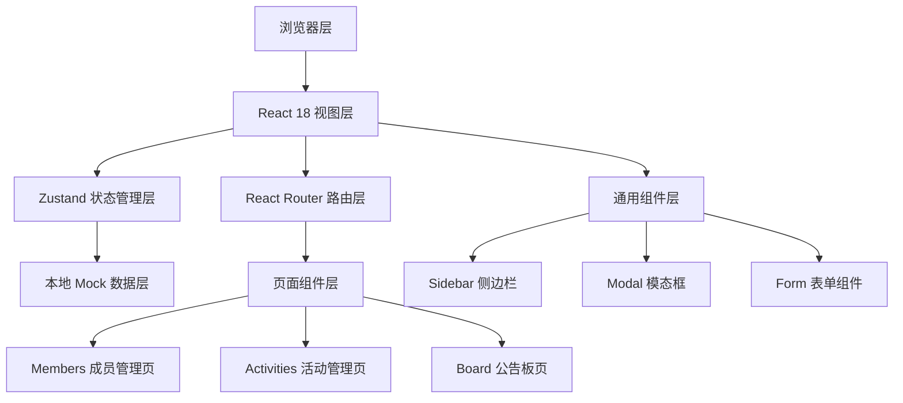
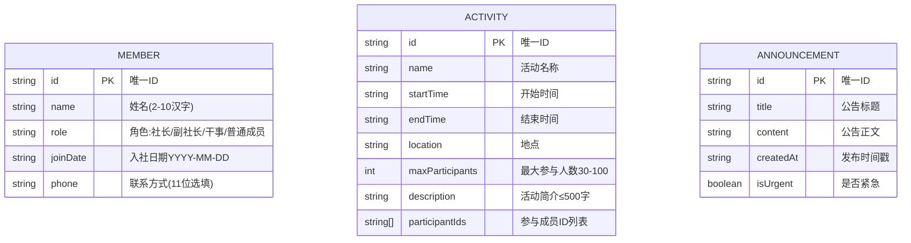

## 1. 架构设计



## 2. 技术说明
- 前端：React@18 + TypeScript@5 + Vite@5
- 路由：react-router-dom@6
- 状态管理：zustand (替代用户指定的自定义hooks，更符合React生态最佳实践)
- 唯一ID：uuid
- 样式：原生CSS (CSS Modules风格，避免Tailwind与用户指定的精确尺寸冲突)
- 图标：lucide-react
- 后端：无后端，纯前端Mock数据，状态内存持久化
- 构建工具：Vite

## 3. 路由定义
| 路由 | 用途 |
|-------|---------|
| /members | 成员管理页面 |
| /activities | 活动管理页面 |
| /board | 公告板页面 |
| / | 默认重定向到 /members |

## 4. 数据模型

### 4.1 数据模型定义



### 4.2 类型定义 (TypeScript)

```typescript
export type MemberRole = '社长' | '副社长' | '干事' | '普通成员';

export interface Member {
  id: string;
  name: string;
  role: MemberRole;
  joinDate: string;
  phone?: string;
}

export interface Activity {
  id: string;
  name: string;
  startTime: string;
  endTime: string;
  location: string;
  maxParticipants: number;
  description: string;
  participantIds: string[];
}

export interface Announcement {
  id: string;
  title: string;
  content: string;
  createdAt: number;
  isUrgent: boolean;
}
```

## 5. 项目文件结构

```
auto102/
├── index.html              # 入口HTML，引入字体
├── package.json            # 依赖与脚本配置
├── tsconfig.json           # TypeScript严格模式配置
├── vite.config.js          # Vite基础配置
└── src/
    ├── App.tsx             # 路由配置 + 侧边栏布局
    ├── main.tsx            # React入口
    ├── index.css           # 全局样式 + CSS变量
    ├── types.ts            # Member/Activity/Announcement接口定义
    ├── hooks/
    │   └── useStore.ts     # Zustand全局状态管理
    ├── components/
    │   ├── Sidebar.tsx     # 侧边栏导航组件
    │   ├── MemberCard.tsx  # 成员卡片组件
    │   ├── ActivityCard.tsx # 活动卡片组件
    │   ├── AnnouncementCard.tsx # 公告卡片组件
    │   └── Modal.tsx       # 通用模态框组件
    ├── pages/
    │   ├── Members.tsx     # 成员管理页面
    │   ├── Activities.tsx  # 活动管理页面
    │   └── Board.tsx       # 公告板页面
    └── utils/
        └── format.ts       # 格式化工具(时间、相对时间)
```

## 6. 关键实现要点
1. **表单验证**：手机号正则 `/^1[3-9]\d{9}$/`，姓名正则 `/^[\u4e00-\u9fa5]{2,10}$/`
2. **动画实现**：CSS @keyframes + transition，模态框fadeIn+scale入场
3. **性能优化**：React.memo包裹卡片组件，useCallback优化事件处理
4. **排序逻辑**：公告按 (isUrgent置顶 + 7天内时间戳倒序) 排序
5. **视觉细节**：头像随机颜色从预设调色板取色，确保美观协调
