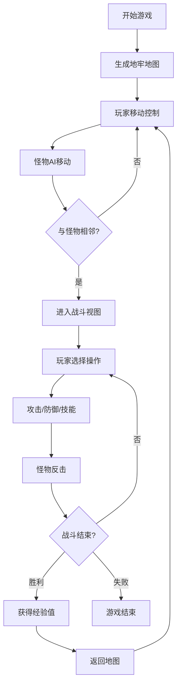

## 1. 产品概述

一款基于浏览器的Roguelike地牢探险游戏，融合程序化地图生成与回合制策略战斗。解决传统Roguelike游戏缺乏直观战斗反馈和动态地图生成可玩性不足的问题，为玩家提供沉浸式的地牢探索体验。

- 目标用户：喜欢Roguelike游戏、策略战斗和像素风格的玩家
- 核心价值：每次游戏都有全新地图布局，战斗策略性强，反馈直观

## 2. 核心功能

### 2.1 用户角色

| 角色 | 注册方式 | 核心权限 |
|------|----------|----------|
| 玩家 | 无需注册，直接进入游戏 | 探索地牢、战斗怪物、升级成长 |

### 2.2 功能模块

1. **地牢地图系统**：程序化生成5x5房间地牢，走廊连接，玩家初始在左上角房间
2. **角色系统**：玩家角色属性（生命、魔力、攻击、等级、经验、金币），怪物AI
3. **战斗系统**：回合制战斗，攻击/防御/技能三种操作
4. **UI界面系统**：状态栏、小地图、战斗面板
5. **渲染系统**：Canvas绘制，帧率优化，动画效果

### 2.3 功能详情

| 模块名称 | 子模块 | 功能描述 |
|---------|--------|----------|
| 地牢地图 | 房间生成 | 随机生成5x5房间布局，每房间8x8格子 |
| 地牢地图 | 走廊连接 | 房间间通过2格宽走廊连接 |
| 地牢地图 | 怪物分布 | 随机放置史莱姆、蝙蝠、骷髅三种怪物 |
| 角色系统 | 玩家属性 | 生命值、魔力值、攻击力、等级、经验值、金币 |
| 角色系统 | 玩家移动 | WASD/方向键控制，每格0.2秒，带拖影效果 |
| 角色系统 | 怪物AI | 相邻且生命高于玩家时靠近，否则随机移动 |
| 战斗系统 | 战斗触发 | 玩家与怪物相邻时进入战斗视图 |
| 战斗系统 | 攻击 | 造成2点伤害，怪物反击1点 |
| 战斗系统 | 防御 | 本回合受到伤害减半 |
| 战斗系统 | 技能 | 消耗1点魔力，造成3点伤害 |
| 战斗系统 | 战利品 | 胜利获得经验值（史莱姆10/蝙蝠15/骷髅25） |
| UI界面 | 状态栏 | 等级、经验条、生命条、魔力条、金币 |
| UI界面 | 小地图 | 显示已探索/未探索房间，玩家位置闪烁红点 |
| UI界面 | 战斗面板 | 双方状态展示、操作按钮、战斗动画 |

## 3. 核心流程

玩家进入游戏 → 生成地牢地图 → 玩家控制角色移动 → 怪物同步AI移动 → 与怪物相邻时触发战斗 → 战斗回合交互 → 战斗胜利获得经验 → 继续探索或升级

## 4. 用户界面设计

### 4.1 设计风格

- 整体风格：暗黑地牢风格，深色主题
- 主背景色：#0f172a
- 文字前景色：#94a3b8 到 #e2e8f0 灰色系
- 强调色：蓝色 #3b82f6、金色 #f59e0b
- 危险色：红色 #ef4444
- 地图元素：墙壁 #334155、地面 #1e293b、通道 #475569
- 按钮样式：圆形按钮，悬停亮度过渡，点击缩放反馈
- 字体：等宽字体（像素风格），白色文字

### 4.2 页面设计概述

| 页面/区域 | 模块名称 | UI元素 |
|-----------|----------|--------|
| 游戏主界面 | 状态栏 | 等级文字、经验条、生命条、魔力条、金币显示、小地图按钮 |
| 游戏主界面 | 地图画布 | 地牢地图、玩家角色、怪物、移动拖影 |
| 战斗弹窗 | 战斗面板 | 玩家头像状态、怪物头像状态、生命条、操作按钮 |
| 侧边面板 | 小地图 | 房间探索状态、玩家位置标记 |

### 4.3 响应式

- 画布居中，最大宽度900px，最大高度700px
- 保持16:9比例
- 桌面端优先，支持键盘操作

### 4.4 动效与交互

- 按钮悬停：0.2秒亮度/颜色过渡
- 按钮点击：缩小到80%再弹回，0.15秒动画
- 战斗弹窗：0.3秒淡入淡出
- 玩家移动：0.2秒每格，半透明拖影
- 小地图红点：闪烁效果
- 游戏循环：30FPS以上
