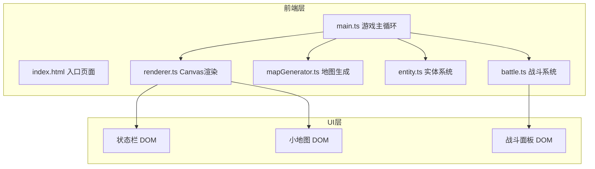

## 1. 架构设计



## 2. 技术描述

- 前端技术栈：TypeScript + HTML5 Canvas + Vite
- 构建工具：Vite 5.x
- 语言标准：ES2020
- TypeScript严格模式：启用
- 渲染方式：Canvas 2D（双缓冲、脏矩形优化）
- 状态管理：模块内状态，无额外状态管理库

## 3. 项目文件结构

| 文件 | 职责 |
|------|------|
| package.json | 项目依赖和脚本配置 |
| vite.config.js | Vite构建配置 |
| tsconfig.json | TypeScript编译配置 |
| index.html | 入口页面，Canvas和UI层容器 |
| src/main.ts | 游戏入口，初始化、主循环、事件处理 |
| src/mapGenerator.ts | 地牢地图程序化生成算法 |
| src/entity.ts | 玩家和怪物实体类定义 |
| src/battle.ts | 战斗系统逻辑和UI管理 |
| src/renderer.ts | Canvas渲染引擎，地图/角色/UI绘制 |

## 4. 核心数据模型

### 4.1 地图数据

```typescript
interface Room {
  x: number;
  y: number;
  width: number;
  height: number;
  explored: boolean;
}

interface DungeonMap {
  tiles: number[][]; // 0=地面, 1=墙壁, 2=走廊
  rooms: Room[];
  width: number;
  height: number;
}
```

### 4.2 实体数据

```typescript
interface Entity {
  x: number;
  y: number;
  hp: number;
  maxHp: number;
  attack: number;
}

interface Player extends Entity {
  mp: number;
  maxMp: number;
  level: number;
  exp: number;
  expToNext: number;
  gold: number;
  moveProgress: number;
  trail: { x: number; y: number; alpha: number }[];
}

type MonsterType = 'slime' | 'bat' | 'skeleton';

interface Monster extends Entity {
  type: MonsterType;
  expReward: number;
}
```

### 4.3 战斗状态

```typescript
interface BattleState {
  active: boolean;
  player: Player;
  monster: Monster;
  turn: 'player' | 'monster';
  defending: boolean;
  message: string;
}
```

## 5. 核心算法

### 5.1 地图生成算法

1. 创建二维数组，初始全部为墙壁
2. 随机生成5x5房间网格布局，每个房间8x8格子
3. 确保房间间有间隔用于走廊
4. 使用连通算法连接相邻房间（2格宽走廊）
5. 随机放置怪物到各房间
6. 玩家初始位置：左上角房间中心

### 5.2 怪物AI算法

1. 计算怪物与玩家的曼哈顿距离
2. 如果相邻且怪物生命 > 玩家生命：向玩家方向移动
3. 否则：随机选择相邻可通行格子移动
4. 不能穿越墙壁和其他怪物

### 5.3 战斗回合逻辑

1. 玩家回合：选择攻击/防御/技能
   - 攻击：造成2点伤害
   - 防御：本回合伤害减半
   - 技能：消耗1MP，造成3点伤害
2. 怪物回合：反击造成攻击力伤害（防御时减半）
3. 检查双方生命，决定战斗继续或结束
4. 胜利：怪物消失，玩家获得经验值

## 6. 性能优化策略

- **双缓冲渲染**：离屏Canvas预渲染静态地图
- **脏矩形更新**：只重绘变化区域
- **帧率控制**：requestAnimationFrame，目标30+ FPS
- **地图缓存**：已生成地图缓存，避免重复计算
- **UI分层**：Canvas渲染游戏内容，DOM渲染UI元素
