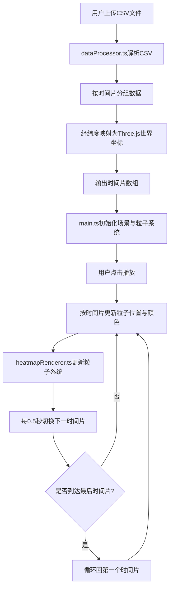

## 1. 产品概述

交互式3D城市交通流量热力时序可视化应用，面向城市数据规划师，解决静态地图和折线图无法直观展示一天内车流在三维空间中动态变化的问题。用户上传CSV交通检测数据后，可在三维地图上动态回放全天车流变化，实现数据驱动的交通流量时空分析。

- 目标用户：城市交通规划师、数据分析师
- 核心价值：将时序交通数据转化为直观的3D动态热力可视化，提升数据汇报的感染力与洞察效率

## 2. 核心功能

### 2.1 功能模块

1. **数据上传与解析模块**：支持拖拽/点击上传CSV文件，解析后自动缩放相机至数据覆盖范围
2. **3D热力粒子渲染模块**：10万粒子系统，根据车流量动态调整粒子大小与颜色
3. **时间轴播放控制模块**：24小时时间轴，播放/暂停/跳转/速度切换
4. **颜色映射与图例模块**：四段渐变色带，可调阈值滑条
5. **地面网格与地理参考模块**：20x20网格，经纬度标签
6. **数据统计摘要面板**：实时统计当前时间片数据

### 2.2 页面详情

| 页面名称 | 模块名称 | 功能描述 |
|---------|---------|---------|
| 主场景 | 数据上传区域 | 拖拽/点击上传CSV，拖入时边框变为实线蓝色并显示文件名，解析后显示数据覆盖范围 |
| 主场景 | 3D粒子热力图 | 10万粒子系统，粒子大小2-12px，颜色四段渐变，每秒更新一次，粒子周围0.5px半透明光圈 |
| 主场景 | 时间轴播放条 | 底部24小时时间轴，点击跳转/拖拽滑块，播放按钮切换播放/暂停，速度1x/2x/4x/8x |
| 主场景 | 颜色图例 | 右侧垂直渐变条20x200px，标注流量阈值，最高阈值滑条50-500步长10 |
| 主场景 | 地面网格 | 20x20单位网格，格间距1，颜色#334155透明度0.2，经纬度标签12px |
| 主场景 | 统计摘要面板 | 总车流量/平均/最高(高亮)/最低，卡片背景#1e293b圆角8px内边距12px，数值20px字体0.3s淡入 |

## 3. 核心流程



## 4. 界面设计

### 4.1 设计风格

- **主色调**：暗色主题，背景色#0f172a（深蓝灰）
- **辅色调**：面板背景#1e293b，悬停#334155，强调色#3b82f6
- **文字色**：主文字#e2e8f0，次要文字#94a3b8
- **按钮风格**：36x36px圆角8px，背景#1e293b，悬停#334155，点击缩放至32x32px
- **字体**：系统等宽字体用于数据，无衬线字体用于标签
- **布局风格**：全屏3D Canvas，2D HUD叠加层，左上角控制面板，右侧图例，底部时间轴

### 4.2 热力颜色映射

| 车流量区间 | 颜色 | 色值 |
|-----------|------|------|
| 低 | 蓝色 | #1e3a8a |
| 中低 | 青色 | #06b6d4 |
| 中高 | 橙色 | #f97316 |
| 高 | 红色 | #ef4444 |

### 4.3 响应式适配

- 桌面端（≥768px）：控制面板完整展开
- 移动端（<768px）：控制面板折叠为图标按钮，点击展开

### 4.4 3D场景指引

- **环境**：暗色空间，无环境光，粒子自发光
- **相机**：透视相机，45度俯视角，OrbitControls支持旋转/缩放/平移
- **地面**：20x20半透明网格线，带经纬度标注
- **粒子**：10万个点精灵，大小2-12px，带0.5px半透明光圈叠加效果
- **交互**：轨道控制器允许自由旋转/缩放查看

## 5. 文件结构与调用关系

```
project/
├── package.json          ← 依赖管理
├── vite.config.js        ← Vite构建配置
├── tsconfig.json         ← TypeScript配置
├── index.html            ← 入口页面
└── src/
    ├── main.ts           ← 主入口：初始化场景 → 调用dataProcessor → 调用heatmapRenderer → 动画循环
    ├── dataProcessor.ts  ← 数据处理：解析CSV → 按时间片分组 → 经纬度映射坐标 → 输出给main.ts
    └── heatmapRenderer.ts ← 渲染管理：粒子系统创建/更新 → 颜色映射 → 被main.ts调用
```

**数据流向**：
- CSV文件 → dataProcessor.ts → Array<{time, positions, values}> → main.ts → heatmapRenderer.ts → Three.js粒子系统 → Canvas渲染
