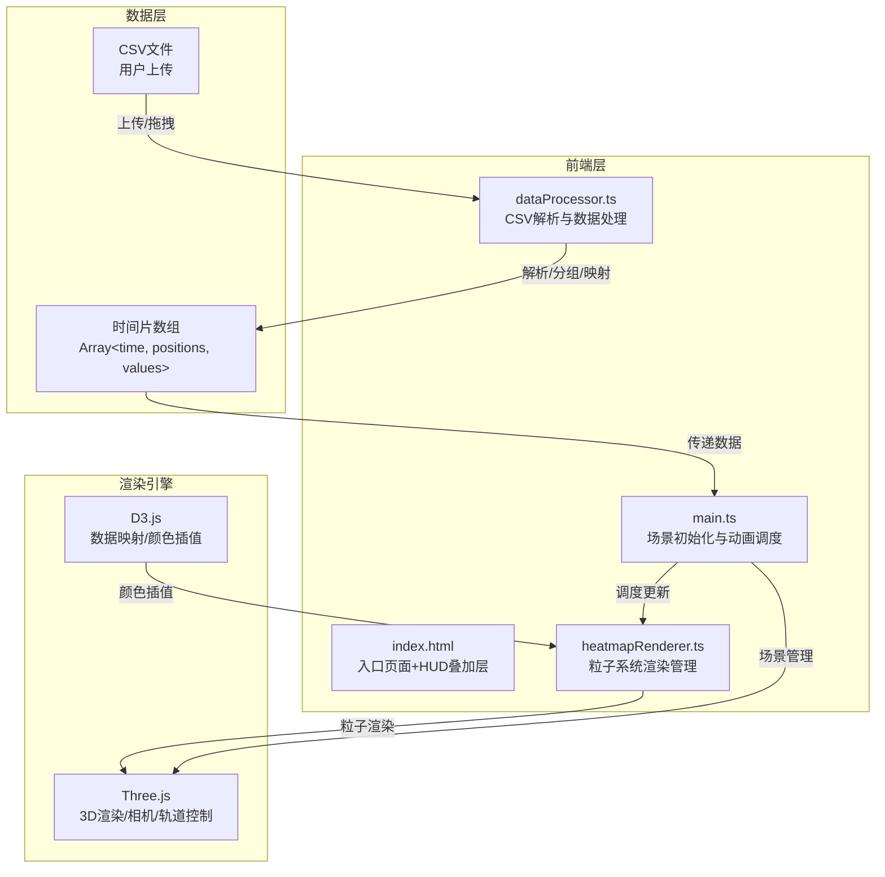

## 1. 架构设计



## 2. 技术说明

- **前端框架**：纯TypeScript（无React/Vue，直接操作Three.js和DOM）
- **构建工具**：Vite
- **3D渲染**：Three.js（场景、相机、渲染器、粒子系统、OrbitControls）
- **数据处理**：D3.js（CSV解析d3.csvParse、颜色插值d3.interpolateRgb/Scale）
- **TypeScript**：严格模式，ES2020模块
- **后端**：无
- **数据库**：无（纯前端数据处理）

## 3. 模块依赖关系

| 模块 | 依赖 | 职责 |
|------|------|------|
| main.ts | three, dataProcessor, heatmapRenderer | 初始化Three.js场景、相机、渲染器、轨道控制器；调度数据加载与动画循环；协调UI交互 |
| dataProcessor.ts | d3 | 解析CSV数据（d3.csvParse）；按时间片分组（48个时间片，每30分钟一个）；经纬度→世界坐标映射；D3颜色比例尺定义 |
| heatmapRenderer.ts | three, d3 | 管理10万粒子系统（THREE.Points + BufferGeometry）；粒子大小/颜色/位置更新；光圈叠加效果 |

## 4. 数据流定义

### 4.1 输入数据格式

CSV格式：`时间戳,纬度,经度,车流量`

示例：
```
timestamp,latitude,longitude,flow
2024-01-01 08:00:00,39.9042,116.4074,150
2024-01-01 08:00:00,39.9100,116.4100,80
```

### 4.2 中间数据格式

```typescript
interface TimeSlice {
  time: number;
  positions: Float32Array;
  values: Float32Array;
}
```

- `time`：时间片索引（0-47，对应0:00-23:30）
- `positions`：Float32Array，每3个值为一组[x, y, z]世界坐标
- `values`：Float32Array，每个值对应该位置的车流量

### 4.3 经纬度映射算法

1. 计算所有数据点的中心经纬度（centerLon, centerLat）
2. 以中心为原点，经度差映射到X轴，纬度差映射到Z轴
3. 缩放因子：将数据范围映射到-10到+10的Three.js世界坐标范围
4. Y轴表示车流量高度（可选，用于增强视觉效果）

## 5. 关键技术实现

### 5.1 粒子系统

- 使用 `THREE.Points` + `THREE.BufferGeometry`
- 最大粒子数：100,000
- 属性：position（3分量）、size（1分量）、color（3分量）
- 更新策略：每0.5秒替换position/size/color缓冲区数据
- 光圈效果：通过自定义ShaderMaterial实现，片段着色器中绘制中心亮点+外围0.5px半透明光晕

### 5.2 颜色映射

- D3线性比例尺：`d3.scaleLinear().domain([0, threshold/3, threshold*2/3, threshold]).range([blue, cyan, orange, red])`
- threshold默认200，用户可通过滑条调整50-500

### 5.3 时间轴控制

- 48个时间片（每30分钟一个，共24小时）
- 播放时每0.5秒切换一个时间片
- 速度倍率：1x=0.5s/片，2x=0.25s/片，4x=0.125s/片，8x=0.0625s/片

### 5.4 性能优化

- BufferAttribute设置`dynamic: true`，更新后调用`needsUpdate = true`
- 粒子更新使用requestAnimationFrame，确保不低于20FPS
- CSV解析使用Web Worker（如超过1万行）避免阻塞主线程
- D3颜色映射预计算查找表，避免每帧重复计算
