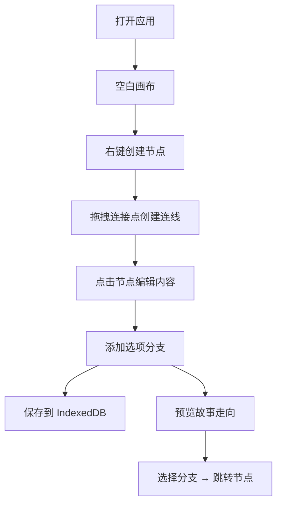

## 1. 产品概述
在线交互式故事编辑器是一款可视化分支叙事剧本创作工具，用户通过拖拽节点和连线的方式构建非线性故事结构，并可实时预览故事走向。

- 主要用途：辅助创作者设计互动小说、游戏剧情、分支叙事等内容
- 目标用户：作家、游戏设计师、互动内容创作者
- 产品价值：将抽象的分支结构可视化，降低创作门槛，提升叙事设计效率

## 2. 核心功能

### 2.1 用户角色
| 角色 | 注册方式 | 核心权限 |
|------|----------|----------|
| 创作者 | 无需注册，本地使用 | 创建、编辑、保存、加载、预览故事 |

### 2.2 功能模块
1. **画布编辑区**：节点可视化展示、拖拽移动、连线绘制、缩放平移
2. **节点编辑器**：节点标题与文本编辑、选项列表管理
3. **工具栏**：保存、加载、撤销、预览操作
4. **故事预览**：交互式故事播放、分支选择、节点跳转
5. **数据持久化**：IndexedDB 本地存储、多项目管理

### 2.3 页面详情
| 页面名称 | 模块名称 | 功能描述 |
|---------|----------|----------|
| 主编辑页 | 顶部工具栏 | 保存/加载/撤销/预览四个操作按钮，固定顶部56px高度 |
| 主编辑页 | SVG画布 | 节点和连线的可视化渲染，支持右键添加节点、拖拽移动、滚轮缩放、空格+拖拽平移 |
| 主编辑页 | 节点编辑面板 | 右侧滑出面板，编辑选中节点的标题、文本、选项列表 |
| 主编辑页 | 预览弹窗 | 全屏遮罩弹窗，以对话框形式交互式预览故事走向 |
| 主编辑页 | 加载文件列表 | 点击加载按钮弹出的历史项目列表，支持选择恢复 |

## 3. 核心流程
用户打开应用后，在空画布上右键创建故事节点，通过节点右侧连接点拖拽创建分支连线，点击节点在右侧面板编辑内容。完成创作后可保存到本地 IndexedDB，或点击预览按钮以第一人称视角体验故事。

## 4. 用户界面设计

### 4.1 设计风格
- **主题**：深色太空主题，深邃科技感
- **主色调**：背景 #0f172a，节点 #1e293b，边框 #334155
- **强调色**：蓝色 #3b82f6（选中/交互），红色 #ef4444（危险操作）
- **文字色**：#e2e8f0（主文本），#94a3b8（次要文本）
- **按钮样式**：圆角8px，36x36px 方形图标按钮，悬停背景加深
- **字体**：无衬线系统字体，14px 基础字号
- **布局风格**：全屏画布 + 顶部工具栏 + 右侧编辑面板 + 模态弹窗
- **动效风格**：0.2s 过渡动画，连线上光点流体运动动画

### 4.2 页面设计概览
| 页面名称 | 模块名称 | UI 元素 |
|---------|----------|---------|
| 主编辑页 | 顶部工具栏 | 56px 高深色栏，底部1px边框，四个图标按钮左对齐 |
| 主编辑页 | SVG画布 | 全屏深色背景，节点圆角矩形带阴影，二次贝塞尔曲线连线，光点流动动画 |
| 主编辑页 | 节点编辑面板 | 400px宽右侧面板，左边界线，关闭按钮右上角，输入框深色风格 |
| 主编辑页 | 右键菜单 | 深色圆角卡片，选项40px高，悬停高亮 |
| 主编辑页 | 预览弹窗 | 居中对话框480px宽，圆角16px，半透明遮罩，选项按钮 |
| 主编辑页 | 加载列表 | 弹出列表，48px高列表项，悬停高亮 |

### 4.3 响应性
- 桌面端优先设计，画布自适应窗口大小
- 编辑面板固定宽度，画布区域弹性伸缩
- 缩放范围 0.5x ~ 2x，节点文字随缩放自适应

### 4.4 性能指标
- 100个节点 + 150条连线时帧率 ≥ 30fps
- 节点拖拽无视觉延迟
- 连线绘制实时响应
