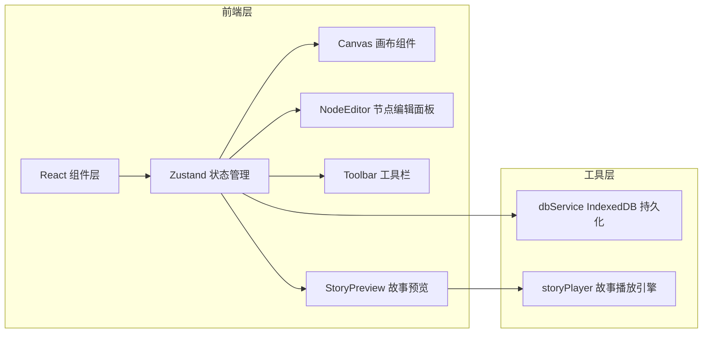
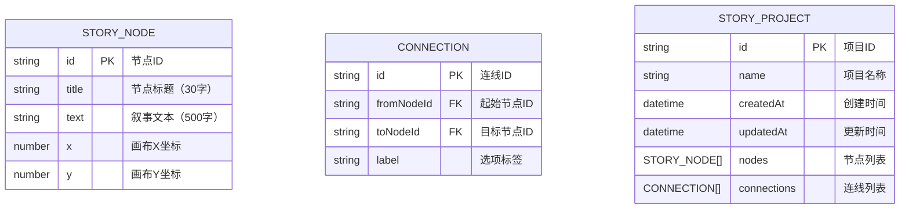

## 1. 架构设计



## 2. 技术说明
- **前端框架**：React 18 + TypeScript
- **构建工具**：Vite 5.x + @vitejs/plugin-react
- **状态管理**：Zustand 4.x
- **数据持久化**：idb-keyval（IndexedDB 封装）
- **唯一标识**：uuid
- **画布渲染**：原生 SVG
- **动画**：CSS Animation + requestAnimationFrame

## 3. 目录结构
```
src/
├── main.tsx              # 应用入口
├── App.tsx               # 根组件
├── stores/
│   └── storyStore.ts     # Zustand 全局状态
├── components/
│   ├── Canvas.tsx        # SVG 画布组件
│   ├── NodeEditor.tsx    # 节点编辑面板
│   ├── Toolbar.tsx       # 顶部工具栏
│   ├── StoryPreview.tsx  # 故事预览弹窗
│   └── ContextMenu.tsx   # 右键菜单
└── utils/
    ├── dbService.ts      # IndexedDB 数据服务
    └── storyPlayer.ts    # 故事播放引擎
```

## 4. 数据模型

### 4.1 数据模型定义



### 4.2 Zustand Store 状态
```typescript
interface StoryState {
  nodes: StoryNode[]
  connections: Connection[]
  selectedNodeId: string | null
  history: { nodes: StoryNode[]; connections: Connection[] }[]
  historyIndex: number
  scale: number
  panOffset: { x: number; y: number }
  // actions
  addNode: (x: number, y: number) => void
  deleteNode: (id: string) => void
  updateNode: (id: string, updates: Partial<StoryNode>) => void
  connectNodes: (fromId: string, toId: string, label: string) => void
  deleteConnection: (id: string) => void
  selectNode: (id: string | null) => void
  undo: () => void
  redo: () => void
  setScale: (scale: number) => void
  setPanOffset: (x: number, y: number) => void
  save: () => Promise<void>
  load: (projectId: string) => Promise<void>
}
```

## 5. 核心技术方案

### 5.1 画布渲染方案
- 使用 SVG 渲染节点和连线，支持 DOM 事件
- 节点使用 `<g>` 分组，包含矩形、文本、连接点
- 连线使用二次贝塞尔曲线 `<path>`，控制点偏移50px
- 缩放平移通过 SVG `viewBox` 或外层 `transform` 实现

### 5.2 拖拽交互
- 节点拖拽：mousedown → mousemove → mouseup，实时更新坐标
- 连线拖拽：从连接点出发，动态绘制临时路径，松开时创建连线
- 画布平移：空格键 + 鼠标拖拽，更新 panOffset

### 5.3 性能优化
- 节点使用 React.memo 避免不必要重渲染
- 连线使用 useMemo 缓存路径计算
- 大量节点时考虑虚拟化（当前100节点直接渲染即可）
- 拖拽时使用 requestAnimationFrame 节流

### 5.4 数据持久化
- 使用 idb-keyval 简化 IndexedDB 操作
- 保存时序列化整个 store 状态
- 加载时弹出项目列表供选择
- 自动保存（可选，防抖3s）

### 5.5 故事预览引擎
- 接收节点列表和起点ID（'start'）
- 维护当前节点状态
- 提供 next(optionIndex) 方法跳转
- fade 切换动画使用 CSS transition
