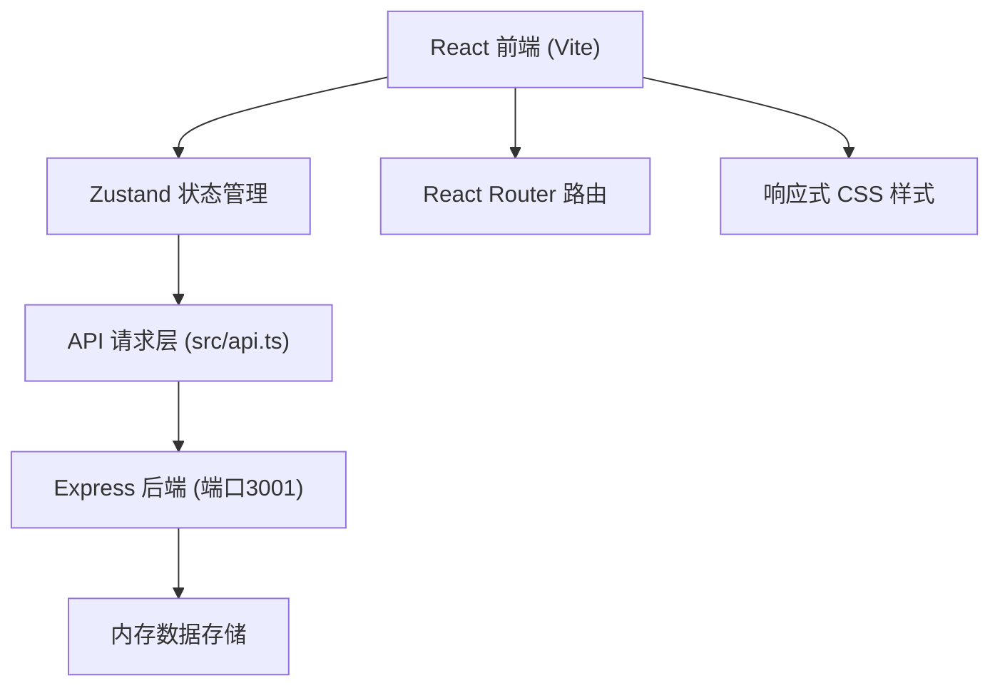
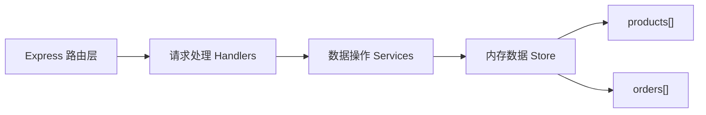
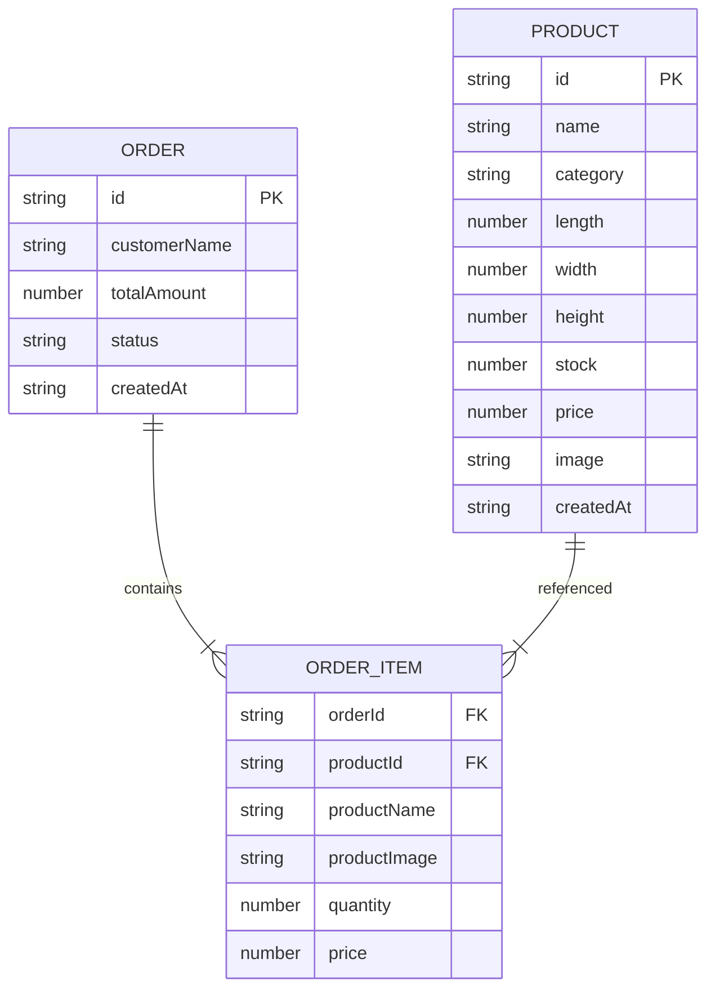

## 1. 架构设计



## 2. 技术描述

- 前端：React@18 + TypeScript + Vite + Zustand + React Router DOM
- 后端：Express@4 + TypeScript + CORS + UUID
- 数据存储：内存模拟（无需数据库）
- 图表：D3.js 实现折线图
- 样式：原生 CSS + CSS Variables，支持响应式

## 3. 路由定义

| 路由 | 用途 |
|------|------|
| / | 数据看板首页 (Dashboard) |
| /products | 产品管理页 (Products) |
| /orders | 订单管理页 (Orders) |

## 4. API 定义

```typescript
// 产品类型
interface Product {
  id: string;
  name: string;
  category: '陶瓷' | '木雕' | '布艺' | '其他';
  dimensions: { length: number; width: number; height: number };
  stock: number;
  price: number;
  image: string;
  createdAt: string;
}

// 订单项
interface OrderItem {
  productId: string;
  productName: string;
  productImage: string;
  quantity: number;
  price: number;
}

// 订单类型
type OrderStatus = 'pending' | 'processing' | 'completed';

interface Order {
  id: string;
  customerName: string;
  items: OrderItem[];
  totalAmount: number;
  status: OrderStatus;
  createdAt: string;
}

// 看板数据
interface DashboardData {
  todayOrders: number;
  pendingOrders: number;
  lowStockProducts: number;
  monthlySales: number;
  salesTrend: { date: string; amount: number }[];
}
```

| 方法 | 路径 | 描述 |
|------|------|------|
| GET | /api/products | 获取所有产品 |
| POST | /api/products | 添加新产品 |
| PUT | /api/products/:id | 更新产品（含库存） |
| DELETE | /api/products/:id | 删除产品 |
| GET | /api/orders | 获取所有订单 |
| POST | /api/orders | 创建新订单 |
| PUT | /api/orders/:id | 更新订单状态（触发库存变更） |
| GET | /api/dashboard | 获取看板数据 |

## 5. 服务端架构



## 6. 数据模型

### 6.1 ER 图



### 6.2 内存数据初始化

应用启动时在 Express 服务内存中初始化模拟数据：
- 6-8 个示例产品（覆盖各品类）
- 3-5 个示例订单（覆盖不同状态）
- 最近7天的销售趋势数据
