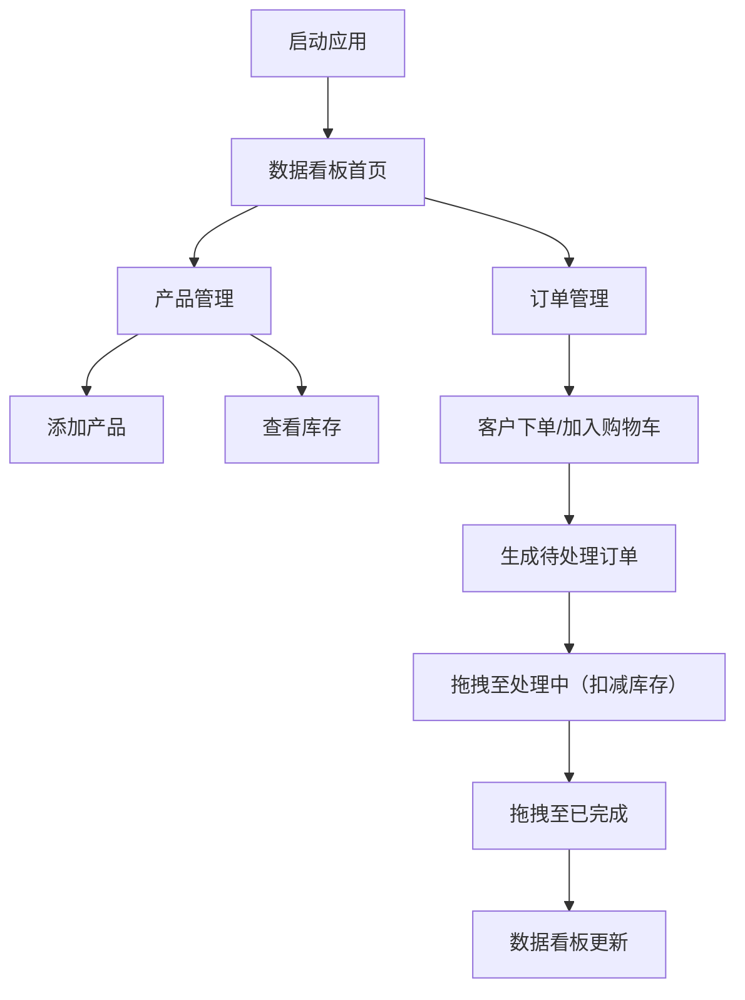

## 1. 产品概述

文创工作室库存与在线订单管理系统，解决手工作品数量少、规格多、手工记账易出错、线上线下销售无法实时同步的问题。

- 主要目的：统一管理库存、订单和销售数据，提升工作室运营效率
- 目标用户：小型文创工作室员工和管理者
- 市场价值：为手工作坊提供轻量级、低成本的数字化管理解决方案

## 2. 核心功能

### 2.1 用户角色

| 角色 | 注册方式 | 核心权限 |
|------|----------|----------|
| 工作室员工 | 内部账号 | 产品管理、订单处理、数据查看 |

### 2.2 功能模块

1. **数据看板首页**：今日订单数、待处理订单、低库存产品、月度销售额趋势图
2. **产品管理页**：产品列表网格展示、添加产品表单、低库存提醒
3. **订单管理页**：三列看板（待处理/处理中/已完成）、拖拽状态变更、库存自动扣减/回滚
4. **购物车系统**：侧边栏滑入、商品加减、订单生成

### 2.3 页面详情

| 页面名称 | 模块名称 | 功能描述 |
|----------|----------|----------|
| 数据看板 | 指标卡片 | 展示4项核心数据：今日订单数、待处理订单、低库存产品、月度销售额 |
| 数据看板 | 销售趋势图 | 折线图展示最近7天销售趋势，x轴日期格式MM/DD |
| 产品管理 | 产品网格 | 响应式卡片网格，产品卡片240x320px，悬停上移6px |
| 产品管理 | 添加表单 | 产品名、类别、尺寸、库存、单价、图片上传 |
| 产品管理 | 库存提醒 | 库存<5件时卡片左上角红色圆点 |
| 订单管理 | 三列看板 | 待处理(橙)/处理中(蓝)/已完成(绿) 三列 |
| 订单管理 | 拖拽交互 | 拖拽卡片至不同列，状态变更时触发库存扣减/回滚 |
| 订单管理 | 购物车侧边栏 | 右侧滑入360px宽，商品加减，确认后生成订单 |

## 3. 核心流程

员工登录系统后，可在产品管理页添加新品并查看库存状态；在订单管理页处理客户订单，通过拖拽更新订单状态；数据看板提供实时运营数据概览。

## 4. 用户界面设计

### 4.1 设计风格

- 主色：翡翠绿 `#059669`，辅助色：靛蓝 `#6366f1`
- 背景色：`#f8fafc`，卡片白色：`#ffffff`
- 文字主色：`#1e293b`，次要文字：`#64748b`
- 按钮圆角10px，悬停颜色加深10%，点击缩放0.95（0.2s）
- 页面切换fade-in动画0.3s
- 卡片圆角12-16px，精致阴影

### 4.2 页面设计概述

| 页面名称 | 模块名称 | UI元素 |
|----------|----------|--------|
| 数据看板 | 指标卡片 | 220x100px卡片，左侧4px靛蓝竖条，32px/700数值，14px/400标签 |
| 数据看板 | 趋势图 | 靛蓝折线+半透明填充，浅色网格线 |
| 产品管理 | 产品卡片 | 240x320px卡片，160px图片区，24px/700翡翠绿价格，悬停上移+阴影0.3s |
| 产品管理 | 添加表单 | 分组表单输入，图片预览区 |
| 订单管理 | 订单卡片 | 320px宽，顶部4px状态色条，拖拽半透明0.7+缩放0.95 |
| 订单管理 | 购物车 | 右侧滑入360px，左圆角16px，左侧阴影，0.4s ease-out动画 |

### 4.3 响应式

- 桌面端(>1024px)：多列网格布局
- 平板端(768-1024px)：2列卡片，看板3列自适应
- 手机端(<768px)：单列瀑布流，看板1列，数据卡片2x2网格，图表240px宽

### 4.4 动效要求

- 产品卡片悬停：上移6px + 阴影加深 0.3s
- 购物车滑入：右侧平移 0.4s ease-out
- 拖拽：半透明0.7 + 缩放0.95，放下弹性动画0.3s
- 按钮点击：缩放0.95 0.2s
- 页面切换：fade-in 0.3s
