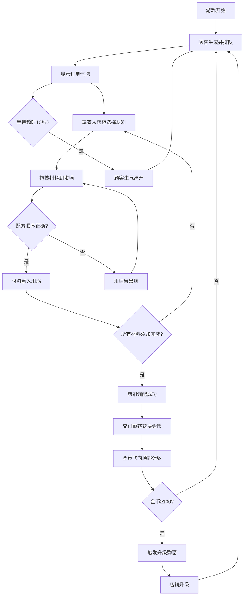

## 1. 产品概述
魔法药剂店是一款基于HTML5 Canvas的模拟经营类休闲游戏，玩家扮演魔法药剂师，根据顾客订单调配魔法药剂赚取金币并升级店铺。
- 目标用户：喜欢模拟经营和休闲益智类游戏的浏览器用户
- 核心价值：提供轻松有趣的配方调配玩法，精美的暗黑魔幻视觉风格，流畅的动画交互体验

## 2. 核心功能

### 2.1 用户角色
| 角色 | 注册方式 | 核心权限 |
|------|----------|----------|
| 玩家 | 无需注册 | 完整游戏体验，调配药剂，赚取金币，升级店铺 |

### 2.2 功能模块
1. **游戏主场景**：顾客排队区、药柜材料区、坩埚调配区三大区域
2. **顾客系统**：随机生成顾客、订单气泡、等待超时机制、愤怒离开动画
3. **材料系统**：4x3药柜网格、材料拖拽、选中光晕效果
4. **调配系统**：坩埚容器、配方顺序验证、液体倒入动画、粒子特效、错误提示
5. **交付系统**：药剂装瓶、金币奖励、飞行动画、数字回弹效果
6. **升级系统**：金币累积、升级弹窗、店铺等级提升

### 2.3 页面详情
| 页面名称 | 模块名称 | 功能描述 |
|---------|----------|----------|
| 游戏主界面 | 顶部标题栏 | 显示游戏名称、金币数量、店铺等级 |
| 游戏主界面 | 顾客等待区 | 顾客排队、订单气泡、计时进度条、愤怒动画 |
| 游戏主界面 | 药柜材料区 | 4x3材料瓶网格、选中状态、拖拽交互 |
| 游戏主界面 | 坩埚调配区 | 半椭圆坩埚、液体动画、粒子特效、配方进度 |
| 游戏主界面 | 升级弹窗 | 升级提示、关闭按钮、居中放大动画 |

## 3. 核心流程
玩家进入游戏后，顾客会随机出现在左侧排队并显示订单。玩家从右侧药柜点击选择材料，拖拽到中间坩埚按配方顺序添加。顺序正确时材料融入坩埚，全部材料添加完成后药剂调配成功。玩家将药剂交付给对应顾客获得金币，金币从顾客位置飞向顶部计数区域。当金币累积达到100时触发升级弹窗，玩家确认后店铺等级提升。若顾客等待超过10秒会生气变红并离开。

## 4. 用户界面设计

### 4.1 设计风格
- 主色调：暗黑魔幻风格，背景色#0f172a，深色调为主
- 强调色：金色#fbbf24（标题、升级边框）、红色#ef4444（错误、愤怒）、绿色#22c55e（成功）、蓝色#3b82f6（材料）
- 按钮样式：圆角8px，背景#334155，hover变为#475569，文字#f8fafc
- 字体：系统无衬线字体，标题24px/700，正文14px/400
- 布局：三栏式布局，左侧30%顾客区，中间40%坩埚区，右侧30%药柜区
- 动画风格：弹性缓动(ease-out)、粒子特效、平滑过渡

### 4.2 页面设计概述
| 页面名称 | 模块名称 | UI元素 |
|---------|----------|--------|
| 游戏主界面 | 顶部标题栏 | 渐变背景#1e293b→#0f172a，金色标题带发光效果，金币计数区域 |
| 游戏主界面 | 顾客等待区 | 像素小人32x32，订单气泡圆角12px背景#1e293b，等待进度条 |
| 游戏主界面 | 药柜材料区 | 4x3网格，彩色材料瓶，选中光晕动画#f8fafc77 |
| 游戏主界面 | 坩埚调配区 | 半椭圆坩埚#334155，内壁渐变，液体倒入动画，水花粒子8个 |
| 游戏主界面 | 升级弹窗 | 背景#1e293b，圆角16px，金色边框1px，红色关闭按钮 |

### 4.3 响应式
- Desktop-first设计，宽度≥768px时三栏横向布局
- 宽度<768px时改为上下排列：顾客区在上，坩埚区居中，药柜区在下
- 所有区域保留圆角8px，触控区域适当放大

### 4.4 性能要求
- 游戏循环稳定60fps
- 使用requestAnimationFrame实现动画
- 粒子系统使用对象池优化
- Canvas分层渲染减少重绘
