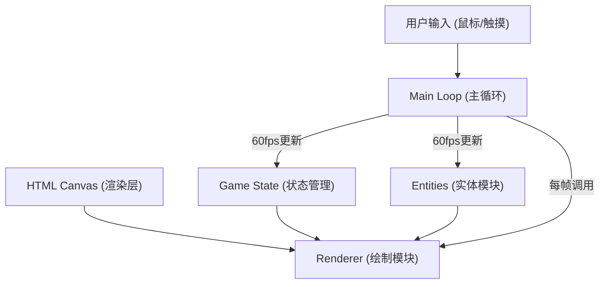

## 1. 架构设计



## 2. 技术描述
- 前端：TypeScript + HTML5 Canvas + Vite
- 构建工具：Vite 5.x
- 语言：TypeScript 5.x（严格模式，ES2020模块）
- 渲染方式：纯Canvas 2D API，无第三方渲染库
- 状态管理：自定义事件监听模式，模块间松耦合通信
- 无后端、无数据库，纯前端游戏

## 3. 项目结构
| 文件路径 | 作用 |
|---------|------|
| `/package.json` | 项目依赖配置，scripts定义 |
| `/index.html` | 入口页面，全屏Canvas，CSS样式嵌入 |
| `/tsconfig.json` | TypeScript严格模式配置 |
| `/vite.config.js` | Vite基础配置，指定入口 |
| `/src/main.ts` | 游戏主循环，初始化场景，帧率管理，更新调度 |
| `/src/entities.ts` | 实体类定义：Customer、MaterialBottle、Cauldron、Potion、Particle |
| `/src/gameState.ts` | 全局状态管理：金币、配方步骤、顾客队列、升级等级、事件系统 |
| `/src/renderer.ts` | Canvas绘制：背景、实体、粒子、UI、动画效果 |

## 4. 核心模块设计

### 4.1 实体类 (entities.ts)
```typescript
interface Position { x: number; y: number; }
interface Size { width: number; height: number; }

class Customer {
  id: string;
  position: Position;
  color: string;
  order: PotionRecipe;
  waitTime: number;
  maxWaitTime: number;
  state: 'waiting' | 'angry' | 'leaving' | 'served';
  angerEmojiTimer: number;
}

class MaterialBottle {
  id: string;
  position: Position;
  color: string;
  type: MaterialType;
  isSelected: boolean;
  glowRadius: number;
  gridIndex: { row: number; col: number };
}

class Cauldron {
  position: Position;
  size: Size;
  ingredients: MaterialType[];
  isSmoking: boolean;
  smokeParticles: Particle[];
}

class Potion {
  id: string;
  position: Position;
  color: string;
  recipe: PotionRecipe;
  isFlying: boolean;
}

class Particle {
  position: Position;
  velocity: Position;
  color: string;
  life: number;
  maxLife: number;
  size: number;
}
```

### 4.2 状态管理 (gameState.ts)
```typescript
type GameEventType = 
  | 'goldChanged' 
  | 'customerServed' 
  | 'customerLeft'
  | 'potionBrewed'
  | 'upgradeAvailable';

class GameState {
  gold: number;
  level: number;
  customers: Customer[];
  currentRecipeStep: number;
  currentRecipe: PotionRecipe | null;
  selectedMaterial: MaterialBottle | null;
  brewedPotion: Potion | null;
  showUpgradeModal: boolean;
  private listeners: Map<GameEventType, Function[]>;
  
  addEventListener(type: GameEventType, callback: Function);
  removeEventListener(type: GameEventType, callback: Function);
  private emit(type: GameEventType, data?: any);
}
```

### 4.3 渲染器 (renderer.ts)
```typescript
class Renderer {
  ctx: CanvasRenderingContext2D;
  canvas: HTMLCanvasElement;
  
  clear();
  drawBackground();
  drawHeader(title: string, gold: number, level: number);
  drawCustomerArea(customers: Customer[], area: Rect);
  drawCabinetArea(bottles: MaterialBottle[], area: Rect);
  drawCauldronArea(cauldron: Cauldron, potion: Potion | null, area: Rect);
  drawParticles(particles: Particle[]);
  drawUpgradeModal(show: boolean, level: number);
  drawOrderBubble(customer: Customer);
  drawPixelCharacter(customer: Customer);
  drawMaterialBottle(bottle: MaterialBottle);
  drawCauldron(cauldron: Cauldron);
  drawPotionBottle(potion: Potion);
  drawLiquidPourEffect(from: Position, to: Position, color: string);
  drawGoldFlyEffect(from: Position, to: Position, amount: number, progress: number);
}
```

### 4.4 主循环 (main.ts)
```typescript
class Game {
  canvas: HTMLCanvasElement;
  renderer: Renderer;
  gameState: GameState;
  lastTime: number;
  deltaTime: number;
  animationFrameId: number;
  
  init();
  loop(currentTime: number);
  update(deltaTime: number);
  render();
  setupInputHandlers();
  spawnCustomer();
  checkRecipe(material: MaterialType);
  serveCustomer();
}
```

## 5. 配方数据
```typescript
type MaterialType = 'fire' | 'nature' | 'water' | 'earth';

interface PotionRecipe {
  id: string;
  name: string;
  ingredients: MaterialType[];
  reward: [number, number]; // [min, max] gold
}

const POTION_RECIPES: PotionRecipe[] = [
  { id: 'healing', name: '治疗药剂', ingredients: ['nature', 'water', 'earth'], reward: [20, 35] },
  { id: 'fire', name: '火焰药剂', ingredients: ['fire', 'fire', 'earth'], reward: [25, 40] },
  { id: 'mana', name: '魔力药剂', ingredients: ['water', 'nature', 'nature'], reward: [30, 45] },
  { id: 'strength', name: '力量药剂', ingredients: ['fire', 'earth', 'water'], reward: [35, 50] },
];

const MATERIAL_COLORS: Record<MaterialType, string> = {
  fire: '#ef4444',
  nature: '#22c55e',
  water: '#3b82f6',
  earth: '#f59e0b',
};
```

## 6. 动画与性能
- 使用requestAnimationFrame实现60fps游戏循环
- 粒子系统采用对象池模式，避免频繁GC
- 位置计算使用deltaTime归一化，保证不同帧率下表现一致
- Canvas采用单次清空+批量绘制模式，减少状态切换
- 弹性缓动函数：`easeOutElastic(t) = 1 - Math.pow(1 - t, 3) * Math.cos(t * Math.PI * 3)`
- 颜色混合：多材料颜色使用RGB加权平均算法
