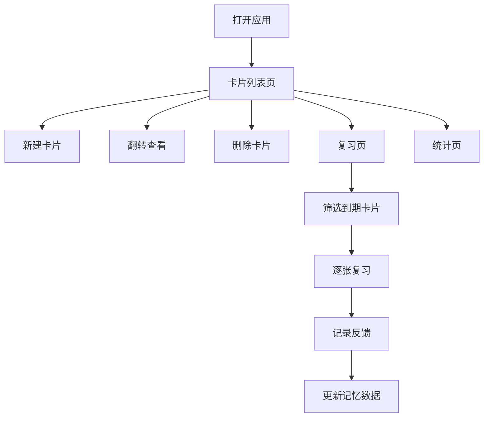

## 1. 产品概述

微型知识卡片闪卡系统是一款基于间隔重复算法的记忆学习工具，帮助用户高效创建、复习和管理知识卡片。通过科学的记忆算法，优化复习节奏，提升学习效率。

- 核心功能：卡片CRUD管理、间隔重复复习、学习数据统计
- 目标用户：学生、自学者、备考人群
- 产品价值：将零散知识结构化，通过算法优化记忆曲线

## 2. 核心功能

### 2.1 功能模块

1. **卡片列表页**：网格展示所有卡片，支持3D翻转动画查看答案，支持删除卡片，支持新建卡片
2. **复习页**：基于间隔重复算法筛选待复习卡片，逐张复习，记录"记住/忘记"反馈
3. **统计看板**：展示总卡片数、已复习数、今日复习数、平均记忆率，以及类别分布柱状图

### 2.2 页面详情

| 页面名称 | 模块名称 | 功能描述 |
|---------|---------|---------|
| 卡片列表页 | 卡片网格 | 3列网格展示卡片（移动端单列），悬停阴影加深，点击翻转显示答案 |
| 卡片列表页 | 新建卡片模态框 | 表单包含问题、答案、类别下拉、难度滑块，支持提交验证 |
| 卡片列表页 | 删除确认弹窗 | 点击删除按钮弹出确认框，删除后卡片淡出 |
| 复习页 | 复习卡片 | 居中显示问题和答案输入框，提交后显示答案比对 |
| 复习页 | 记忆反馈 | 记住/忘记按钮，更新下次复习时间，显示进度条 |
| 统计页 | 数据看板 | 4项核心统计卡片，渐变色背景 |
| 统计页 | 柱状图 | 纯CSS柱状图展示各类别卡片数量 |

## 3. 核心流程

用户打开应用 → 浏览卡片列表 → 点击卡片翻转查看答案 / 点击新建按钮创建卡片 / 点击删除按钮移除卡片
用户点击复习标签 → 系统筛选到期卡片 → 逐张复习（回答→比对→记住/忘记）→ 更新记忆数据
用户点击统计标签 → 查看学习数据统计和类别分布

## 4. 用户界面设计

### 4.1 设计风格

- 主题色：#3b82f6（主蓝）、#1e40af（深蓝）、#10b981（成功绿）、#ef4444（危险红）
- 背景色：#f8fafc（页面）、#ffffff（卡片/导航）
- 按钮风格：圆角8px，悬停深色，点击缩放反馈
- 字体：无衬线系统字体，层级清晰
- 布局：顶部导航56px + 主内容区，卡片式设计
- 动效：翻转动画0.5s、页面切换0.3s fadeIn、悬停/点击微交互0.2s

### 4.2 页面设计概述

| 页面名称 | 模块名称 | UI元素 |
|---------|---------|---------|
| 卡片列表页 | 卡片网格 | 240x180px卡片，圆角12px，1px边框，悬停阴影加深上移4px，0.2s过渡 |
| 卡片列表页 | 类别标签 | 圆角8px，背景#dbeafe，文字#1e40af，12px字号 |
| 卡片列表页 | 删除按钮 | 24px圆形，#fee2e2背景，悬停#fecaca |
| 复习页 | 卡片容器 | 居中，#f8fafc背景 |
| 复习页 | 答案输入框 | 500x150px，圆角8px，2px边框，聚焦变蓝 |
| 复习页 | 反馈按钮 | 圆角，绿色记住，红色忘记，点击缩放0.95 |
| 统计页 | 统计卡片 | 160x100px，渐变背景，圆角12px，32px/700数字 |
| 统计页 | 柱状图 | 纯CSS，柱宽40px，高0-200px，间距12px，#3b82f6 |
| 全局 | 导航栏 | 56px高，#ffffff，底部阴影，底部2px选中指示 |
| 全局 | 模态框 | #00000080遮罩，4px模糊，内容居中 |

### 4.3 响应式

- 移动端（<768px）：卡片单列，网格间隙8px，统计卡片100%宽度
- 桌面端（≥768px）：卡片3列网格，间隙16px

### 4.4 性能要求

- 卡片列表加载时间 ≤ 200ms（前端分页，每页20张）
- 复习状态更新响应 ≤ 50ms
