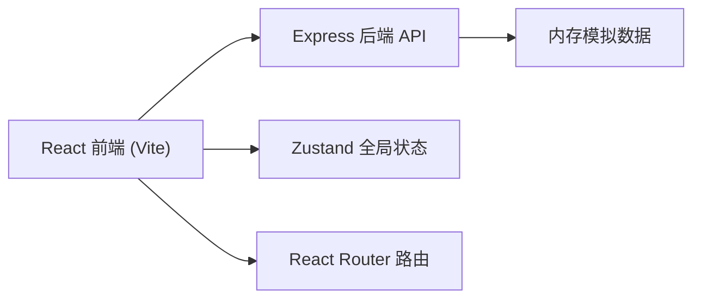
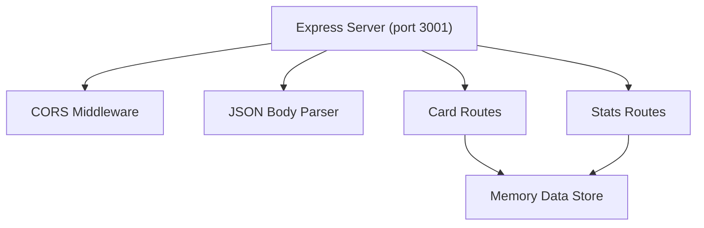
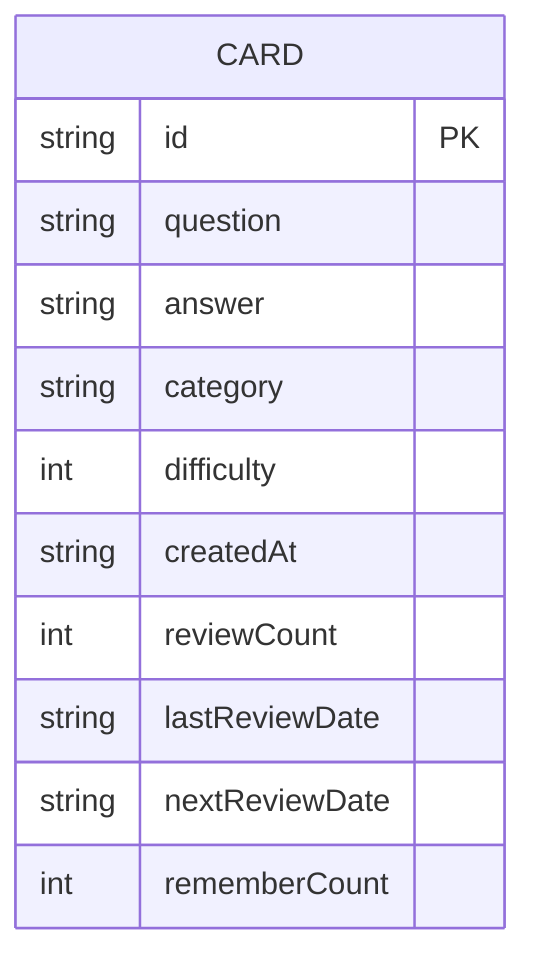

## 1. 架构设计



## 2. 技术描述

- 前端框架：React 18 + TypeScript
- 构建工具：Vite
- 路由：react-router-dom
- 状态管理：Zustand
- HTTP请求：Fetch API 封装
- 样式：CSS Modules / 内联样式（纯CSS，不使用Tailwind）
- 后端：Express 4
- 后端中间件：cors
- 唯一ID：uuid
- 端口：前端Vite默认端口，后端3001
- 数据存储：内存模拟数据（后端内存）

## 3. 路由定义

| 路由 | 页面 | 功能 |
|-----|------|------|
| / | 卡片列表页 | 网格展示所有卡片，支持新建/删除/翻转 |
| /review | 复习页 | 间隔重复算法复习卡片 |
| /stats | 统计页 | 学习数据统计看板 |

## 4. API 定义

### 4.1 类型定义

```typescript
interface Card {
  id: string;
  question: string;
  answer: string;
  category: string;
  difficulty: number;
  createdAt: string;
  reviewCount: number;
  lastReviewDate: string | null;
  nextReviewDate: string | null;
  rememberCount: number;
}
```

### 4.2 接口定义

| 方法 | 路径 | 功能 | 请求/响应 |
|-----|------|------|----------|
| GET | /api/cards | 获取所有卡片 | 响应：Card[] |
| GET | /api/cards/:id | 获取单张卡片 | 响应：Card |
| POST | /api/cards | 创建卡片 | 请求：{question, answer, category, difficulty} 响应：Card |
| PUT | /api/cards/:id | 更新卡片（复习反馈） | 请求：{remembered: boolean} 响应：Card |
| DELETE | /api/cards/:id | 删除卡片 | 响应：{success: boolean} |
| GET | /api/cards/review/due | 获取今日待复习卡片 | 响应：Card[] |
| GET | /api/stats | 获取统计数据 | 响应：{total, reviewed, todayReviewed, rememberRate, categoryCounts} |

## 5. 服务器架构



## 6. 数据模型

### 6.1 数据实体



### 6.2 间隔重复算法

```
简化版间隔重复算法：
- 首次复习：nextReview = today + 1天
- 记住（remembered=true）：间隔天数 *= (2 - difficulty * 0.15)
- 忘记（remembered=false）：间隔天数重置为1天
- difficulty: 1-5，影响复习间隔增长速度
```

## 7. 项目文件结构

```
.
├── package.json
├── vite.config.js
├── tsconfig.json
├── index.html
├── server.js
└── src/
    ├── main.tsx
    ├── App.tsx
    ├── api.ts
    ├── types.ts
    ├── store/
    │   └── useCardStore.ts
    ├── components/
    │   ├── Navbar.tsx
    │   ├── FlashCard.tsx
    │   ├── NewCardModal.tsx
    │   ├── DeleteConfirmModal.tsx
    │   └── StatCard.tsx
    ├── pages/
    │   ├── CardListPage.tsx
    │   ├── ReviewPage.tsx
    │   └── StatsPage.tsx
    └── styles/
        └── global.css
```
