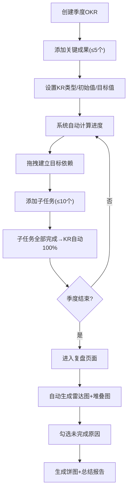

## 1. 产品概述

面向小型团队的季度OKR制定、跟踪与复盘工具，解决纸质管理或简单文档无法直观展示目标进度、跨周期关联和团队协作的问题。通过可视化进度追踪、拖拽式目标依赖关联和自动化复盘报告，帮助团队高效管理目标与关键成果。

- 目标用户：5-20人小型团队，需要季度目标管理的创业公司/部门
- 核心价值：让OKR管理从"文档记录"升级为"可视化协作"，实现进度实时可见、依赖关系清晰、复盘数据驱动

## 2. 核心功能

### 2.1 用户角色
| 角色 | 注册方式 | 核心权限 |
|------|----------|----------|
| 团队成员 | 加入团队 | 查看OKR、编辑自己负责的关键成果和子任务 |
| 团队管理员 | 创建团队 | 创建/编辑/删除OKR、管理成员、查看复盘报告 |

### 2.2 功能模块
1. **OKR看板页面**：目标列表展示、拖拽关联、进度追踪、关键成果管理、子任务面板
2. **复盘报告页面**：雷达图、堆叠条形图、饼图、未完成原因标注、季度总结

### 2.3 页面详情
| 页面名称 | 模块名称 | 功能描述 |
|----------|----------|----------|
| OKR看板 | 目标标题区 | 显示当前季度目标名称，支持点击编辑 |
| OKR看板 | 关键成果列表 | 每个成果占一行，含进度条、类型标签、负责人头像，悬停显示编辑/删除 |
| OKR看板 | 拖拽关联视图 | 同季度目标间横向拖拽建立依赖，箭头曲线连接线，可选中高亮 |
| OKR看板 | 子任务面板 | 底部折叠/展开面板，可切换视图模式，支持按负责人筛选 |
| 复盘报告 | 完成率雷达图 | 目标完成率多维度展示，渐变网格线背景，鼠标悬停显示详情 |
| 复盘报告 | 进度堆叠条形图 | 关键成果进度堆叠展示，悬停显示详情 |
| 复盘报告 | 未完成原因饼图 | 用户勾选原因后生成分布图，悬停显示详情 |

## 3. 核心流程

**OKR创建与管理流程：**
1. 管理员创建季度OKR，设置目标名称
2. 为每个目标添加最多5个关键成果，设置类型（数值型/布尔型/百分比型）、初始值和目标值
3. 系统自动计算完成百分比，实时更新进度条颜色和数值
4. 通过拖拽建立目标间依赖关系，依赖目标需解锁条件满足才可操作
5. 为关键成果添加子任务（最多10个），指定负责人和状态
6. 所有子任务完成后关键成果自动标记为100%

**复盘报告生成流程：**
1. 季度结束后进入复盘页面
2. 系统自动生成雷达图、堆叠条形图
3. 用户对未完成的关键成果勾选原因
4. 系统生成未完成原因分布饼图
5. 形成完整季度OKR总结报告

## 4. 用户界面设计

### 4.1 设计风格
- 主色：#0d9488（蓝绿色），强调色：#14b8a6，警告色：#f59e0b
- 按钮风格：圆角（rounded-lg），悬停有轻微阴影提升效果
- 字体：标题使用 Outfit（粗体），正文使用 DM Sans
- 布局：左-中-右三栏布局，左侧固定导航240px，中间主内容区，右侧留白
- 进度条颜色规则：0-30%红色、31-70%黄色、71-100%绿色，切换1秒渐变动画
- 图标风格：使用 lucide-react 线性图标

### 4.2 页面设计概览
| 页面名称 | 模块名称 | UI元素 |
|----------|----------|--------|
| OKR看板 | 导航栏 | 240px宽，#f3f4f6背景，1px #e5e7eb右分隔线，团队名称+OKR列表+复盘入口 |
| OKR看板 | 目标标题区 | 可编辑标题，蓝绿色下划线指示，点击进入编辑态 |
| OKR看板 | 关键成果卡片 | 进度条+类型标签+负责人头像，悬停编辑/删除图标，点击scale(1.02) 150ms弹起 |
| OKR看板 | 拖拽关联线 | SVG曲线连接线+箭头，选中高亮，依赖条件文字标注 |
| OKR看板 | 子任务面板 | 折叠/展开切换，视图模式切换（列表/看板），复选框300ms旋转+颜色填充动画 |
| 复盘报告 | 雷达图 | Recharts RadarChart，渐变网格线背景，悬停tooltip |
| 复盘报告 | 堆叠条形图 | Recharts BarChart stacked，悬停tooltip |
| 复盘报告 | 饼图 | Recharts PieChart，原因分布，悬停tooltip |

### 4.3 响应式设计
- 桌面优先（≥768px）：三栏布局，完整功能
- 移动端（<768px）：三栏变为上下堆叠，导航栏收起为汉堡菜单，图表缩放至合适尺寸
- 触摸优化：拖拽操作支持触摸事件，按钮和卡片增大点击区域

### 4.4 动效规范
- 进度条颜色变化：1秒 CSS transition 渐变
- 关键成果卡片点击：transform: scale(1.02) 150ms ease-out
- 子任务复选框：300ms 旋转 + 颜色填充 CSS animation
- 页面切换：淡入效果 200ms
- 拖拽连接线：绘制动画 300ms stroke-dashoffset
