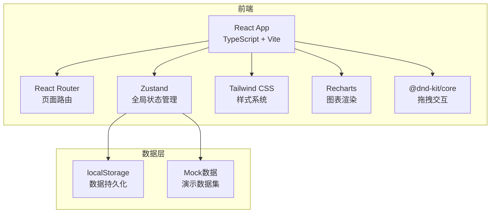
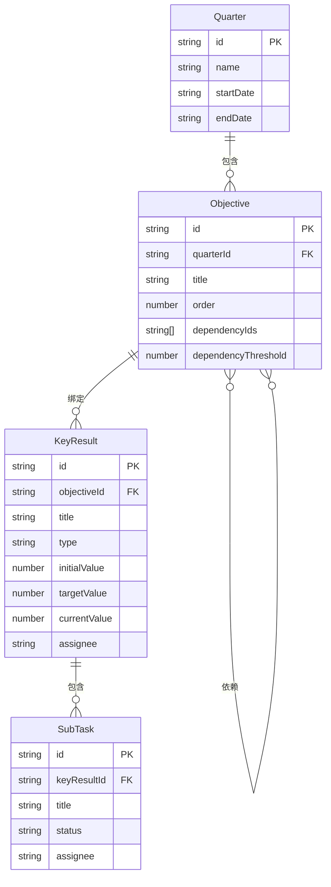

## 1. 架构设计



纯前端架构，使用localStorage持久化数据，无需后端服务。

## 2. 技术说明
- 前端：React@18 + TypeScript + Tailwind CSS@3 + Vite
- 初始化工具：vite-init（react-ts模板）
- 状态管理：Zustand
- 路由：React Router v6（BrowserRouter）
- 图表：Recharts
- 拖拽：@dnd-kit/core + @dnd-kit/sortable
- 数据持久化：localStorage
- 图标：lucide-react

## 3. 路由定义
| 路由 | 用途 |
|------|------|
| / | 重定向到当前季度OKR看板 |
| /okr/:quarterId | OKR看板主页面，展示指定季度的目标、关键成果、子任务 |
| /report/:quarterId | 复盘报告页面，展示雷达图、堆叠图、饼图 |

## 4. 数据模型

### 4.1 数据模型定义



### 4.2 数据类型定义

```typescript
type KRType = 'numeric' | 'boolean' | 'percentage';
type SubTaskStatus = 'todo' | 'in_progress' | 'done';

interface Quarter {
  id: string;
  name: string;
  startDate: string;
  endDate: string;
}

interface Objective {
  id: string;
  quarterId: string;
  title: string;
  order: number;
  dependencyIds: string[];
  dependencyThreshold: number;
}

interface KeyResult {
  id: string;
  objectiveId: string;
  title: string;
  type: KRType;
  initialValue: number;
  targetValue: number;
  currentValue: number;
  assignee: string;
}

interface SubTask {
  id: string;
  keyResultId: string;
  title: string;
  status: SubTaskStatus;
  assignee: string;
}
```

## 5. 文件组织

```
├── package.json
├── vite.config.js
├── tsconfig.json
├── index.html
├── tailwind.config.js
├── postcss.config.js
├── src/
│   ├── main.tsx
│   ├── App.tsx
│   ├── index.css
│   ├── store/
│   │   └── useOkrStore.ts
│   ├── modules/
│   │   ├── okr/
│   │   │   ├── components/
│   │   │   │   ├── OkrBoard.tsx
│   │   │   │   └── KeyResultCard.tsx
│   │   │   └── utils/
│   │   │       └── progressCalculator.ts
│   │   └── report/
│   │       ├── components/
│   │       │   └── ReportPage.tsx
│   │       └── utils/
│   │           └── chartConfig.ts
│   └── shared/
│       └── components/
│           └── Navigation.tsx
```

## 6. 关键技术方案

### 6.1 进度计算（progressCalculator.ts）
- 数值型：`(currentValue - initialValue) / (targetValue - initialValue) * 100`
- 布尔型：currentValue >= targetValue ? 100 : 0
- 百分比型：直接使用 currentValue 作为百分比
- 颜色映射：0-30% → 红色(#ef4444)，31-70% → 黄色(#f59e0b)，71-100% → 绿色(#22c55e)
- 动画参数：transition duration 1000ms ease-in-out

### 6.2 拖拽关联（OkrBoard.tsx）
- 使用 @dnd-kit/core 实现目标卡片间拖拽
- SVG层绘制贝塞尔曲线连接线+箭头
- 依赖关系数据存储在 Objective.dependencyIds 中
- 选中连接线时高亮显示（stroke-width + 颜色变化）

### 6.3 子任务自动完成
- 监听子任务状态变化
- 当某关键成果下所有子任务状态为 done 时，自动将 currentValue 设为 targetValue
- 触发进度重新计算

### 6.4 图表配置（chartConfig.ts）
- 雷达图：RadarChart + PolarGrid（渐变背景）+ Tooltip
- 堆叠条形图：BarChart + 堆叠Bar + Tooltip
- 饼图：PieChart + Pie + Tooltip + Cell（原因对应颜色）
