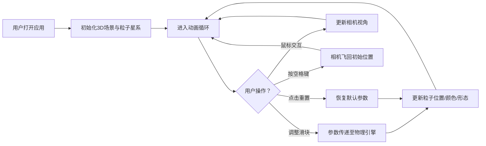

## 1. 产品概述

3D粒子星系生成与形态演化应用，为天文爱好者和教育者提供低门槛、可交互的星系可视化工具，用于展示星系碰撞、螺旋臂形态变化等天文现象。

- 目标用户：天文爱好者、教育工作者、学生
- 核心价值：将抽象的星系物理过程转化为直观的3D交互体验

## 2. 核心功能

### 2.1 功能模块

1. **3D星系场景**：5000粒子实时渲染，背景垂直渐变
2. **参数控制面板**：旋转速度、引力强度、星系扁平度滑块
3. **视角交互系统**：鼠标拖拽旋转、滚轮缩放、空格键重置视角
4. **性能监控面板**：FPS帧率、粒子渲染数量、更新次数实时显示
5. **物理引擎**：粒子引力计算、旋转变形、颜色速度映射

### 2.2 功能详情

| 页面/模块 | 子模块 | 功能描述 |
|-----------|--------|----------|
| 3D星系场景 | 粒子系统 | 5000粒子，大小0.05单位，初始颜色#2563eb，半径10球体分布 |
| 3D星系场景 | 颜色映射 | 速度0.1→#2563eb，速度1.0→#ef4444，线性插值，过渡0.3s |
| 参数控制面板 | 旋转速度滑块 | 范围0.1-2.0，步长0.1，实时生效 |
| 参数控制面板 | 引力强度滑块 | 范围0.5-5.0，步长0.1，实时生效 |
| 参数控制面板 | 星系扁平度滑块 | 范围0.1-1.0，步长0.05，实时生效 |
| 参数控制面板 | 重置按钮 | 恢复所有参数默认值，点击动画反馈 |
| 视角交互 | 鼠标拖拽 | 左键拖拽旋转视角，阻尼0.95 |
| 视角交互 | 滚轮缩放 | 缩放范围5-30单位 |
| 视角交互 | 空格键 | 相机飞回初始视角，1.5秒ease-in-out动画 |
| 性能监控 | FPS显示 | 实时帧率，低于30FPS时边框变红 |
| 性能监控 | 粒子统计 | 渲染数量、每秒更新次数 |

## 3. 核心流程

## 4. 用户界面设计

### 4.1 设计风格

- **主色调**：深空蓝紫渐变（#0f172a → #1e1b4b）
- **强调色**：蓝色#3b82f6、红色#ef4444
- **辅助色**：文本#cbd5e1、次级文本#94a3b8、背景#1e293b
- **按钮样式**：圆角8px，悬停变色，点击缩放反馈
- **字体**：monospace（性能面板）、无衬线体（控制标签）

### 4.2 页面设计

| 模块 | UI元素 | 设计规范 |
|------|--------|----------|
| 全屏Canvas | 3D场景 | 背景#0f172a→#1e1b4b垂直渐变 |
| 左侧控制面板 | 容器 | 宽度280px，背景#1e293be0，圆角16px，内边距20px，距左上各20px |
| 左侧控制面板 | 参数标签 | 14px/600，颜色#cbd5e1 |
| 左侧控制面板 | 滑块轨道 | 高4px，颜色#475569 |
| 左侧控制面板 | 滑块按钮 | 直径16px，颜色#3b82f6，拖动时#60a5fa |
| 左侧控制面板 | 重置按钮 | 高40px，背景#3b82f6，文字白色14px/500，圆角8px，悬停#2563eb，点击缩放0.95/0.1s |
| 右下性能面板 | 容器 | 半透明背景#1e293bcc，圆角8px，12px monospace #94a3b8，<30FPS边框#ef4444 |

### 4.3 响应式

- 桌面端优先设计
- 控制面板固定定位，不随缩放改变
- Canvas自适应窗口大小

### 4.4 3D场景指导

- **环境**：深空背景，垂直蓝紫渐变
- **光照**：无额外光源，粒子自发光
- **相机**：PerspectiveCamera，初始距离适中，支持OrbitControls式交互
- **动画**：60FPS粒子更新，参数变化0.3s平滑过渡
- **性能目标**：集成显卡现代笔记本上≥60FPS
