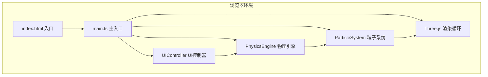

## 1. 架构设计



## 2. 技术说明

- **前端框架**：原生 TypeScript（无React/Vue）
- **3D引擎**：Three.js
- **构建工具**：Vite
- **模块组织**：按职责分离为独立类

### 2.1 依赖说明

| 依赖 | 版本 | 用途 |
|------|------|------|
| three | latest | 3D渲染引擎 |
| @types/three | latest | Three.js类型定义 |
| typescript | latest | TypeScript编译 |
| vite | latest | 构建与开发服务器 |

## 3. 模块设计

### 3.1 ParticleSystem（粒子系统）

职责：
- 生成5000个粒子的初始星系（球体随机分布，半径10）
- 管理粒子的位置、颜色、大小属性
- 暴露更新接口供PhysicsEngine调用
- 使用BufferGeometry + PointsMaterial实现高效渲染

关键属性：
- `particleCount: number = 5000`
- `positions: Float32Array`
- `colors: Float32Array`
- `points: THREE.Points`

关键方法：
- `constructor(scene: THREE.Scene)`
- `updatePositions(positions: Float32Array): void`
- `updateColors(colors: Float32Array): void`
- `getPositions(): Float32Array`

### 3.2 PhysicsEngine（物理引擎）

职责：
- 计算粒子间引力（简化模型）
- 应用旋转速度到粒子
- 根据扁平度参数压缩Y轴
- 根据粒子速度映射颜色（蓝→红）
- 参数变化0.3秒平滑过渡

关键属性：
- `rotationSpeed: number`（范围0.1-2.0）
- `gravityStrength: number`（范围0.5-5.0）
- `flatness: number`（范围0.1-1.0）
- `particleSystem: ParticleSystem`

关键方法：
- `constructor(particleSystem: ParticleSystem)`
- `update(deltaTime: number): void`
- `setRotationSpeed(value: number): void`
- `setGravityStrength(value: number): void`
- `setFlatness(value: number): void`
- `reset(): void`

### 3.3 UIController（UI控制器）

职责：
- 创建左侧控制面板DOM元素
- 创建右下性能监控面板
- 绑定滑块事件，将参数传递给PhysicsEngine
- 重置按钮逻辑
- 监控FPS、更新次数等性能指标

关键属性：
- `physicsEngine: PhysicsEngine`
- `camera: THREE.PerspectiveCamera`
- `controls: OrbitControls`

关键方法：
- `constructor(physicsEngine: PhysicsEngine, camera, controls)`
- `createControlPanel(): void`
- `createPerformancePanel(): void`
- `updatePerformance(fps: number, particleCount: number, updatesPerSec: number): void`

### 3.4 main.ts（主入口）

职责：
- 初始化Three.js场景、相机、渲染器
- 创建ParticleSystem、PhysicsEngine、UIController实例
- 绑定鼠标交互（拖拽旋转、滚轮缩放）
- 绑定空格键重置视角
- 启动requestAnimationFrame动画循环

## 4. 文件结构

```
auto110/
├── package.json
├── vite.config.js
├── tsconfig.json
├── index.html
└── src/
    ├── main.ts
    ├── particleSystem.ts
    ├── physicsEngine.ts
    └── uiController.ts
```

## 5. 性能优化策略

1. 使用BufferGeometry而非Geometry，减少CPU-GPU数据传输
2. 粒子颜色/位置数据通过typed array批量更新
3. 引力计算使用简化N体模型（避免O(n²)全量计算）
4. 相机旋转使用阻尼平滑，避免每帧大量矩阵运算
5. 性能面板节流更新（每500ms刷新一次）
