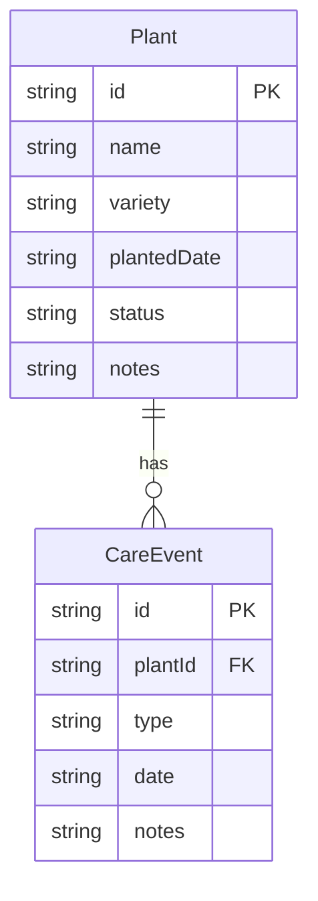

## 1. 架构设计

```mermaid
flowchart TB
    "Frontend[React + TypeScript + Vite]" --> "API[Express.js REST API]"
    "API" --> "Data[内存数据存储]"
    "Frontend" --> "Charts[Recharts 图表库]"
    "Frontend" --> "Router[React Router DOM]"
```

## 2. 技术说明

- 前端：React@18 + TypeScript + TailwindCSS + Vite
- 初始化工具：vite-init（react-express-ts 模板）
- 后端：Express.js + CORS + uuid
- 数据库：内存数组存储（模拟数据）
- 图表：Recharts（环形图PieChart + 折线图LineChart）
- 路由：React Router DOM v6

## 3. 路由定义

| 路由 | 用途 |
|------|------|
| / | 植物列表页，展示卡片墙和添加植物入口 |
| /plant/:id | 植物详情页，展示植物信息和养护事件列表 |
| /dashboard | 健康看板页，展示健康评分、环形图和折线图 |

## 4. API 定义

### 植物相关

| 方法 | 路径 | 描述 | 请求体 | 响应 |
|------|------|------|--------|------|
| GET | /api/plants | 获取所有植物 | - | Plant[] |
| GET | /api/plants/:id | 获取单个植物 | - | Plant |
| POST | /api/plants | 创建植物 | CreatePlantDTO | Plant |
| PUT | /api/plants/:id | 更新植物 | UpdatePlantDTO | Plant |
| DELETE | /api/plants/:id | 删除植物 | - | { success: boolean } |

### 事件相关

| 方法 | 路径 | 描述 | 请求体 | 响应 |
|------|------|------|--------|------|
| GET | /api/plants/:id/events | 获取植物事件列表 | - | CareEvent[] |
| POST | /api/plants/:id/events | 创建养护事件 | CreateEventDTO | CareEvent |
| DELETE | /api/events/:eventId | 删除养护事件 | - | { success: boolean } |

### 健康分析

| 方法 | 路径 | 描述 | 请求体 | 响应 |
|------|------|------|--------|------|
| GET | /api/health-analysis | 获取健康分析数据 | - | HealthAnalysis |

### TypeScript 类型定义

```typescript
type PlantStatus = "healthy" | "thirsty" | "low_light" | "pest";

interface Plant {
  id: string;
  name: string;
  variety: string;
  plantedDate: string;
  status: PlantStatus;
  notes: string;
}

interface CareEvent {
  id: string;
  plantId: string;
  type: "water" | "fertilize" | "repot" | "prune";
  date: string;
  notes: string;
}

interface HealthAnalysis {
  score: number;
  suggestion: string;
  statusDistribution: { status: PlantStatus; count: number; percentage: number }[];
  eventFrequency: { date: string; count: number; events: CareEvent[] }[];
}

interface CreatePlantDTO {
  name: string;
  variety: string;
  plantedDate: string;
  status: PlantStatus;
  notes?: string;
}

interface CreateEventDTO {
  type: "water" | "fertilize" | "repot" | "prune";
  date: string;
  notes?: string;
}
```

## 5. 服务器架构图

```mermaid
flowchart LR
    "Router[Express Router]" --> "PlantCtrl[植物控制器]"
    "Router" --> "EventCtrl[事件控制器]"
    "Router" --> "HealthCtrl[健康分析控制器]"
    "PlantCtrl" --> "Store[内存数据存储]"
    "EventCtrl" --> "Store"
    "HealthCtrl" --> "Store"
```

## 6. 数据模型

### 6.1 数据模型定义



### 6.2 初始数据

服务器启动时预置3-5棵示例植物和对应的养护事件，确保首页和看板有数据展示。
