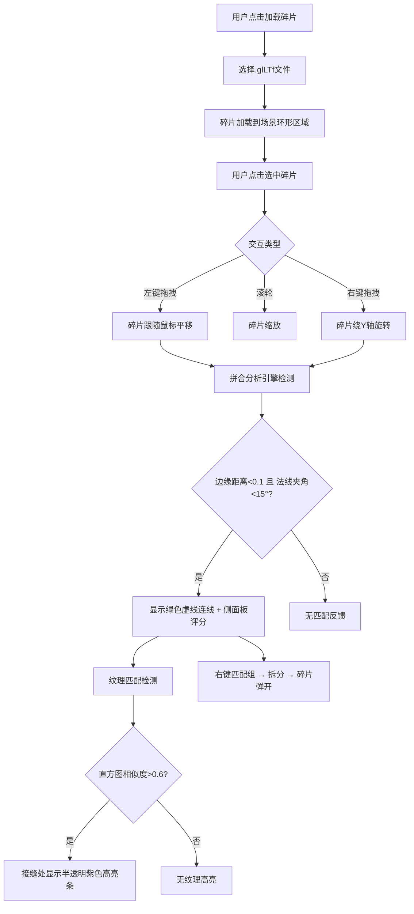

## 1. 产品概述

交互式3D陶器碎片拼合与纹理匹配可视化应用，面向考古学家和文物修复人员，解决传统2D照片和手绘图纸难以直观展示碎片空间关系的问题。用户可在三维场景中加载、拖拽、旋转碎片，系统实时计算边缘贴合度与纹理匹配度并给出视觉反馈。

## 2. 核心功能

### 2.1 功能模块

1. **3D场景页面**：全屏3D画布 + 顶部操作栏 + 右侧属性面板 + 左下角小地图

### 2.2 页面详情

| 页面名称 | 模块名称 | 功能描述 |
|----------|----------|----------|
| 3D场景页面 | 顶部操作栏 | "加载碎片"按钮（上传.glTF文件）、"重置视角"按钮（相机平滑回位） |
| 3D场景页面 | 3D画布 | Three.js渲染场景，碎片拖拽/旋转/缩放交互，匹配连线显示，纹理高亮条 |
| 3D场景页面 | 右侧属性面板 | 显示选中碎片编号、顶点数、纹理信息，拼合匹配结果列表 |
| 3D场景页面 | 小地图 | 左下角200x200px缩略图，彩色点表示碎片位置与匹配状态 |
| 3D场景页面 | 右键菜单 | 匹配碎片组的拆分操作，弹开动画 |

## 3. 核心流程

## 4. 用户界面设计

### 4.1 设计风格

- 主色调：深色主题，背景#0f172a，面板#1e293b
- 按钮风格：圆角8px，主按钮#3b82f6，hover #2563eb
- 字体：系统无衬线字体，操作栏标题16px，面板正文14px
- 布局风格：全屏3D画布为底，顶部固定操作栏，右侧固定属性面板
- 图标风格：简洁线性图标
- 匹配评分颜色：<50 #ef4444，50-80 #fbbf24，>80 #22c55e
- 匹配连线：#22c55e虚线
- 选中高亮：#fbbf24边框

### 4.2 页面设计概览

| 页面名称 | 模块名称 | UI元素 |
|----------|----------|--------|
| 3D场景页面 | 顶部操作栏 | 高60px，背景#1e293b，圆底阴影，"加载碎片"按钮120x40px，"重置视角"按钮同尺寸 |
| 3D场景页面 | 3D画布 | 全屏，深色背景#0f172a，地面网格，碎片模型带纹理 |
| 3D场景页面 | 右侧属性面板 | 宽320px，背景#1e293b，圆角8px，距右边缘10px，碎片信息+匹配列表 |
| 3D场景页面 | 小地图 | 200x200px，左下角，背景#1e293b88，圆角8px |
| 3D场景页面 | 右键菜单 | 圆角8px，背景#1e293b，文字#f8fafc，hover #334155 |

### 4.3 响应式

桌面优先设计，3D画布自适应窗口大小，面板固定宽度不响应式折叠。

### 4.4 3D场景指引

- 环境：深色背景，柔和环境光+方向光，地面网格辅助空间感
- 光照：环境光0.4强度，方向光0.8强度从斜上方照射
- 相机：透视相机，默认视角45°俯视，距离15单位，支持OrbitControls旋转
- 交互：射线拾取碎片，拖拽平移，右键旋转，滚轮缩放
- 动效：碎片移动0.1s缓动，选中高亮脉动，匹配连线虚线动画
- 性能预算：10个碎片(500-2000三角形/个)，目标50FPS+
