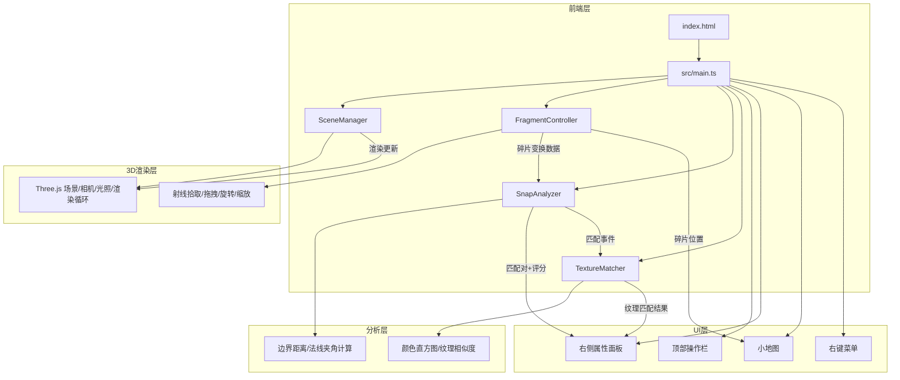

## 1. 架构设计



## 2. 技术说明

- 前端：TypeScript + Three.js + Vite
- 构建工具：Vite
- 3D渲染：Three.js (场景管理、glTF加载、射线检测)
- 事件系统：EventEmitter3 (模块间通信)
- 初始化工具：Vite vanilla-ts 模板
- 无后端服务

## 3. 文件结构与模块职责

```
项目根目录/
├── package.json              # 依赖: three, typescript, vite, @types/three, eventemitter3
├── vite.config.js            # Vite配置，入口index.html
├── tsconfig.json             # 严格模式，ES2020模块
├── index.html                # 入口页面，全屏3D画布+操作栏
└── src/
    ├── main.ts               # 应用入口，初始化各模块，数据流调度
    ├── scene/
    │   └── SceneManager.ts   # 3D场景管理(渲染循环/光照/地面网格)
    ├── fragment/
    │   └── FragmentController.ts  # 碎片交互(拾取/拖拽/旋转/缩放)
    ├── analysis/
    │   └── SnapAnalyzer.ts   # 拼合分析(边界距离/法线夹角)
    └── texture/
        └── TextureMatcher.ts # 纹理匹配(颜色直方图/相似度)
```

## 4. 数据流向

```
用户操作 → FragmentController(更新碎片变换)
         → SnapAnalyzer(读取变换，计算匹配)
         → TextureMatcher(读取纹理，计算相似度)
         → UI更新(属性面板/匹配列表/小地图/连线)
         → SceneManager(渲染更新)
```

## 5. 关键接口定义

```typescript
interface FragmentData {
  id: string;
  mesh: THREE.Group;
  boundingBox: THREE.Box3;
  normals: THREE.Vector3[];
  textureData: ImageData | null;
  vertexCount: number;
  hasTexture: boolean;
}

interface MatchPair {
  fragmentA: string;
  fragmentB: string;
  distance: number;
  normalAngle: number;
  score: number;
  textureScore: number;
}

interface SnapResult {
  pairs: MatchPair[];
  timestamp: number;
}
```

## 6. 性能策略

- 渲染：10碎片(500-2000三角形/个)，目标50FPS+
- 拼合检测：每0.3秒一次，延迟<0.2秒
- 纹理匹配：延迟<0.5秒
- 降级策略：帧率低于50FPS时自动降低阴影质量
- 匹配检测使用边界框预筛选减少计算量
