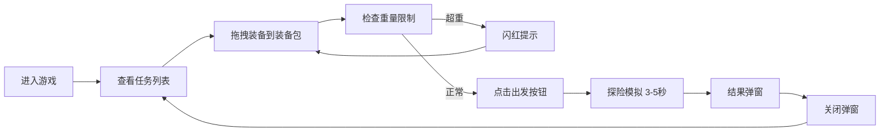

## 1. 产品概述

丛林探险队装备管理站是一款浏览器端经营模拟小游戏，玩家扮演装备管理员，根据探险任务需求从仓库中挑选合适装备组合成装备包，影响探险队在随机事件中的存活概率和收获。

- 目标用户：喜欢轻量级策略经营类小游戏的玩家
- 核心玩法：拖拽装备到装备包、重量限制策略、随机事件探险模拟
- 产品价值：提供策略性装备搭配的趣味性，随机事件带来重玩价值

## 2. 核心功能

### 2.1 功能模块
1. **任务消息栏**：右侧滚动展示探险任务，包含任务名称、难度星级、装备类型提示
2. **仓库货架**：左侧网格展示所有可用装备，支持拖拽操作
3. **装备包区域**：中间区域放置6个装备槽位，显示总重量，超重提示
4. **出发按钮**：启动探险模拟
5. **探险结果弹窗**：展示探险成败、收获或损失

### 2.2 页面详情

| 页面名称 | 模块名称 | 功能描述 |
|---------|---------|---------|
| 主界面 | 任务消息栏 | 右侧320px宽滚动消息栏，展示任务列表，新任务从底部滑入动画 |
| 主界面 | 仓库货架 | 左侧4列网格，每个格子160x180px，装备图标64x64px，悬停放大阴影效果 |
| 主界面 | 装备包区域 | 中间220px宽区域，6个50x50px槽位，虚线边框，拖入装备后边框变绿 |
| 主界面 | 出发按钮 | 下方160x48px绿色按钮，点击启动探险模拟，3-5秒后返回结果 |
| 主界面 | 结果弹窗 | 400px宽弹窗，展示探险结果，中心放大弹性动画 |

## 3. 核心流程

玩家进入游戏 → 查看右侧任务列表了解需求 → 从左侧仓库拖拽装备到中间装备包 → 监控总重量不超过20kg → 点击出发按钮 → 等待3-5秒探险模拟 → 查看结果弹窗 → 关闭弹窗开始新任务

## 4. 用户界面设计

### 4.1 设计风格
- 主题：深色丛林主题
- 主背景：#0f172a
- 点缀色：绿色#22c55e、蓝色#60a5fa
- 面板背景：#1e293b（半透明磨砂效果）
- 文字颜色：#cbd5e1
- 圆角设计：面板圆角分隔
- 过渡动画：统一0.2s ease-out

### 4.2 页面设计总览

| 页面名称 | 模块名称 | UI元素 |
|---------|---------|--------|
| 主界面 | 任务消息栏 | 320px宽、100%高、背景#1e293b磨砂、文字#cbd5e1、14px/1.6、新任务底部滑入0.4s ease-out |
| 主界面 | 仓库货架 | 4列网格、格子160x180px、背景#334155、圆角8px、边框#475569、悬停放大1.05倍+阴影、过渡0.2s |
| 主界面 | 装备图标 | 64x64px、类型配色：工具#60a5fa、医疗#f87171、食物#f59e0b、通讯#a78bfa |
| 主界面 | 装备包区域 | 220px宽、70%高、背景#1e293b、圆角12px、虚线边框2px dashed #475569、6个50x50px槽位 |
| 主界面 | 出发按钮 | 160x48px、背景#22c55e、圆角8px、16px/600白色文字、点击缩小0.95+变色#16a34a、过渡0.1s |
| 主界面 | 结果弹窗 | 400px宽、背景#1e293b、圆角16px、边框#475569、中心放大0.3s弹性动画 |

### 4.3 响应式
- 桌面端优先，最低适配1220px宽度屏幕
- 三栏布局：仓库货架 + 装备包 + 任务消息栏
- 固定宽度布局，不做移动端适配

### 4.4 性能要求
- 拖拽操作帧率不低于55fps
- 任务消息滚动流畅无卡顿
- 弹窗动画流畅无卡顿
