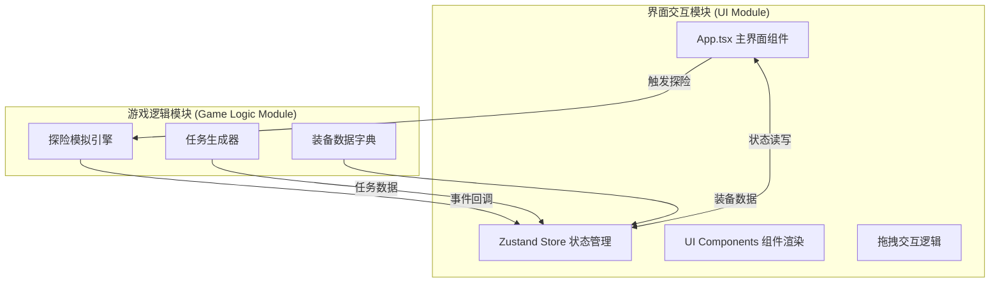

## 1. 架构设计

项目采用前端单页应用架构，分为两个独立模块：界面交互模块和游戏逻辑模块，通过Zustand状态管理和自定义事件进行通信。

## 2. 技术描述

- 前端框架：React 18 + TypeScript
- 构建工具：Vite
- 状态管理：Zustand
- 唯一ID生成：uuid
- 样式方案：原生CSS（styles.css全局样式）
- 模块划分：UI模块 + 游戏逻辑模块，通过Zustand store和自定义事件接口调用

## 3. 文件结构

| 文件路径 | 用途 |
|---------|------|
| package.json | 项目依赖和脚本配置 |
| vite.config.js | Vite构建配置 |
| tsconfig.json | TypeScript配置（严格模式，ES2020） |
| index.html | 入口页面，全屏容器和基础暗色样式 |
| src/main.ts | React应用入口，挂载App组件，初始化全局样式 |
| src/ui/App.tsx | 主界面组件，组合装备架、装备包、任务栏，管理拖拽和任务状态 |
| src/logic/gameEngine.ts | 独立游戏逻辑模块，任务生成器、装备数据、探险模拟 |
| src/logic/types.ts | TypeScript类型和接口定义，两模块共享 |
| src/store/gameStore.ts | Zustand store，全局状态和actions |
| src/styles.css | 全局样式，深色主题、网格布局、拖拽样式、动画关键帧 |

## 4. 数据模型

### 4.1 装备 (Equipment)
| 属性 | 类型 | 说明 |
|------|------|------|
| id | string | 唯一标识 |
| name | string | 装备名称 |
| type | 'tool' \| 'medical' \| 'food' \| 'communication' | 装备类型 |
| weight | number | 重量(kg) |
| durability | number | 耐久度 |
| icon | string | 图标标识 |

### 4.2 任务 (Mission)
| 属性 | 类型 | 说明 |
|------|------|------|
| id | string | 唯一标识 |
| name | string | 任务名称 |
| difficulty | 1 \| 2 \| 3 | 难度星级 |
| requiredTypes | EquipmentType[] | 所需装备类型提示 |
| description | string | 任务描述 |

### 4.3 探险结果 (ExpeditionResult)
| 属性 | 类型 | 说明 |
|------|------|------|
| success | boolean | 是否成功 |
| message | string | 结果说明 |
| rewards | string[] | 收获物品 |
| losses | string[] | 损失说明 |
| survivalRate | number | 存活率 |

## 5. 状态管理 (Zustand Store)

### 5.1 State
- `equipmentList: Equipment[]` - 仓库所有装备列表
- `missions: Mission[]` - 任务列表
- `packSlots: (Equipment | null)[]` - 装备包6个槽位
- `totalWeight: number` - 总重量
- `currentResult: ExpeditionResult | null` - 当前探险结果
- `isExpediting: boolean` - 是否正在探险
- `isOverweight: boolean` - 是否超重

### 5.2 Actions
- `addEquipmentToPack(equipment: Equipment): void` - 添加装备到装备包
- `removeEquipmentFromPack(slotIndex: number): void` - 从装备包移除装备
- `generateNewMission(): void` - 生成新任务
- `startExpedition(): void` - 启动探险
- `setExpeditionResult(result: ExpeditionResult): void` - 设置探险结果
- `clearResult(): void` - 清除结果

## 6. 游戏逻辑模块接口

### 6.1 装备数据
- `EQUIPMENT_DICTIONARY: Equipment[]` - 所有装备数据字典

### 6.2 任务生成
- `generateMission(): Mission` - 随机生成一个任务

### 6.3 探险模拟
- `simulateExpedition(pack: Equipment[], mission: Mission): ExpeditionResult` - 模拟探险，返回结果
- 模拟时长：3-5秒（setTimeout随机时长）
- 根据装备类型和数量计算存活率和收获
