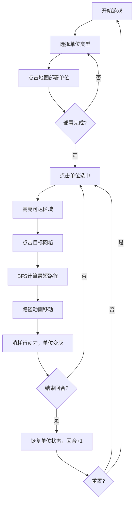

## 1. 产品概述

回合制战术小队部署与路径规划模拟应用，为小队指挥官提供直观的战术单位部署和路径规划可视化工具。通过六边形网格地图、单位交互和路径动画，帮助用户快速制定战术决策。

- 核心目标：解决现有软件无法直观展示行动路径与单位交互的问题，缩短决策耗时
- 目标用户：战术指挥官、策略游戏玩家
- 市场价值：提供高效、可视化的战术规划体验，可应用于军事模拟、回合制策略游戏等场景

## 2. 核心功能

### 2.1 功能模块
1. **地图渲染模块**：8x8六边形网格地图，支持网格高亮、单位显示、路径动画
2. **单位管理模块**：突击兵、狙击手、医疗兵三种单位类型的部署与管理
3. **路径规划模块**：BFS最短路径计算，支持移动范围高亮和路径动画
4. **回合系统模块**：回合制管理，行动力消耗，单位状态恢复
5. **控制面板模块**：回合信息、单位信息、行动按钮、重置功能

### 2.2 页面详情

| 页面名称 | 模块名称 | 功能描述 |
|----------|----------|----------|
| 主界面 | 地图区域 | Canvas渲染六边形网格，支持单位选择和移动交互 |
| 主界面 | 控制面板 | 显示回合信息、单位类型选择、部署按钮、结束回合按钮、重置按钮 |
| 主界面 | 单位信息面板 | 显示选中单位的详细信息（类型、阵营、状态） |

## 3. 核心流程

## 4. 用户界面设计

### 4.1 设计风格

- **设计主题**：深色科幻战术风格
- **主色调**：
  - 背景：`#0f172a`（深蓝黑）
  - 面板背景：`#1e293b`（深蓝灰）
  - 网格边框：`#475569`（石板灰）
  - 高亮色：`#60a5fa`（天蓝）
  - 按钮色：`#3b82f6`（亮蓝）
- **单位配色**：
  - 突击兵：`#fbbf24`（琥珀金）
  - 狙击手：`#a78bfa`（紫罗兰）
  - 医疗兵：`#34d399`（翡翠绿）
- **字体**：选用科技感无衬线字体，标题加粗，正文清晰可读
- **动画**：0.3秒ease-out过渡，路径移动每格0.2秒平滑动画
- **布局**：左侧280px控制面板，右侧自适应地图区域，移动端面板折叠为顶部横幅

### 4.2 页面设计概述

| 页面名称 | 模块名称 | UI元素 |
|----------|----------|--------|
| 主界面 | 控制面板 | 圆角12px卡片，内边距16px，单位选择按钮，回合信息，操作按钮 |
| 主界面 | 地图区域 | Canvas居中显示，六边形网格，单位圆形图标，高亮可达区域 |
| 主界面 | 选中效果 | 单位外圈3px白色边框，高亮网格半透明覆盖 |

### 4.3 响应式

- **桌面端（>768px）**：左侧固定280px控制面板，右侧地图区域自适应
- **移动端（≤768px）**：控制面板折叠为顶部横幅，地图区域全屏显示
- **触控优化**：按钮最小44px触控尺寸，手势缩放支持

## 5. 性能约束

- 地图渲染帧率 ≥ 45FPS
- BFS路径计算响应时间 ≤ 10ms
- 单位移动动画无卡顿
- 内存占用稳定，无内存泄漏
