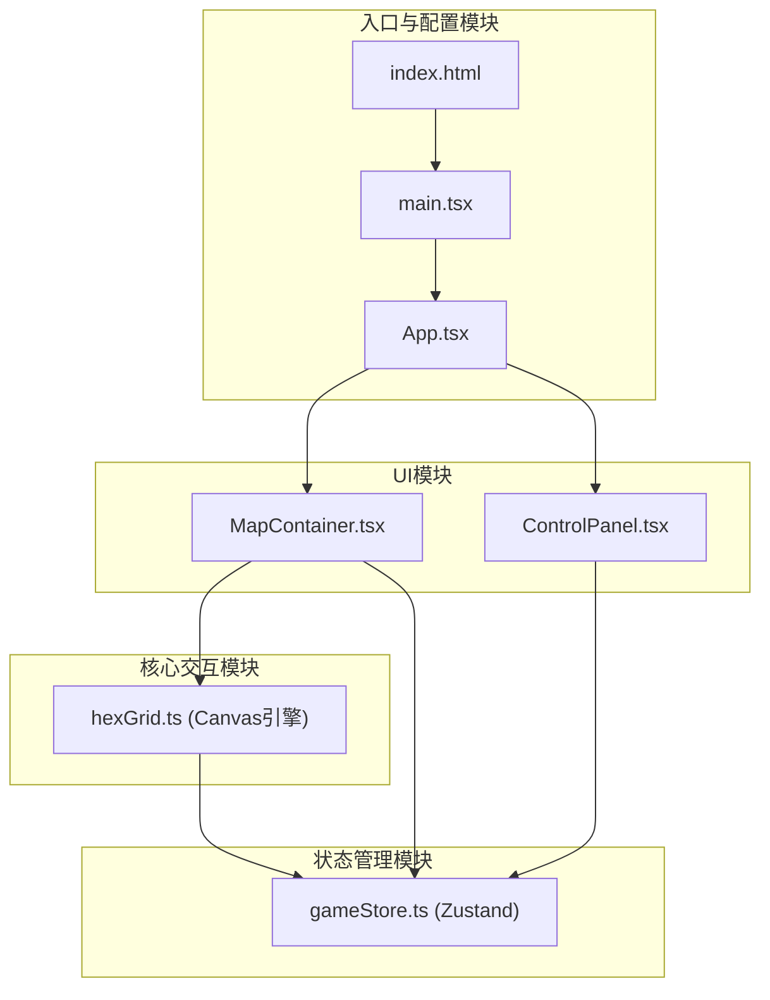
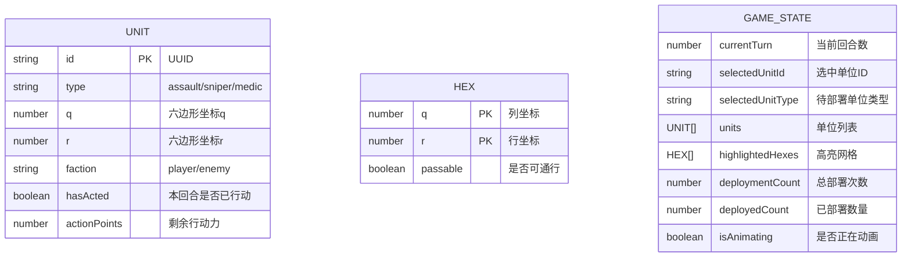

## 1. 架构设计



## 2. 技术描述

- **前端框架**：React 18 + TypeScript
- **构建工具**：Vite 5
- **状态管理**：Zustand 4
- **渲染引擎**：HTML5 Canvas 2D
- **其他依赖**：uuid（唯一标识符生成）
- **开发工具**：@vitejs/plugin-react

### 技术选型理由
- **Vite**：快速的开发服务器和构建工具，支持HMR
- **Zustand**：轻量级状态管理，API简洁，性能优秀
- **Canvas**：高性能网格渲染，支持复杂动画
- **TypeScript**：类型安全，减少运行时错误

## 3. 文件结构与调用关系

```
project/
├── index.html                      # 入口页面，全屏Canvas + 叠加UI层
├── package.json                    # 依赖配置
├── vite.config.js                  # Vite配置
├── tsconfig.json                   # TypeScript配置
└── src/
    ├── main.tsx                    # React入口，挂载App
    ├── App.tsx                     # 根组件，组合MapContainer和ControlPanel
    ├── store/
    │   └── gameStore.ts            # Zustand状态管理，暴露useGameStore
    ├── core/
    │   └── hexGrid.ts              # Canvas引擎，导出drawGrid/animateUnitMove
    └── components/
        ├── MapContainer.tsx        # Canvas容器，处理鼠标事件
        └── ControlPanel.tsx        # 控制面板，显示回合信息和操作按钮
```

### 数据流向
1. **用户交互 → MapContainer**：点击事件触发，获取网格坐标
2. **MapContainer → gameStore**：调用action（selectUnit/moveToHex/deployUnit）
3. **gameStore → hexGrid**：状态变化通知，触发重绘
4. **hexGrid → Canvas**：渲染网格、单位、高亮区域
5. **gameStore → ControlPanel**：状态变化更新UI显示

## 4. 数据模型

### 4.1 数据结构定义



### 4.2 TypeScript类型定义

```typescript
// 六边形坐标
interface HexCoord {
  q: number;
  r: number;
}

// 单位类型
type UnitType = 'assault' | 'sniper' | 'medic';

// 阵营
type Faction = 'player' | 'enemy';

// 单位数据
interface Unit {
  id: string;
  type: UnitType;
  q: number;
  r: number;
  faction: Faction;
  hasActed: boolean;
  actionPoints: number;
}

// 六边形网格
interface Hex {
  q: number;
  r: number;
  passable: boolean;
}

// 游戏状态
interface GameState {
  // 地图数据
  gridSize: number;
  hexRadius: number;
  
  // 单位数据
  units: Unit[];
  
  // 选中状态
  selectedUnitId: string | null;
  selectedUnitType: UnitType | null;
  highlightedHexes: HexCoord[];
  
  // 回合状态
  currentTurn: number;
  deploymentCount: number;
  maxDeployments: number;
  maxUnits: number;
  
  // 动画状态
  isAnimating: boolean;
  
  // Actions
  selectUnit: (id: string | null) => void;
  selectUnitType: (type: UnitType | null) => void;
  deployUnit: (q: number, r: number) => void;
  moveToHex: (q: number, r: number) => void;
  nextTurn: () => void;
  resetGame: () => void;
  setHighlightedHexes: (hexes: HexCoord[]) => void;
  setIsAnimating: (animating: boolean) => void;
}
```

## 5. 核心算法

### 5.1 六边形坐标系统

使用轴向坐标系（axial coordinates），每个六边形由(q, r)唯一标识。

### 5.2 BFS最短路径算法

```typescript
function findPath(start: HexCoord, end: HexCoord, grid: Hex[][], maxRange: number): HexCoord[] {
  // 1. 初始化队列和访问集合
  // 2. 从起点开始BFS遍历
  // 3. 记录每个节点的父节点
  // 4. 到达终点后回溯路径
  // 5. 返回路径坐标数组
}
```

### 5.3 六边形邻居计算

```typescript
const HEX_DIRECTIONS = [
  { q: 1, r: 0 }, { q: 1, r: -1 }, { q: 0, r: -1 },
  { q: -1, r: 0 }, { q: -1, r: 1 }, { q: 0, r: 1 }
];

function getNeighbors(hex: HexCoord): HexCoord[] {
  return HEX_DIRECTIONS.map(dir => ({
    q: hex.q + dir.q,
    r: hex.r + dir.r
  }));
}
```

### 5.4 六边形距离计算

```typescript
function hexDistance(a: HexCoord, b: HexCoord): number {
  return (Math.abs(a.q - b.q) + Math.abs(a.q + a.r - b.q - b.r) + Math.abs(a.r - b.r)) / 2;
}
```

## 6. 性能优化策略

1. **Canvas渲染优化**：
   - 使用requestAnimationFrame进行动画
   - 分层渲染（背景层、网格层、单位层）
   - 局部重绘而非全量重绘

2. **状态更新优化**：
   - Zustand自动shallow比较
   - 避免不必要的状态更新
   - 使用useMemo/useCallback优化重渲染

3. **路径计算优化**：
   - BFS算法时间复杂度O(N)，N为网格数
   - 预计算可达区域，避免重复计算
   - 限制搜索范围（移动范围2格）

4. **内存管理**：
   - 及时清理动画定时器
   - 避免闭包内存泄漏
   - Canvas资源正确释放

## 7. 配置文件说明

### package.json依赖
```json
{
  "dependencies": {
    "react": "^18.2.0",
    "react-dom": "^18.2.0",
    "zustand": "^4.5.0",
    "uuid": "^9.0.1"
  },
  "devDependencies": {
    "typescript": "^5.3.0",
    "vite": "^5.0.0",
    "@vitejs/plugin-react": "^4.2.0",
    "@types/react": "^18.2.0",
    "@types/react-dom": "^18.2.0",
    "@types/uuid": "^9.0.7"
  },
  "scripts": {
    "dev": "vite",
    "build": "tsc && vite build",
    "preview": "vite preview"
  }
}
```

### tsconfig.json
```json
{
  "compilerOptions": {
    "target": "ES2020",
    "useDefineForClassFields": true,
    "lib": ["ES2020", "DOM", "DOM.Iterable"],
    "module": "ESNext",
    "skipLibCheck": true,
    "moduleResolution": "bundler",
    "allowImportingTsExtensions": true,
    "resolveJsonModule": true,
    "isolatedModules": true,
    "noEmit": true,
    "jsx": "react-jsx",
    "strict": true,
    "noUnusedLocals": true,
    "noUnusedParameters": true,
    "noFallthroughCasesInSwitch": true
  },
  "include": ["src"]
}
```
