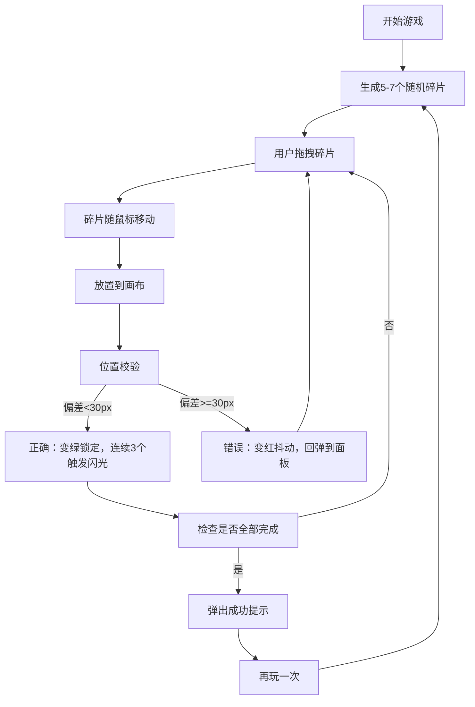

## 1. 产品概述

本应用是一款在线网页布局碎片还原训练工具，用户通过拖拽页面碎片（如导航栏、卡片、按钮、底部区域）到画布上还原给定目标截图，帮助提升网页布局识别和空间想象能力。

- 核心功能：随机生成布局碎片、拖拽交互、实时位置校验、进度跟踪
- 目标用户：前端开发初学者、UI设计师、任何希望提升布局感知能力的用户
- 产品价值：通过游戏化方式训练用户的网页布局识别能力

## 2. 核心功能

### 2.1 功能模块

1. **游戏主界面**：左侧碎片面板、中央画布区域、右侧目标预览三个分区
2. **碎片管理系统**：自动生成5-7个布局碎片，支持随机旋转和打乱顺序
3. **拖拽交互系统**：基于@dnd-kit的流畅拖拽体验，支持碰撞检测和位置校验
4. **状态反馈系统**：正确/错误位置的视觉反馈，连续正确的橙色闪光奖励
5. **进度管理系统**：实时显示完成进度，支持重置游戏
6. **胜利提示系统**：完成所有碎片后的成功弹窗和重新开始功能

### 2.2 页面详情

| 页面名称 | 模块名称 | 功能描述 |
|-----------|-------------|---------------------|
| 游戏主界面 | 顶部工具栏 | 显示进度（已放置/总数）、重置按钮 |
| 游戏主界面 | 左侧碎片面板 | 显示所有可用碎片，宽280px，碎片卡片白底圆角12px |
| 游戏主界面 | 中央画布区域 | 600x700px，浅灰底色，虚线网格辅助线，碎片放置区 |
| 游戏主界面 | 右侧预览面板 | 显示目标布局缩略图，高亮当前拖拽碎片对应区域 |
| 游戏主界面 | 成功弹窗 | 全屏遮罩，中央弹窗显示"完美还原！"和再玩一次按钮 |

## 3. 核心流程

用户打开应用 → 系统自动生成一组随机碎片 → 用户从左侧面板拖拽碎片 → 碎片随鼠标移动进入画布区 → 松开鼠标放置 → 系统实时校验位置 → 正确则锁定变绿/错误则回弹 → 连续3个正确触发橙色闪光 → 全部正确后弹出成功提示 → 点击再玩一次重新开始

## 4. 用户界面设计

### 4.1 设计风格
- 主色调：简约蓝灰（#f8fafc背景，#f1f5f9画布）
- 状态色：正确#22c55e（绿）、错误#ef4444（红）、高亮#3b82f6（蓝）、奖励#f97316（橙）
- 按钮风格：圆角8px，悬停变色效果
- 字体：系统无衬线字体，清晰易读
- 布局风格：三栏式结构，卡片式设计，统一圆角12px
- 动画风格：流畅顺滑，拖拽0.15s ease-out，状态切换0.3s

### 4.2 页面设计概述

| 页面名称 | 模块名称 | UI元素 |
|-----------|-------------|-------------|
| 游戏主界面 | 顶部工具栏 | 进度文字18px/600，重置按钮深色背景#1e293b |
| 游戏主界面 | 碎片面板 | 宽280px，碎片卡片260px宽，白底#ffffff，边框#e2e8f0，悬停阴影上移4px |
| 游戏主界面 | 画布区域 | 600x700px，#f1f5f9背景，虚线网格间距20px颜色#cbd5e1 |
| 游戏主界面 | 预览面板 | 宽240px，目标缩略图，高亮边框3px #3b82f6，提示文字14px #64748b |
| 游戏主界面 | 成功弹窗 | 半透明遮罩#00000050，白底弹窗圆角20px，文字32px/700 #059669 |

### 4.3 响应式
- 桌面端（>=1000px）：三栏布局，左280px+中600px+右240px
- 平板（<1000px）：左右面板收窄为180px，画布自动缩小
- 移动端（<768px）：三栏改为上下排列，碎片面板在上、画布居中、预览在下

## 5. 性能要求
- 拖拽交互帧率保持60fps
- 碎片放置校验和位置计算在1ms内完成
- 动画使用CSS transform和opacity避免重排
