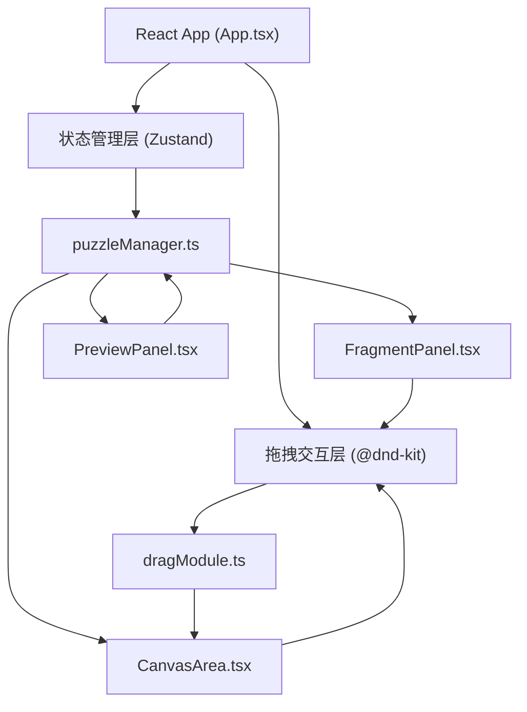

## 1. 架构设计



## 2. 技术描述

- **前端框架**：React@18 + TypeScript
- **构建工具**：Vite@5
- **状态管理**：Zustand@4
- **拖拽库**：@dnd-kit/core, @dnd-kit/utilities
- **唯一ID**：uuid
- **样式方案**：原生CSS（CSS变量 + CSS Modules）
- **开发语言**：TypeScript（严格模式，ES2020模块）

## 3. 目录结构

```
├── package.json          # 项目依赖和脚本
├── vite.config.js        # Vite配置
├── tsconfig.json         # TypeScript配置
├── index.html            # 入口HTML
├── src/
│   ├── main.tsx          # React入口
│   ├── App.tsx           # 主应用组件
│   ├── modules/
│   │   ├── puzzleManager.ts   # 碎片管理、状态、校验逻辑
│   │   └── dragModule.ts      # DnD kit封装、拖拽处理
│   ├── components/
│   │   ├── FragmentPanel.tsx  # 左侧碎片面板
│   │   ├── CanvasArea.tsx     # 中央画布区域
│   │   └── PreviewPanel.tsx   # 右侧目标预览
│   └── styles/
│       └── index.css     # 全局样式
```

## 4. 核心数据结构

### 4.1 Fragment（碎片）类型定义

```typescript
interface Fragment {
  id: string;
  name: string;
  width: number;    // 80-240px
  height: number;   // 60-180px
  targetX: number;  // 目标X坐标（相对于画布）
  targetY: number;  // 目标Y坐标（相对于画布）
  currentX: number; // 当前X坐标
  currentY: number; // 当前Y坐标
  rotation: number; // 随机旋转角度 -3°到+3°
  isPlaced: boolean; // 是否已放置
  isCorrect: boolean; // 位置是否正确
  bgColor: string;  // 碎片背景色（模拟截图区块）
  previewX: number; // 预览图中的X位置（百分比）
  previewY: number; // 预览图中的Y位置（百分比）
  previewW: number; // 预览图中的宽度（百分比）
  previewH: number; // 预览图中的高度（百分比）
}

interface GameState {
  fragments: Fragment[];
  isDragging: boolean;
  draggingId: string | null;
  correctStreak: number;
  showSuccess: boolean;
  flashOrange: boolean;
}
```

## 5. 模块接口定义

### 5.1 puzzleManager 接口

```typescript
// 生成随机碎片
generateFragments(): Fragment[];

// 添加碎片
addFragment(fragment: Fragment): void;

// 检查放置位置
checkPlacement(id: string, x: number, y: number): boolean;

// 检查游戏是否完成
isComplete(): boolean;

// 重置游戏
resetGame(): void;

// 获取碎片列表
getFragments(): Fragment[];

// 获取拖拽中的碎片
getDraggingFragment(): Fragment | null;
```

### 5.2 dragModule 接口

```typescript
// 拖拽上下文Provider
DragProvider: React.FC<{ children: React.ReactNode }>;

// 拖拽处理Hook
useDragHandlers(): {
  handleDragStart: (id: string) => void;
  handleDragMove: (x: number, y: number) => void;
  handleDragEnd: (x: number, y: number) => void;
  isDragging: boolean;
  draggingId: string | null;
};
```

## 6. 状态管理（Zustand）

```typescript
import { create } from 'zustand';

interface GameStore {
  fragments: Fragment[];
  draggingId: string | null;
  correctStreak: number;
  showSuccess: boolean;
  flashOrange: boolean;
  flashRed: string | null;
  
  // Actions
  setFragments: (fragments: Fragment[]) => void;
  updateFragmentPosition: (id: string, x: number, y: number) => void;
  setFragmentCorrect: (id: string, correct: boolean) => void;
  setDraggingId: (id: string | null) => void;
  incrementStreak: () => void;
  resetStreak: () => void;
  setShowSuccess: (show: boolean) => void;
  setFlashOrange: (flash: boolean) => void;
  setFlashRed: (id: string | null) => void;
  resetGame: () => void;
}
```

## 7. 关键算法

### 7.1 位置校验算法

```typescript
function checkPlacement(
  targetX: number, targetY: number,
  currentX: number, currentY: number,
  threshold: number = 30
): boolean {
  const distance = Math.sqrt(
    Math.pow(targetX - currentX, 2) + 
    Math.pow(targetY - currentY, 2)
  );
  return distance < threshold;
}
```

### 7.2 随机碎片生成算法

```typescript
function generateRandomFragments(count: number = 6): Fragment[] {
  // 预设目标布局位置（模拟真实网页布局区块）
  const presets = [
    { name: '导航栏', targetX: 0, targetY: 0, w: 600, h: 60, color: '#334155' },
    { name: 'Hero卡片', targetX: 50, targetY: 80, w: 500, h: 150, color: '#3b82f6' },
    { name: '功能卡片1', targetX: 50, targetY: 250, w: 240, h: 160, color: '#10b981' },
    { name: '功能卡片2', targetX: 310, targetY: 250, w: 240, h: 160, color: '#f59e0b' },
    { name: '按钮组', targetX: 200, targetY: 430, w: 200, h: 50, color: '#8b5cf6' },
    { name: '信息卡片', targetX: 50, targetY: 500, w: 500, h: 100, color: '#ec4899' },
    { name: '底部区域', targetX: 0, targetY: 620, w: 600, h: 80, color: '#1e293b' },
  ];
  
  // 随机选择5-7个，调整尺寸到要求范围，打乱顺序
  // 添加随机旋转-3°到+3°
}
```

## 8. 性能优化策略

1. **CSS硬件加速**：所有动画使用`transform`和`opacity`，避免`top/left`引起重排
2. **will-change提示**：拖拽元素添加`will-change: transform`
3. **React.memo**：碎片组件使用memo避免不必要重渲染
4. **useCallback**：事件处理函数缓存
5. **位置计算优化**：使用简单的距离公式，避免复杂计算
6. **事件节流**：拖拽移动事件适当节流（@dnd-kit已处理）

## 9. 动画定义

| 动画名称 | 属性 | 时长 | 缓动函数 | 触发条件 |
|---------|------|------|---------|---------|
| 悬停上移 | transform: translateY(-4px), box-shadow | 0.2s | ease-out | 鼠标悬停碎片卡片 |
| 正确高亮 | border-color, transform | 0.3s | ease-out | 位置校验正确 |
| 勾选标记 | opacity, transform: scale | 0.3s | ease-out | 位置校验正确 |
| 错误抖动 | transform: translateX | 0.2s | ease-in-out | 位置校验错误 |
| 回弹动画 | transform, opacity | 0.3s | ease-in | 错误后返回面板 |
| 橙色闪光 | background-color | 0.4s | ease-in-out | 连续正确3个 |
| 拖拽移动 | transform | 0.15s | ease-out | 拖拽过程中 |
| 弹窗出现 | transform: scale, opacity | 0.3s | cubic-bezier(0.34, 1.56, 0.64, 1) | 游戏完成 |
