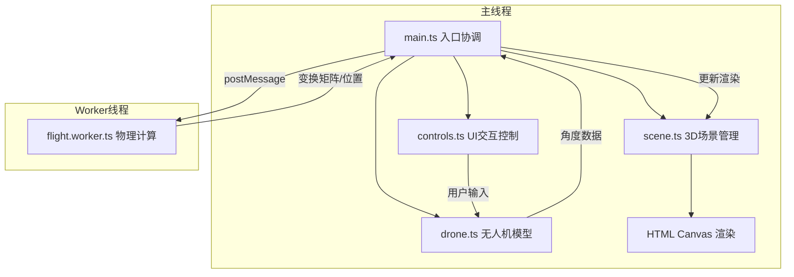

## 1. 架构设计



## 2. 技术描述

- **前端框架**: TypeScript 5.x + Three.js 0.160.x + Vite 5.x
- **初始化工具**: Vite vanilla-ts 模板
- **依赖**: three, @types/three, typescript, vite
- **物理计算**: Web Worker 独立线程处理飞行路径、旋翼旋转、粒子更新
- **无后端服务**，纯前端应用

## 3. 模块职责与数据流向

| 文件路径 | 职责 | 数据流向 |
|---------|------|----------|
| `src/scene.ts` | 初始化3D场景（相机、光照、网格、坐标轴），提供对象增删接口 | 接收创建对象指令 → 渲染循环更新场景状态 |
| `src/drone.ts` | 创建四旋翼模型（机身+4个机翼），角度更新、旋转动画、姿态数据 | 接收角度参数 → 更新模型变换 → 输出姿态数据 |
| `src/flight.worker.ts` | Worker线程计算飞行路径、旋翼转速、粒子位置 | 接收角度/航点 → 计算每帧变换 → postMessage发送结果 |
| `src/controls.ts` | 创建控制面板DOM，处理滑块/按钮事件，绑定Three.js交互 | 用户输入 → 触发更新事件 → 调用drone/flight接口 |
| `src/main.ts` | 入口模块，协调各模块，帧循环调度 | controls事件 → 更新drone → 发数据给Worker → 接收结果 → 更新scene |

## 4. 核心数据结构

```typescript
// 旋翼角度数据
interface RotorAngles {
  frontLeft: number;
  frontRight: number;
  rearLeft: number;
  rearRight: number;
}

// 无人机姿态
interface DroneAttitude {
  pitch: number;
  yaw: number;
  roll: number;
}

// Worker消息类型
type WorkerMessage = 
  | { type: 'init'; waypoints: Vector3[] }
  | { type: 'start'; angles: RotorAngles }
  | { type: 'updateAngles'; angles: RotorAngles }
  | { type: 'reset' }
  | { type: 'frame'; delta: number };

// Worker响应
type WorkerResponse =
  | { type: 'transform'; position: [number, number, number]; rotation: [number, number, number] }
  | { type: 'rotorSpeeds'; speeds: [number, number, number, number] }
  | { type: 'trailParticles'; particles: Array<{pos: [number, number, number]; alpha: number}> }
  | { type: 'attitude'; pitch: number; yaw: number };
```

## 5. 性能优化策略

1. **Web Worker**: 所有浮点计算（路径插值、旋翼转速、粒子更新）在Worker线程执行，避免阻塞主线程
2. **帧率控制**: Worker以60fps更新计算，主线程渲染50+fps
3. **粒子优化**: 250个粒子使用BufferGeometry，每帧仅更新position和alpha属性
4. **对象池**: 拖尾粒子复用，避免频繁GC
5. **CSS硬件加速**: 控制面板使用transform和opacity动画
