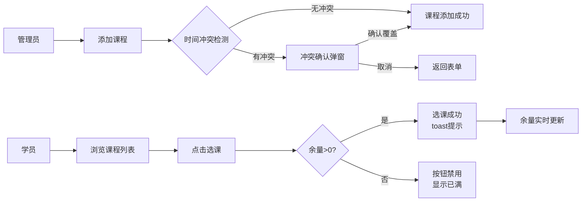

## 1. 产品概述

本系统是一个面向小型在线教育机构的课程排期与学员选课管理应用，旨在解决传统Excel排课易冲突、学员选课流程繁琐、课程余量无法实时查看的痛点问题。

- **目标用户**：教育机构管理员和学员
- **核心价值**：提升排课效率、减少冲突、优化选课体验
- **使用场景**：管理员后台管理课程与学员，学员前台浏览和选课

## 2. 核心功能

### 2.1 用户角色

| 角色 | 使用方式 | 核心权限 |
|------|----------|----------|
| 管理员 | 后台管理 | 添加课程、查看选课学员列表、检测排课冲突 |
| 学员 | 前台使用 | 浏览课程列表、进行选课操作、查看课程余量 |

### 2.2 功能模块

1. **课程管理模块**：添加课程、课程列表展示、课程搜索
2. **选课模块**：学员选课、余量实时更新、满员状态显示
3. **冲突检测模块**：排课时间冲突自动检测、冲突确认弹窗
4. **学员管理模块**：选课学员列表、分页展示、按课程名搜索

### 2.3 页面详情

| 页面名称 | 模块名称 | 功能描述 |
|----------|----------|----------|
| 课程列表页（前台） | 课程卡片展示 | 以卡片形式展示所有课程，支持选课操作 |
| 课程列表页（前台） | 选课交互 | 点击选课按钮进行选课，toast提示，余量实时更新 |
| 课程管理页（后台） | 添加课程表单 | 表单输入课程信息，含日期时间选择器 |
| 课程管理页（后台） | 冲突检测弹窗 | 检测到时间冲突时弹出警告模态框 |
| 学员管理页（后台） | 学员列表表格 | 表格展示选课学员，支持分页和搜索 |

## 3. 核心流程

### 3.1 管理员添加课程流程
管理员填写课程表单 → 系统检测排课冲突 → 无冲突则直接添加 / 有冲突则弹出确认模态框 → 确认覆盖后添加成功 → 课程列表更新

### 3.2 学员选课流程
学员浏览课程列表 → 点击选课按钮 → 系统校验余量 → 选课成功（toast提示）→ 课程余量实时减少 → 满员时按钮禁用

### 3.3 管理员查看选课学员流程
进入学员管理页 → 可按课程名搜索 → 查看学员列表表格 → 支持分页浏览

## 4. 用户界面设计

### 4.1 设计风格
- **主色调**：深蓝色 #1e293b（导航栏背景）、白色 #ffffff（内容区背景）
- **强调色**：蓝色 #3b82f6（按钮、选中状态）、#6366f1（点缀色）
- **布局风格**：左侧导航栏 + 右侧内容区的经典后台布局
- **卡片风格**：白色背景、圆角12px、浅灰边框、悬停上移效果
- **按钮风格**：圆角8px、悬停缩小效果（scale 0.95）、点击颜色加深

### 4.2 页面设计概述

| 页面名称 | 模块名称 | UI元素 |
|----------|----------|--------|
| 课程列表（前台） | 课程卡片 | 280px×200px卡片、白色背景、圆角12px、1px边框、悬停上移4px |
| 课程列表（前台） | 选课按钮 | 120px×40px、#3b82f6背景、白色文字、圆角8px、悬停缩小 |
| 课程管理（后台） | 添加课程表单 | 输入框聚焦蓝色边框发光、日期时间选择器 |
| 课程管理（后台） | 冲突模态框 | 白色背景、圆角16px、大阴影、红色冲突文字 |
| 学员管理（后台） | 学员表格 | #f8fafc背景、深色表头、交替行背景 |
| 全局布局 | 左侧导航栏 | 宽220px、#1e293b背景、24px间距、选中项左侧蓝色条 |

### 4.3 响应式设计
- **桌面端**：左侧导航栏（220px）+ 右侧内容区
- **移动端**（<768px）：导航栏折叠为汉堡菜单，内容区全宽
- **触摸优化**：按钮和可点击区域确保足够大的触摸面积

### 4.4 交互动效
- **导航切换**：0.2秒淡入过渡效果
- **按钮交互**：transform: scale(0.95) + 背景色变化，动画0.15秒
- **卡片悬停**：上移4px + 阴影加深
- **Toast提示**：选课成功提示，2秒后自动消失
- **输入框聚焦**：边框变蓝 + 轻微发光阴影

## 5. 性能要求

- **首屏加载时间**：小于2秒
- **课程列表分页切换**：无卡顿感
- **数据更新实时性**：选课后余量立即更新
