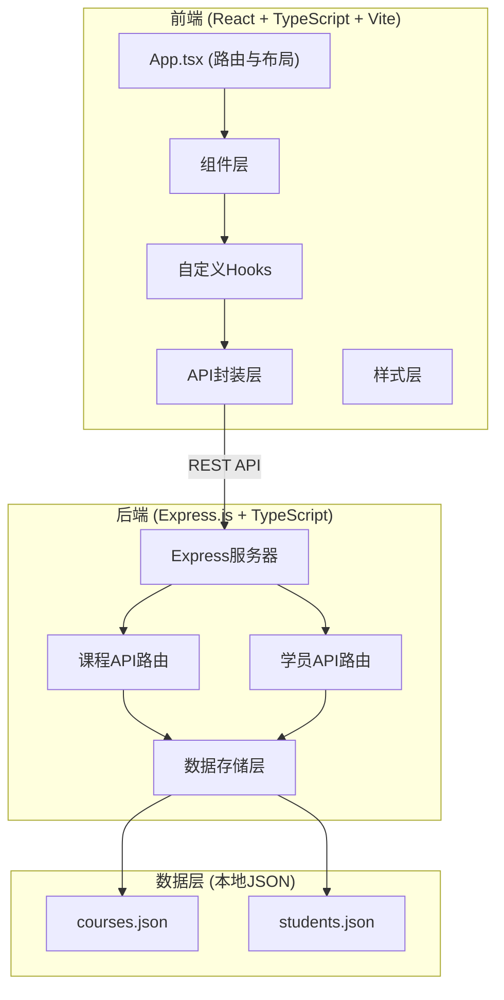
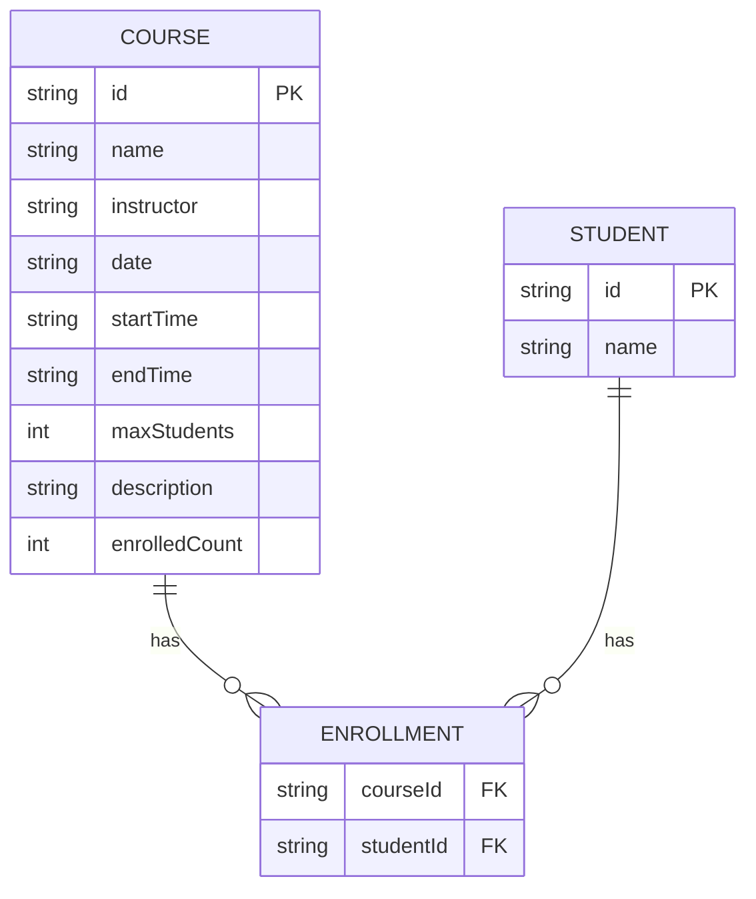

## 1. 架构设计



## 2. 技术栈说明

- **前端框架**：React@18 + TypeScript
- **构建工具**：Vite
- **路由管理**：react-router-dom
- **后端框架**：Express.js
- **数据存储**：本地JSON文件（courses.json / students.json）
- **唯一ID生成**：uuid
- **跨域处理**：cors

## 3. 路由定义

### 3.1 前端路由

| 路由路径 | 页面用途 |
|----------|----------|
| / | 前台课程列表页（学员端） |
| /admin/courses | 后台课程管理页 |
| /admin/students | 后台学员管理页 |

### 3.2 后端API路由

| 方法 | 路径 | 用途 |
|------|------|------|
| GET | /api/courses | 获取所有课程列表 |
| POST | /api/courses | 添加新课程 |
| GET | /api/courses/:id | 获取单门课程详情 |
| GET | /api/courses/:id/students | 获取某课程的选课学员列表 |
| POST | /api/courses/:id/enroll | 学员选课 |
| GET | /api/students | 获取所有学员列表 |

## 4. API 数据定义

### 4.1 数据类型定义

```typescript
// 课程类型
interface Course {
  id: string;
  name: string;           // 课程名，2-20字符
  instructor: string;     // 讲师名，2-10汉字
  date: string;           // 上课日期 YYYY-MM-DD
  startTime: string;      // 开始时间 HH:mm
  endTime: string;        // 结束时间 HH:mm
  maxStudents: number;    // 最大学员数，1-30
  description: string;    // 课程简介，200字以内
  enrolledCount: number;  // 已选人数
}

// 学员类型
interface Student {
  id: string;
  name: string;           // 学员名，字母数字组成，最多16字符
  courseIds: string[];    // 已选课程ID列表
}

// 选课请求
interface EnrollRequest {
  studentName: string;
}

// 冲突检测响应
interface ConflictResponse {
  hasConflict: boolean;
  conflictCourses: Course[];
}
```

### 4.2 请求/响应格式

- **Content-Type**: application/json
- **成功响应**: `{ success: true, data: ... }`
- **失败响应**: `{ success: false, message: '错误信息' }`

## 5. 项目结构

```
auto119/
├── package.json              # 项目依赖与脚本
├── vite.config.js            # Vite配置
├── tsconfig.json             # TypeScript配置
├── index.html                # 入口HTML
├── server/
│   ├── index.ts              # Express服务器入口
│   └── data/
│       ├── courses.json      # 课程数据存储
│       └── students.json     # 学员数据存储
└── src/
    ├── api.ts                # 后端请求封装
    ├── hooks/
    │   └── useCourses.ts     # 课程状态管理Hook
    ├── components/
    │   ├── CourseCard.tsx    # 课程卡片组件
    │   └── ConflictModal.tsx # 冲突模态框组件
    └── App.tsx               # 应用入口组件
```

## 6. 数据模型

### 6.1 实体关系图



### 6.2 初始数据

**courses.json** 初始包含若干示例课程数据

**students.json** 初始为空数组
