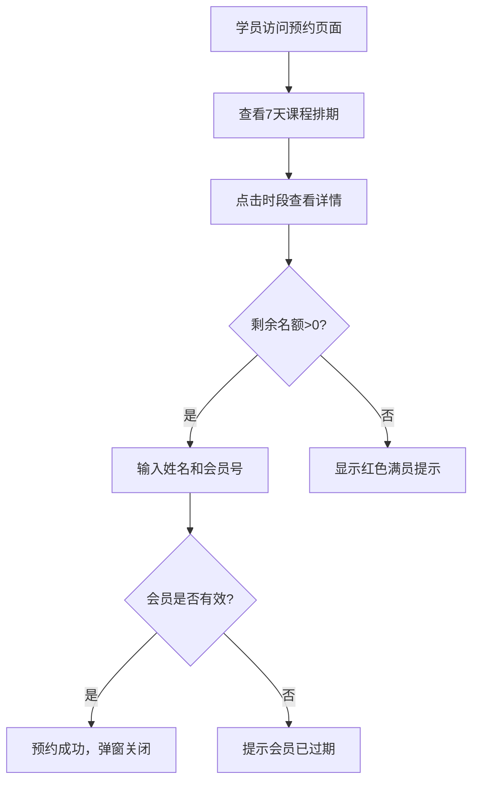

## 1. 产品概述

健身俱乐部会员管理与课程预约应用，旨在解决小型健身俱乐部依赖纸质登记和Excel手工统计导致的管理混乱问题。系统提供会员管理、课程预约、教练看板和续费提醒功能，防止到期会员继续使用器材和热门课程超额报名。

- 目标用户：健身俱乐部管理员、前台学员、教练
- 核心价值：数字化会员管理，自动化到期提醒，规范课程预约流程

## 2. 核心功能

### 2.1 用户角色

| 角色 | 使用场景 | 核心权限 |
|------|----------|----------|
| 管理员 | 管理后台 | 添加/续费会员，查看到期提醒，管理课程排期 |
| 学员 | 预约页面 | 查看课程排期，预约/取消课程 |
| 教练 | 教练看板 | 查看今日课程安排和已预约学员列表 |

### 2.2 功能模块

1. **管理后台**：会员管理表格，续费提醒横幅，侧边栏导航
2. **教练看板**：今日课程卡片列表，已预约学员名单
3. **预约页面**：7天课程日历，时段详情弹窗，预约/取消操作

### 2.3 页面详情

| 页面名称 | 模块名称 | 功能描述 |
|----------|----------|----------|
| 管理后台 | 会员管理面板 | 表格展示会员姓名/会籍类型/到期日/状态，支持新增和续费，到期前7天黄色警告图标并置顶，过期会员状态变红并禁止预约 |
| 管理后台 | 续费提醒横幅 | 到期前3天自动显示顶部横幅通知，可关闭且刷新后不再显示 |
| 预约页面 | 课程日历视图 | 展示未来7天课程排期（每日09:00/14:00/19:00三时段），点击查看详情弹窗 |
| 预约页面 | 预约详情弹窗 | 显示课程名/教练名/剩余名额，输入姓名和会员号预约，成功后自动关闭 |
| 教练看板 | 课程卡片列表 | 按时间顺序显示今日课程，卡片含课程名和已预约学员名单（最多5人+"等N人"） |

## 3. 核心流程

### 3.1 会员管理流程

1. 管理员在管理后台点击"新增会员"
2. 填写姓名（2-10汉字必填）、选择会籍类型（月卡/季卡/年卡）
3. 到期日默认当前日期+30天，状态默认有效
4. 会员信息存入系统，表格自动刷新
5. 到期前7天，状态列显示黄色警告图标并自动置顶该会员
6. 超出到期日，状态变红，该会员禁止预约课程

### 3.2 课程预约流程

1. 学员在预约页面查看未来7天课程排期
2. 点击某一时段，弹出详情弹窗
3. 弹窗显示课程名、教练名、剩余名额
4. 剩余名额>0时输入姓名和会员号，点击预约
5. 预约成功弹窗自动关闭，名额相应减少
6. 剩余名额=0时显示红色并禁止预约按钮

### 3.3 续费提醒流程

1. 系统检测到期前3天的会员
2. 管理后台顶部自动显示横幅通知
3. 管理员可点击关闭按钮关闭横幅
4. 已关闭的通知刷新页面后不再显示

## 4. 用户界面设计

### 4.1 设计风格

- 主色：#1e293b（深灰蓝），辅色：#3b82f6（蓝色），背景：#f1f5f9（浅灰）
- 按钮风格：圆角8px，背景#3b82f6，悬停#2563eb，按下缩放0.95，过渡0.15s ease-out
- 字体：系统默认无衬线字体，菜单项14px/400
- 布局风格：左侧固定侧边栏+右侧主区域，卡片式课程展示
- 图标：使用lucide-react图标库

### 4.2 页面设计概览

| 页面名称 | 模块名称 | UI元素 |
|----------|----------|--------|
| 管理后台 | 侧边栏 | 宽220px，背景#1e293b，菜单项高48px，选中项背景#334155左侧3px蓝色竖条 |
| 管理后台 | 会员表格 | 行高48px，奇偶行#f8fafc/#ffffff，悬停#e2e8f0，到期警告黄色图标，过期红色状态 |
| 管理后台 | 续费横幅 | 高60px，背景#fef3c7，文字#92400e，圆角8px，内边距16px，右下角关闭按钮 |
| 预约页面 | 日历视图 | 7天×3时段网格，每节课最大容量20人 |
| 预约页面 | 详情弹窗 | 宽400px，背景#ffffff，圆角16px，阴影0 4px 12px rgba(0,0,0,0.15) |
| 教练看板 | 课程卡片 | 宽280px，高160px，背景#ffffff，圆角12px，边框1px solid #d1d5db，左侧4px彩色条（上午#3b82f6/下午#f59e0b/晚上#8b5cf6） |

### 4.3 响应式设计

- 桌面优先设计，最小宽度800px主区域
- 屏幕宽度<1024px时侧边栏折叠为顶部导航栏
- 屏幕宽度<768px时表格横向滚动
- 课程卡片在小屏幕下自适应宽度

### 4.4 性能约束

- 页面初始加载时间≤1.5秒
- 列表数据筛选和排序响应时间<100ms（会员数≤200）
