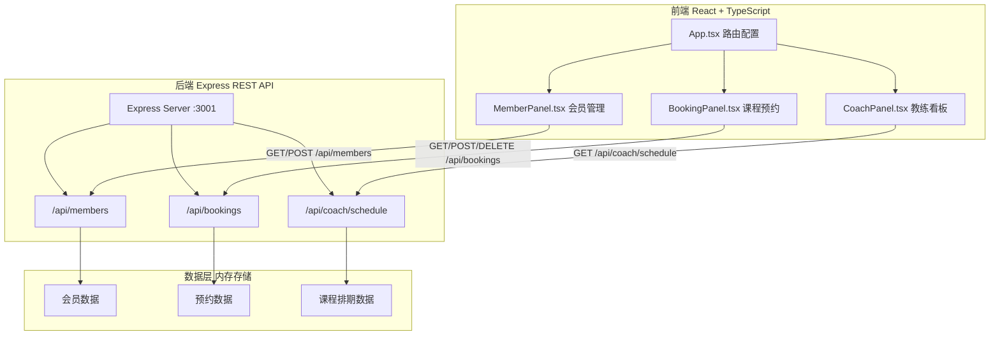
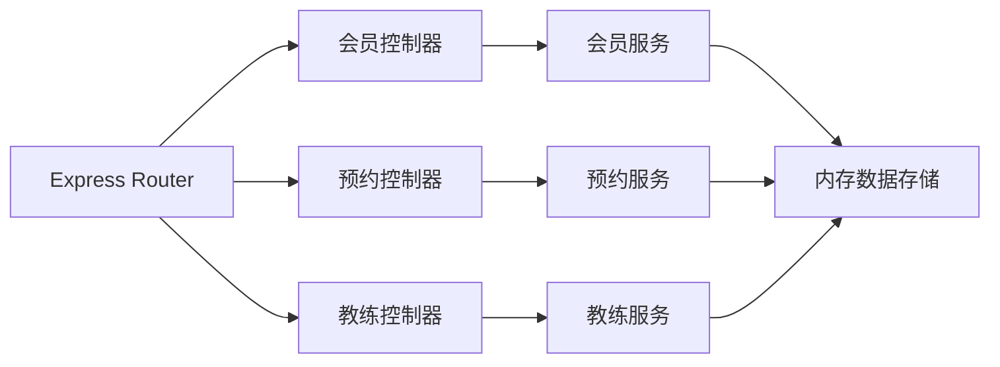
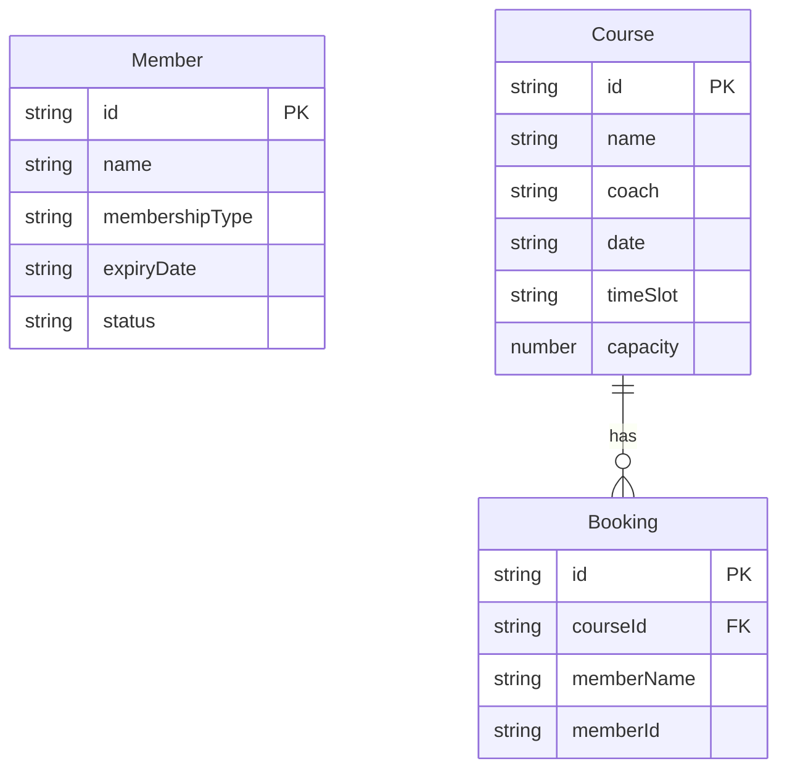

## 1. 架构设计



## 2. 技术说明

- 前端：React@18 + TypeScript + Vite + Tailwind CSS
- 初始化工具：vite-init (react-express-ts 模板)
- 后端：Express@4 + cors + uuid
- 数据库：内存模拟存储（无持久化数据库）
- 状态管理：Zustand
- 图标库：lucide-react

## 3. 路由定义

| 路由 | 用途 |
|------|------|
| / | 管理后台（会员管理面板+续费提醒） |
| /coach | 教练看板（今日课程安排） |
| /booking | 预约页面（7天课程日历） |

## 4. API 定义

### 4.1 会员管理 API

```
GET    /api/members          获取所有会员列表
POST   /api/members          新增会员
PUT    /api/members/:id/renew  会员续费
```

**Member 类型定义：**
```typescript
interface Member {
  id: string;
  name: string;
  membershipType: '月卡' | '季卡' | '年卡';
  expiryDate: string;
  status: '有效' | '即将到期' | '已过期';
}
```

### 4.2 课程预约 API

```
GET    /api/bookings           获取未来7天课程排期
POST   /api/bookings           创建预约
DELETE /api/bookings/:id       取消预约
```

**Booking 类型定义：**
```typescript
interface Course {
  id: string;
  name: string;
  coach: string;
  date: string;
  timeSlot: '09:00' | '14:00' | '19:00';
  capacity: number;
  bookings: Booking[];
}

interface Booking {
  id: string;
  courseId: string;
  memberName: string;
  memberId: string;
}
```

### 4.3 教练看板 API

```
GET    /api/coach/schedule     获取今日课程安排及预约学员
```

**CoachSchedule 类型定义：**
```typescript
interface CoachSchedule {
  date: string;
  courses: CourseDetail[];
}

interface CourseDetail {
  id: string;
  name: string;
  timeSlot: string;
  coach: string;
  bookedStudents: string[];
  totalBooked: number;
}
```

## 5. 服务端架构图



## 6. 数据模型

### 6.1 数据模型定义



### 6.2 初始化数据

- 预置10条会员记录（含不同会籍类型和到期状态）
- 预置未来7天每天3个时段共21节课程
- 每节课程预设不同教练和部分预约记录
