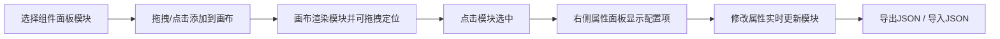

## 1. 产品概述

交互式页面搭建工具 - 让产品经理和设计师通过拖拽预设UI模块像拼乐高一样快速搭建原型页面，大幅提升原型设计效率。

- 核心价值：通过可视化拖拽+实时预览+属性配置，省去手写组件和拼接布局的重复劳动
- 目标用户：产品经理、UI/UX设计师、前端开发者

## 2. 核心功能

### 2.1 功能模块

1. **组件面板**：左侧展示可用UI模块列表，支持拖拽或点击添加
2. **画布区域**：中间画布支持模块自由布局、拖拽移动、滚轮缩放
3. **属性面板**：右侧根据选中模块类型动态显示可编辑参数，实时更新
4. **数据持久化**：支持将布局导出为JSON配置文件，支持导入JSON还原布局

### 2.2 页面详情

| 页面名称 | 模块名称 | 功能描述 |
|-----------|-------------|---------------------|
| 主编辑页面 | 顶部工具栏 | 导出JSON按钮、导入JSON按钮、缩放控制显示 |
| 主编辑页面 | 左侧组件面板 | 搜索栏、用户卡片、数据表格、按钮组模块缩略图，64x64px，悬停放大效果 |
| 主编辑页面 | 中间画布 | 1200x800px，可缩放范围0.5-2.0，支持模块拖拽定位，24px自动间距 |
| 主编辑页面 | 右侧属性面板 | 280px宽，根据模块类型渲染对应属性表单 |

## 3. 核心流程

用户拖拽模块缩略图到画布 → 画布上渲染模块 → 点击模块选中 → 右侧面板显示属性 → 修改属性实时刷新模块外观 → 点击导出按钮生成JSON文件

## 4. 用户界面设计

### 4.1 设计风格

- **主色**：背景 #0f172a（深色），卡片 #ffffff（白色），交互色 #3b82f6（蓝色）
- **按钮样式**：圆角8px，悬停变 #2563eb
- **卡片风格**：整体采用卡片式布局，圆角、阴影、白色卡片在深色背景上
- **图标**：64x64px缩略图，背景 #f1f5f9，圆角12px，悬停放大1.1倍+蓝色边框
- **动画**：所有交互过渡0.15s-0.2s，ease/ease-out缓动

### 4.2 页面设计概述

| 页面名称 | 模块名称 | UI元素 |
|-----------|-------------|-------------|
| 主编辑页面 | 组件面板 | 网格排列缩略图、悬停动画、拖拽指示 |
| 主编辑页面 | 画布区域 | 浅灰背景 #f8fafc、模块可拖拽、选中高亮、滚轮缩放 |
| 主编辑页面 | 属性面板 | 白色卡片、顶部阴影、表单项标签+输入控件、实时联动 |

### 4.3 响应式

- Desktop-first设计
- 画布最小宽度800px，支持响应式缩放适配不同屏幕
- 三栏布局：左固定(组件面板) + 中间弹性(画布) + 右固定(属性面板)

### 4.4 性能要求

- 同时支持30个模块操作无卡顿
- 帧率保持30fps以上
- 属性修改响应延迟≤50ms
